# Active Directory Certificate Services (AD CS) Enterprise PKI Lab

## Project Overview

This project demonstrates the deployment, configuration, administration, and operational validation of **Active Directory Certificate Services (AD CS)** within a Microsoft Windows Server 2022 Active Directory environment.

The implementation focuses on designing and deploying an enterprise **Public Key Infrastructure (PKI)** using Microsoft's native Certificate Services solution to provide centralized certificate issuance, lifecycle management, and trust services throughout the Active Directory domain.

During this project, an Enterprise Root Certification Authority (CA) is installed and configured, certificate templates are published, automatic certificate enrollment is implemented using Group Policy, user certificates are enrolled and validated, certificate revocation procedures are demonstrated, Certificate Revocation Lists (CRLs) are published, Certification Authority backup operations are performed, and the overall PKI environment is verified using both graphical management tools and command-line administrative utilities.

The project simulates enterprise-level administrative tasks commonly performed by Windows System Administrators, Infrastructure Administrators, PKI Administrators, and IT Administrators responsible for identity management, secure authentication, certificate lifecycle management, and enterprise security infrastructure.

The implementation follows Microsoft's recommended deployment practices for a single-tier Enterprise Root Certification Authority integrated with Active Directory Domain Services.

---

# Objectives

The primary objectives of this project were to:

- Deploy Active Directory Certificate Services on Windows Server 2022
- Configure an Enterprise Root Certification Authority
- Establish an enterprise Public Key Infrastructure
- Configure Certification Authority cryptographic settings
- Publish certificate templates for enterprise use
- Configure Certificate Auto-Enrollment through Group Policy
- Enroll and validate user certificates
- Demonstrate certificate revocation procedures
- Publish updated Certificate Revocation Lists (CRLs)
- Backup the Certification Authority database and private key
- Validate PKI functionality using PowerShell administrative tools
- Verify Certification Authority health using CertUtil
- Perform operational verification of the complete PKI deployment
- Document enterprise PKI deployment procedures using professional administrative documentation

---

# Lab Environment

| Component | Configuration |
|------------|---------------|
| Hypervisor | VMware Workstation Pro |
| Operating System | Windows Server 2022 Standard Evaluation |
| Server Hostname | WS-DC01 |
| Domain | corp.local |
| Server Role | Domain Controller |
| PKI Solution | Active Directory Certificate Services |
| Certification Authority | Enterprise Root CA |
| Directory Service | Active Directory Domain Services |
| Administrative Tools | Server Manager, Certification Authority, Group Policy Management, PowerShell, CertUtil |

---

# Enterprise PKI Architecture

The Public Key Infrastructure deployed during this project follows Microsoft's recommended architecture for a single-tier Enterprise Certification Authority integrated with Active Directory.

```text
                    Active Directory
                       corp.local
                            │
                            ▼
                Enterprise Root CA
                      (WS-DC01)
                            │
      ┌─────────────────────┼─────────────────────┐
      │                     │                     │
      ▼                     ▼                     ▼
Certificate          Certificate          Certificate
 Templates           Enrollment            Revocation
      │                     │                     │
      └─────────────────────┼─────────────────────┘
                            ▼
                Domain Users & Computers
```

This architecture enables centralized certificate issuance, automated certificate enrollment, certificate lifecycle management, trust establishment, and secure authentication across the Active Directory environment.

---

# Enterprise PKI Workflow

The implementation follows the standard enterprise deployment lifecycle commonly used within Microsoft Active Directory environments.

```text
Install AD CS
        │
        ▼
Configure Enterprise Root CA
        │
        ▼
Publish Certificate Templates
        │
        ▼
Configure Auto-Enrollment
        │
        ▼
Enroll User Certificates
        │
        ▼
Revoke Certificate
        │
        ▼
Publish Updated CRL
        │
        ▼
Backup Certification Authority
        │
        ▼
Validate PKI Environment
        │
        ▼
Operational Readiness
```

This workflow demonstrates the complete lifecycle of deploying, administering, validating, and maintaining an enterprise Public Key Infrastructure.

---

# Part 1 – Active Directory Certificate Services Deployment

## Overview

The first stage of the project focuses on deploying the Active Directory Certificate Services server role and preparing the Windows Server environment for Enterprise Public Key Infrastructure implementation.

The deployment begins with installing the required server role, selecting the Certification Authority role service, and verifying successful installation before proceeding with Certification Authority configuration.

Successful completion of this stage establishes the infrastructure required for enterprise certificate management.

---

# Phase 1 – Active Directory Certificate Services Role Installation

## Overview

The initial deployment phase consists of installing the Active Directory Certificate Services server role on the Windows Server 2022 Domain Controller.

Installing this role provides the core services required to issue, manage, revoke, and validate digital certificates throughout the Active Directory domain.

The deployment was performed using Server Manager following Microsoft's recommended role installation process.

---

## Objectives

The objectives completed during this phase include:

- Verify server readiness
- Install Active Directory Certificate Services
- Install Certification Authority role service
- Install required management tools
- Verify successful role deployment
- Prepare the server for Enterprise Certification Authority configuration

---

## Environment

| Component | Value |
|-----------|-------|
| Server | WS-DC01 |
| Operating System | Windows Server 2022 Standard Evaluation |
| Server Role | Domain Controller |
| AD CS Role | Active Directory Certificate Services |
| Role Service | Certification Authority |

---

# Implementation

### Step 1 – Review Server Environment

Before deploying Active Directory Certificate Services, the Server Manager dashboard was reviewed to verify that the Windows Server environment was healthy and ready for additional server roles.

This verification ensured that Active Directory Domain Services was operating normally and that the server was prepared for PKI deployment.

### Step 2 – Select Active Directory Certificate Services

The **Add Roles and Features Wizard** was launched from Server Manager.

The **Active Directory Certificate Services** server role was selected together with the required management tools, allowing Windows Server to install the components necessary for enterprise certificate management.

### Step 3 – Select Certification Authority Role Service

During role installation, the **Certification Authority** role service was selected.

This role provides the primary functionality responsible for certificate issuance, certificate lifecycle management, certificate revocation, and trust establishment throughout the Active Directory environment.

### Step 4 – Install Active Directory Certificate Services

After confirming the selected server roles and features, the installation process was initiated.

Windows Server installed the required binaries, administrative consoles, and supporting services necessary for Certification Authority deployment.

### Step 5 – Verify Successful Installation

Following installation, Server Manager confirmed that Active Directory Certificate Services had been successfully installed.

At this stage, the role installation was complete while the Certification Authority itself remained unconfigured, requiring post-deployment configuration before enterprise certificate services could become operational.

---

## Screenshots

### Screenshot 00 – Server Manager Dashboard Overview

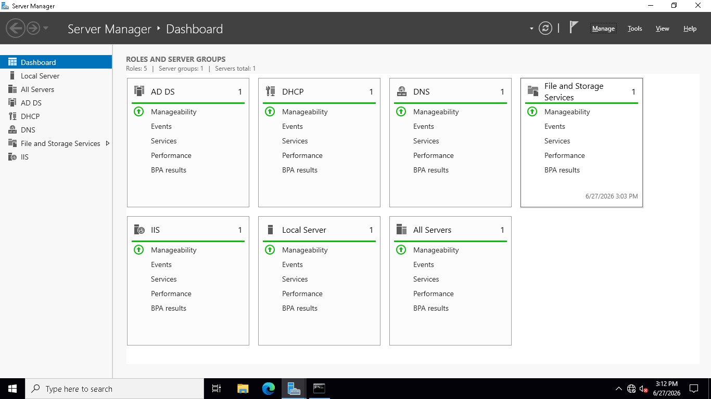

---

### Screenshot 01 – Active Directory Certificate Services Role Selected

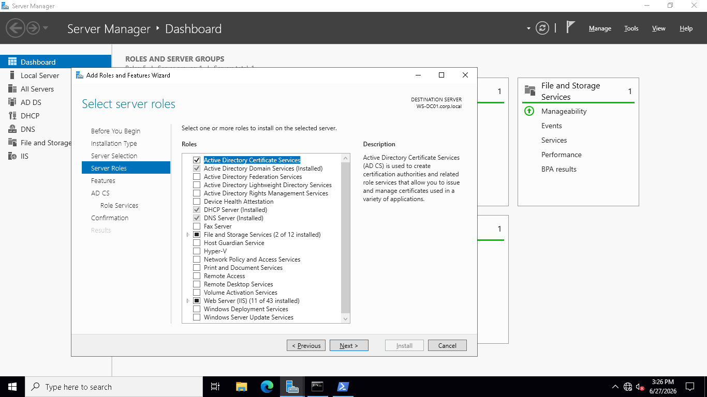

---

### Screenshot 02 – Certification Authority Role Service Selected

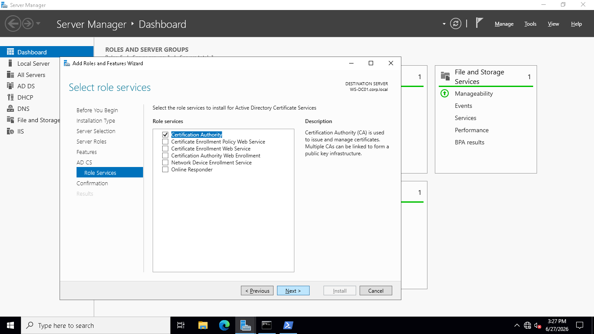

---

### Screenshot 03 – Active Directory Certificate Services Installation

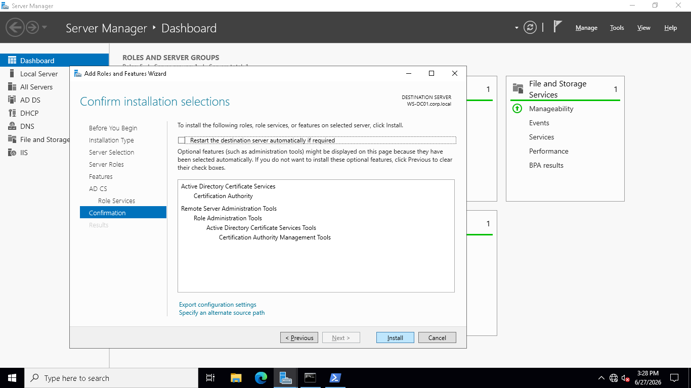

---

### Screenshot 04 – Active Directory Certificate Services Installation Successful

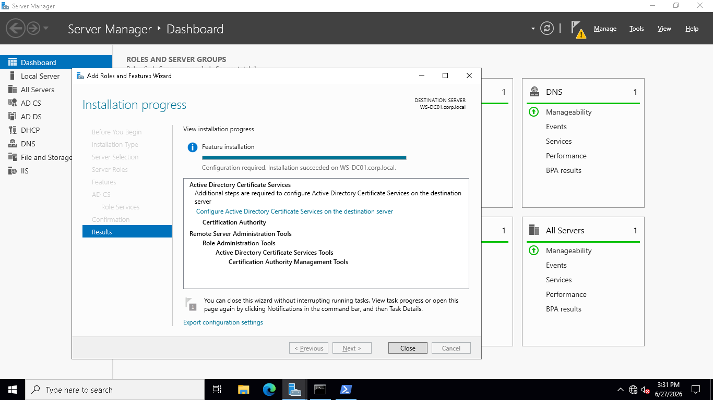

---

## Phase 1 Results

The Active Directory Certificate Services server role was successfully deployed on the Windows Server 2022 Domain Controller.

All required management tools were installed successfully, preparing the environment for Enterprise Root Certification Authority configuration during the next implementation phase.

---

## Skills Demonstrated

- Windows Server Administration
- Server Role Deployment
- Active Directory Certificate Services Installation
- Server Manager Administration
- Enterprise PKI Infrastructure Preparation
- Windows Server Feature Management

---

The successful deployment of Active Directory Certificate Services establishes the foundation required to configure an Enterprise Root Certification Authority and implement a trusted Public Key Infrastructure throughout the Active Directory environment.

---

# Phase 2 – Enterprise Root Certification Authority Configuration

## Overview

Following successful installation of the Active Directory Certificate Services server role, the post-deployment configuration wizard was launched to initialize the Enterprise Root Certification Authority.

During this phase, the Certification Authority was configured as an **Enterprise Root Certification Authority**, allowing it to integrate directly with Active Directory Domain Services and provide trusted certificate services for domain users and computers.

The configuration process included selecting the Certification Authority type, generating a new private key, defining cryptographic settings, specifying the Certification Authority common name, configuring the certificate validity period, and completing the Enterprise Certification Authority deployment.

Once configuration was completed successfully, the Certification Authority management console was opened to verify operational readiness before certificate templates were published.

---

## Objectives

The following objectives were completed during this phase:

- Launch the AD CS Configuration Wizard
- Configure the Certification Authority role service
- Deploy an Enterprise Root Certification Authority
- Generate a new Certification Authority private key
- Configure cryptographic provider settings
- Configure the Certification Authority common name
- Define the root certificate validity period
- Complete Enterprise Certification Authority deployment
- Verify Certification Authority functionality

---

## Environment

| Component | Value |
|-----------|-------|
| Server | WS-DC01 |
| Operating System | Windows Server 2022 Standard Evaluation |
| Certification Authority Type | Enterprise Root CA |
| Cryptographic Provider | RSA Software Key Storage Provider |
| Hash Algorithm | SHA256 |
| Directory Integration | Active Directory |

---

# Implementation

### Step 1 – Launch Active Directory Certificate Services Configuration

Following installation of the Active Directory Certificate Services role, the post-deployment configuration wizard was launched from Server Manager.

This wizard initializes the Certification Authority and completes the deployment process by configuring the services required to establish a trusted enterprise Public Key Infrastructure.

---

### Step 2 – Select Certification Authority Role Service

The Certification Authority role service was selected for configuration.

This role provides the core functionality required to issue, renew, revoke, and validate certificates throughout the Active Directory environment.

Since this deployment consists of a single Enterprise Certification Authority, only the Certification Authority role service was configured.

---

### Step 3 – Configure an Enterprise Certification Authority

The Certification Authority was configured as an **Enterprise CA**.

Enterprise Certification Authorities integrate directly with Active Directory, allowing certificate templates, auto-enrollment, certificate publication, and trust relationships to be managed centrally through directory services.

This configuration enables automated certificate deployment and simplifies certificate lifecycle management across the enterprise.

---

### Step 4 – Configure a Root Certification Authority

The Certification Authority type was configured as a **Root CA**.

As the trust anchor of the Public Key Infrastructure, the Root Certification Authority issues and signs its own root certificate while establishing the initial chain of trust for all certificates issued within the environment.

In a single-tier PKI deployment, the Root Certification Authority performs all certificate issuance and management functions.

---

### Step 5 – Generate a New Private Key

A new private key was generated for the Certification Authority.

The private key represents the most critical security component within the PKI because it is used to digitally sign every certificate issued by the Certification Authority.

Generating a new private key ensures that the Certification Authority begins operation with a unique cryptographic identity.

---

### Step 6 – Configure Cryptographic Settings

Cryptographic settings were configured using Microsoft's recommended provider and hashing algorithm.

The Certification Authority was configured to use the RSA Software Key Storage Provider together with the SHA-256 hashing algorithm to provide modern cryptographic security and compatibility with current Microsoft enterprise environments.

Appropriate key length settings were selected to balance security, performance, and long-term operational requirements.

---

### Step 7 – Configure the Certification Authority Name

A descriptive common name was assigned to the Certification Authority.

The Certification Authority name uniquely identifies the trusted certificate issuer throughout the Active Directory forest and becomes part of every certificate generated by the Certification Authority.

Proper naming simplifies certificate management and administrative identification within enterprise environments.

---

### Step 8 – Configure Certificate Validity Period

The root Certification Authority certificate validity period was configured according to enterprise deployment requirements.

The validity period determines how long the Certification Authority certificate remains trusted before renewal becomes necessary.

Selecting an appropriate validity period helps balance long-term operational stability with security best practices.

---

### Step 9 – Review Configuration Summary

Before deployment, the configuration summary was reviewed to verify all selected options.

This validation confirmed the Certification Authority type, cryptographic settings, private key configuration, Certification Authority name, and certificate validity period before the final configuration was applied.

Reviewing deployment settings before implementation reduces configuration errors and aligns with enterprise change management practices.

---

### Step 10 – Complete Certification Authority Configuration

After validation, the configuration wizard completed deployment of the Enterprise Root Certification Authority.

Windows Server generated the root certificate, initialized the Certification Authority database, configured Active Directory integration, and activated the Certification Authority service.

Upon successful completion, the server was fully prepared to issue and manage digital certificates throughout the domain.

---

### Step 11 – Verify Certification Authority Operation

Following successful deployment, the Certification Authority management console was opened to verify operational readiness.

The console displayed the newly deployed Enterprise Root Certification Authority together with the available management nodes for issued certificates, pending requests, revoked certificates, certificate templates, and Certification Authority properties.

Successful access to the management console confirmed that the Certification Authority was operating correctly and was ready for certificate template administration.

---

## Screenshots

### Screenshot 05 – Configure Active Directory Certificate Services

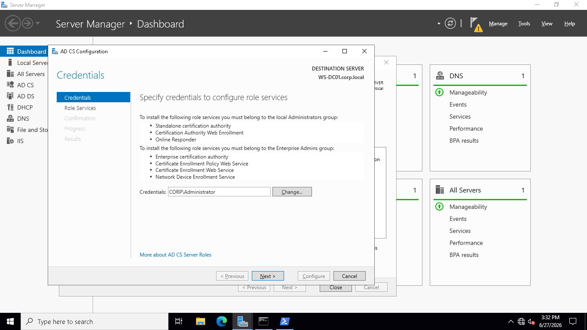

---

### Screenshot 06 – Certification Authority Role Service Selected

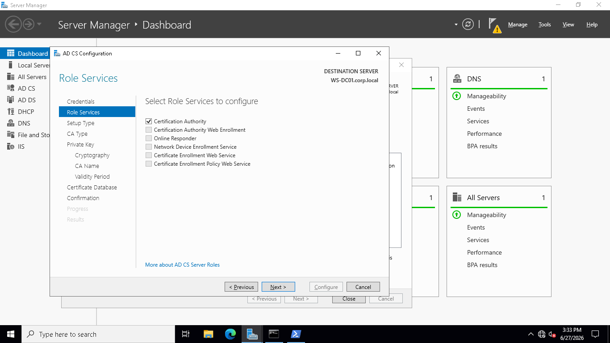

---

### Screenshot 07 – Enterprise Certification Authority Selected

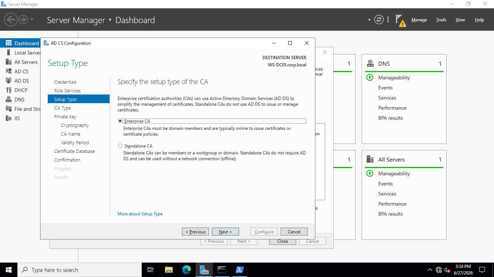

---

### Screenshot 08 – Root Certification Authority Selected

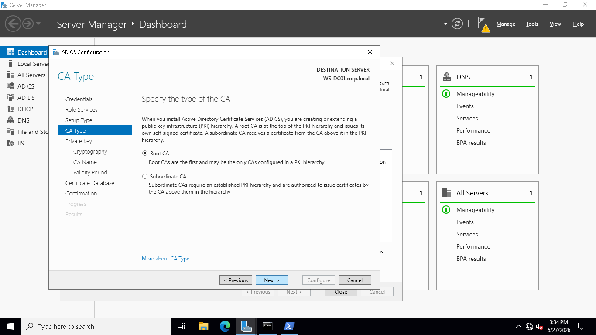

---

### Screenshot 09 – Create New Private Key

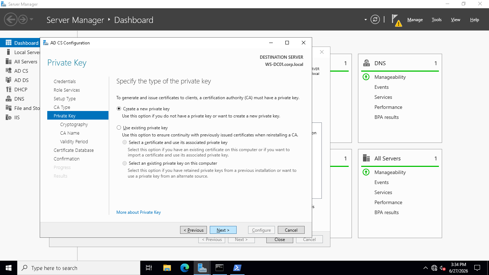

---

### Screenshot 10 – Cryptography Configuration

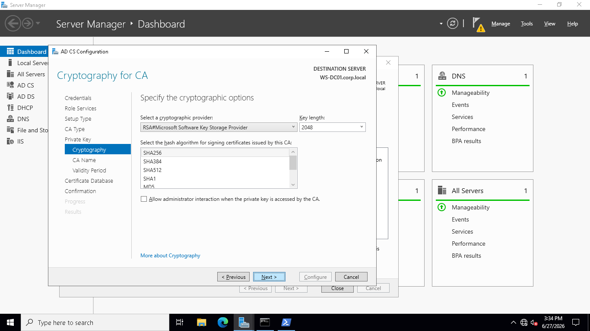

---

### Screenshot 11 – Certification Authority Name

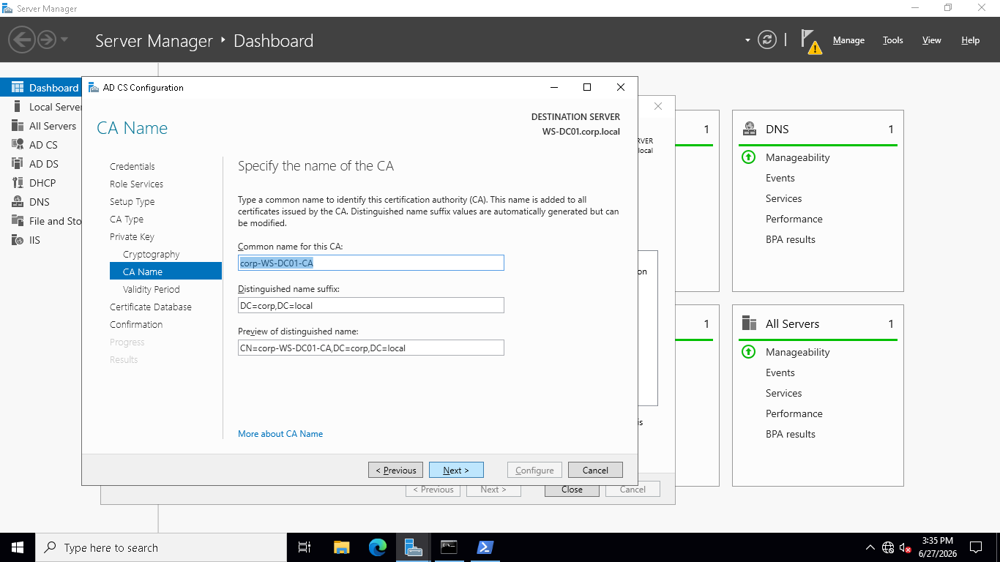

---

### Screenshot 12 – Certification Authority Validity Period

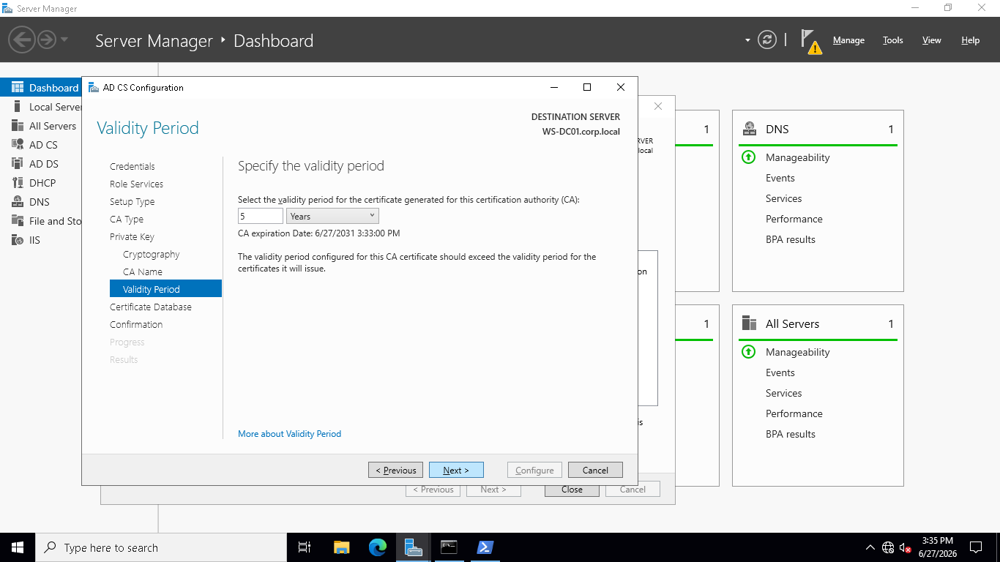

---

### Screenshot 13 – Active Directory Certificate Services Configuration Summary

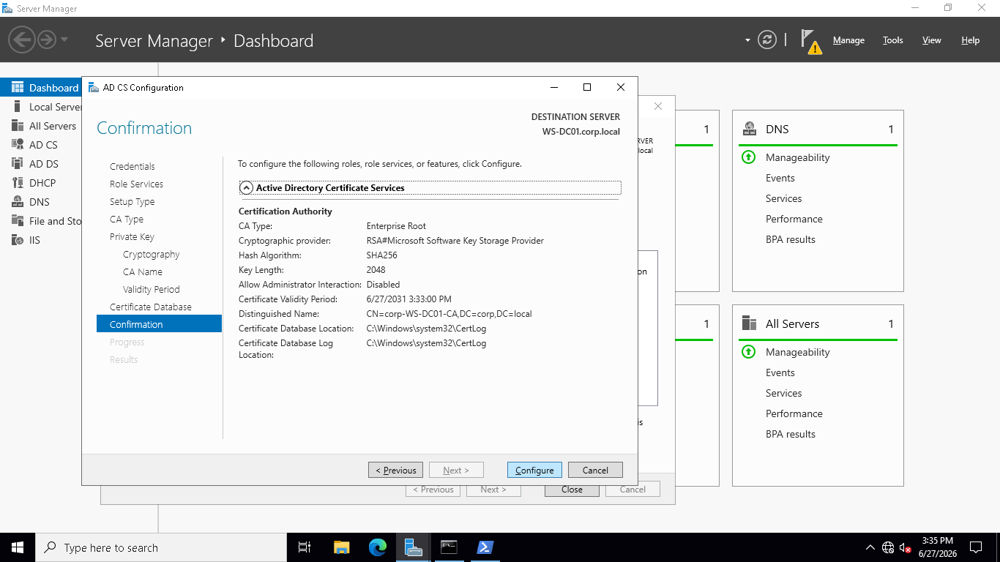

---

### Screenshot 14 – Active Directory Certificate Services Configuration Successful

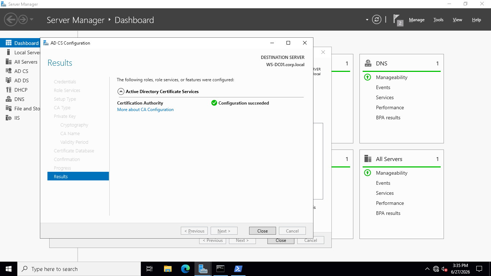

---

### Screenshot 15 – Certification Authority Management Console

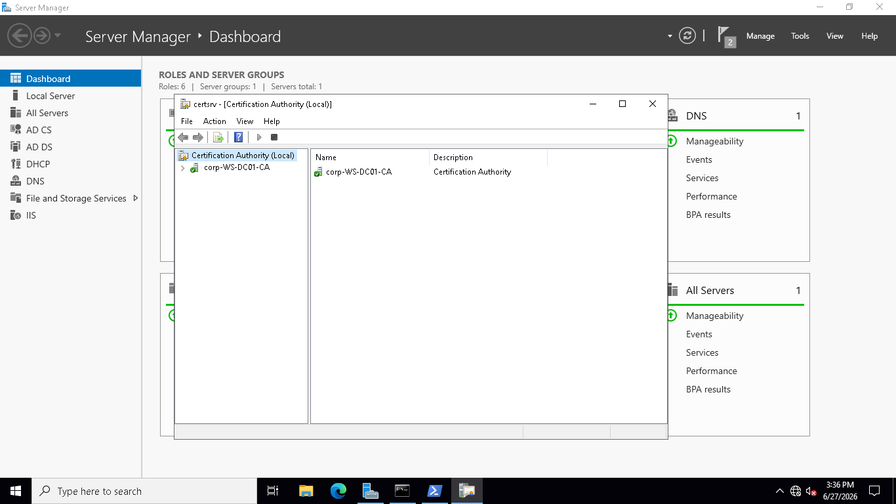

---

## Phase 2 Results

The Enterprise Root Certification Authority was successfully deployed and integrated with Active Directory Domain Services.

A trusted enterprise Public Key Infrastructure was established, including a newly generated Certification Authority private key, enterprise cryptographic configuration, Active Directory integration, and a fully operational Certification Authority management console.

The PKI environment is now prepared for certificate template publication and certificate lifecycle administration.

---

## Skills Demonstrated

- Enterprise Public Key Infrastructure Deployment
- Enterprise Root Certification Authority Configuration
- Microsoft PKI Administration
- Cryptographic Configuration Management
- Active Directory Integration
- Certification Authority Administration
- Enterprise Security Infrastructure Deployment

---

The successful deployment of the Enterprise Root Certification Authority establishes the trust anchor for the organization's Public Key Infrastructure.

With the Certification Authority fully operational, the environment is now prepared for certificate template publication, enabling standardized certificate issuance and automated certificate enrollment throughout the Active Directory domain.

---

# Phase 3 – Certificate Template Administration

## Overview

Certificate templates define the policies, permissions, intended purposes, and enrollment settings used when issuing digital certificates within an enterprise Public Key Infrastructure.

During this phase, the available certificate templates were reviewed and the required template was published to the Enterprise Certification Authority.

Certificate templates provide standardized configuration settings that define certificate usage, enrollment permissions, cryptographic requirements, certificate validity, and subject information. Publishing the appropriate certificate template makes it available for enrollment by authorized users and computers within the Active Directory environment.

By publishing certificate templates through the Certification Authority, certificate issuance can be centrally managed while maintaining consistency and security across the enterprise.

---

## Objectives

The following objectives were completed during this phase:

- Review Certificate Templates
- Open the Certificate Templates Management Console
- Review available enterprise certificate templates
- Select the User certificate template
- Publish the User certificate template
- Verify successful template publication

---

## Environment

| Component | Value |
|-----------|-------|
| Server | WS-DC01 |
| Certification Authority | Enterprise Root CA |
| Certificate Template | User |
| Directory Service | Active Directory Domain Services |

---

# Implementation

### Step 1 – Review the Certificate Templates Node

The Certification Authority management console was opened to review the available administrative nodes.

The **Certificate Templates** node provides centralized management of templates that can be issued by the Certification Authority.

Initially, the node displayed only the management container before certificate templates were published.

---

### Step 2 – Open the Certificate Templates Console

The Certificate Templates management console was launched to review all certificate templates available within Active Directory.

This console provides administrators with access to Microsoft's built-in certificate templates as well as any customized templates created for enterprise-specific requirements.

Certificate templates define enrollment permissions, certificate purposes, cryptographic settings, renewal behavior, and certificate validity periods.

---

### Step 3 – Review Available Certificate Templates

The available certificate templates were reviewed to identify templates appropriate for enterprise certificate enrollment.

Windows Server includes numerous predefined templates supporting user authentication, computer authentication, smart cards, web servers, domain controllers, and other enterprise services.

Reviewing available templates ensures that only the required templates are published by the Certification Authority.

---

### Step 4 – Select Certificate Template to Issue

The Certification Authority was configured to publish a certificate template by selecting the **Certificate Template to Issue** option.

Publishing templates through the Certification Authority makes them available for enrollment by authorized security principals while maintaining centralized administrative control.

---

### Step 5 – Publish the User Certificate Template

The built-in **User** certificate template was selected and published.

The User certificate template supports user authentication, digital signatures, secure email, and other identity-related certificate functions commonly required within Active Directory environments.

Publishing this template prepares the Certification Authority for user certificate enrollment during the next implementation phase.

---

### Step 6 – Verify Template Publication

Following publication, the Certification Authority console was reviewed to verify that the User certificate template appeared beneath the Certificate Templates node.

Successful publication confirmed that the Certification Authority was prepared to issue user certificates to authorized domain users.

---

## Screenshots

### Screenshot 16 – Certificate Templates Node

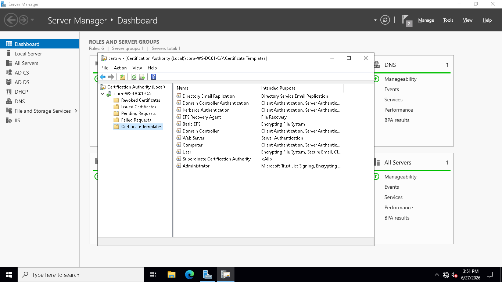

---

### Screenshot 17 – Certificate Templates Console

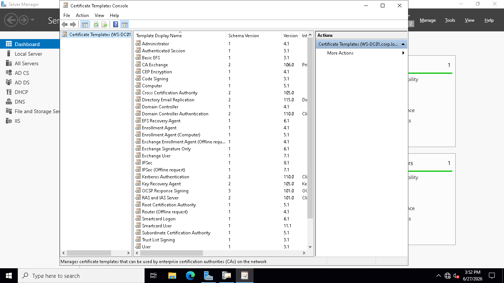

---

### Screenshot 18 – Available Certificate Templates

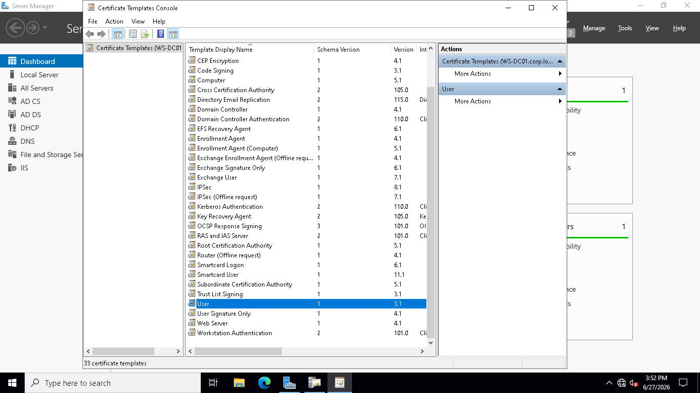

---

### Screenshot 19 – Certificate Template to Issue

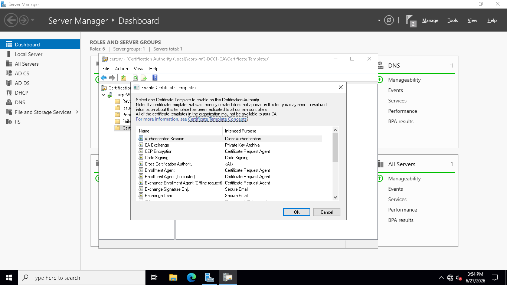

---

### Screenshot 20 – User Certificate Template Selected

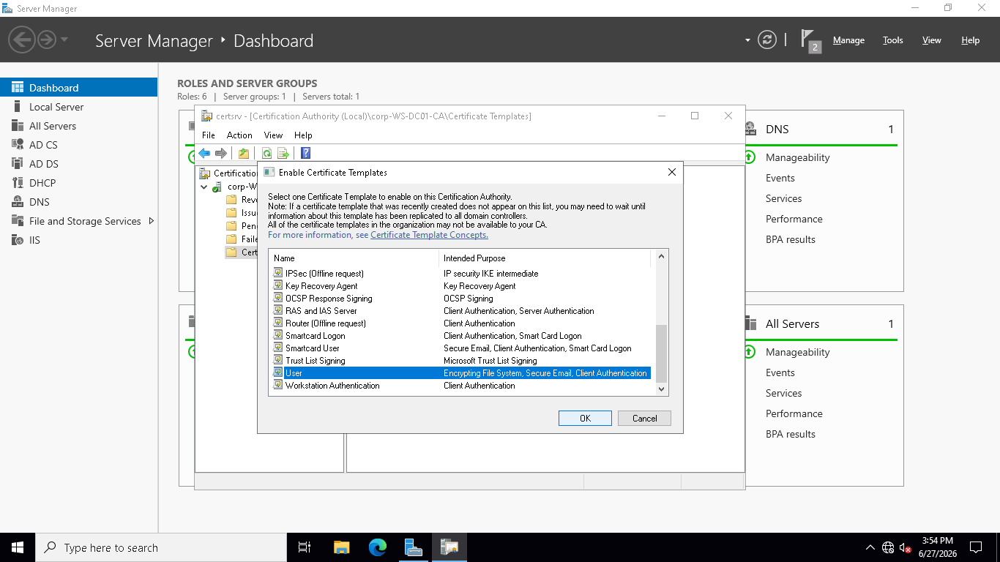

---

### Screenshot 21 – User Certificate Template Published

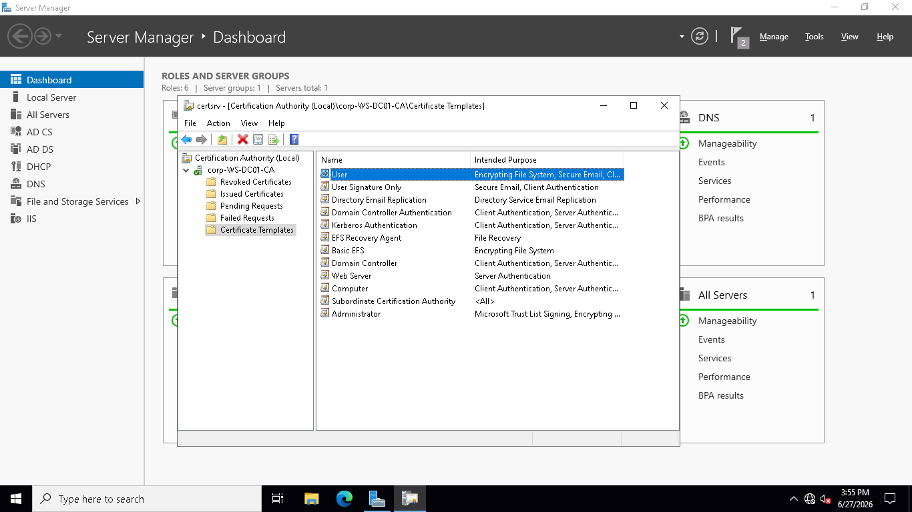

---

## Phase 3 Results

The required certificate template was successfully published to the Enterprise Root Certification Authority.

Publishing the User certificate template enables authorized Active Directory users to request and receive certificates based on standardized enterprise enrollment policies.

The Certification Authority is now prepared to support automated certificate enrollment through Active Directory Group Policy.

---

## Skills Demonstrated

- Certificate Template Administration
- Enterprise PKI Management
- Certification Authority Administration
- Certificate Policy Management
- Active Directory Integration
- Enterprise Certificate Lifecycle Preparation

---

Publishing certificate templates establishes the certificate policies used throughout the enterprise Public Key Infrastructure.

With the required template available for enrollment, the next phase focuses on configuring Certificate Auto-Enrollment through Group Policy to automate certificate deployment across the Active Directory environment.

---

# Phase 4 – Certificate Auto-Enrollment Configuration

## Overview

Certificate Auto-Enrollment simplifies certificate lifecycle management by allowing Active Directory users and computers to automatically enroll, renew, and update certificates without manual administrative intervention.

During this phase, Group Policy was configured to enable automatic certificate enrollment for domain users. Auto-enrollment significantly reduces administrative overhead while ensuring that certificates are deployed consistently according to enterprise security policies.

The policy configuration was applied through Active Directory Group Policy and validated by refreshing Group Policy settings on the server before verifying successful certificate enrollment.

---

## Objectives

The following objectives were completed during this phase:

- Review Group Policy Management
- Configure Certificate Auto-Enrollment
- Enable automatic certificate enrollment
- Apply Group Policy changes
- Refresh Group Policy settings
- Verify certificate store population

---

## Environment

| Component | Value |
|-----------|-------|
| Server | WS-DC01 |
| Group Policy | Default Domain Policy |
| Configuration Area | Public Key Policies |
| Enrollment Method | Automatic Certificate Enrollment |

---

# Implementation

### Step 1 – Open Group Policy Management

The Group Policy Management Console was opened to configure enterprise certificate enrollment policies.

Group Policy provides centralized administration of security settings, user configurations, and certificate services throughout the Active Directory environment.

---

### Step 2 – Edit the Default Domain Policy

The **Default Domain Policy** was opened for modification.

Using an existing domain-wide policy ensures that certificate enrollment settings are applied consistently to all applicable domain users and computers.

---

### Step 3 – Configure Certificate Auto-Enrollment Policy

Within the Public Key Policies section, the Certificate Services Client – Auto-Enrollment policy was opened for configuration.

This policy controls whether certificates are enrolled automatically and whether certificate renewals and updates occur without administrator intervention.

---

### Step 4 – Enable Certificate Auto-Enrollment

Automatic certificate enrollment was enabled by configuring the policy to renew expired certificates, update pending certificates, and remove revoked certificates where applicable.

Enabling these options allows Active Directory to automatically manage certificate enrollment and renewal, reducing manual administrative effort while maintaining compliance with enterprise certificate policies.

---

### Step 5 – Refresh Group Policy

Following policy configuration, Group Policy was refreshed to apply the new certificate enrollment settings.

Refreshing Group Policy ensures that certificate enrollment policies become active without requiring a system restart.

---

### Step 6 – Verify Certificate Store

After Group Policy processing completed successfully, the Windows certificate store was reviewed to verify that certificate enrollment settings had been applied successfully.

The successful presence of enterprise-issued certificates confirmed that Auto-Enrollment was functioning correctly and that communication between Active Directory and the Certification Authority was operating as expected.

---

## Screenshots

### Screenshot 22 – Group Policy Management Console

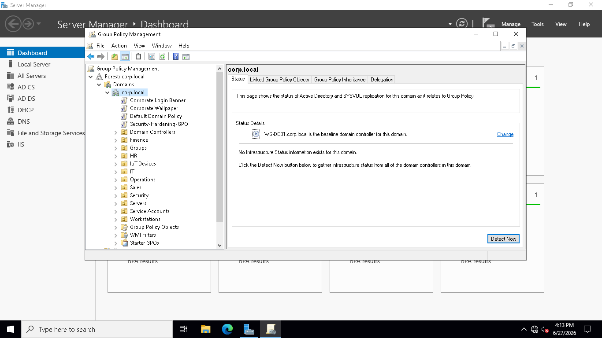

---

### Screenshot 23 – Default Domain Policy

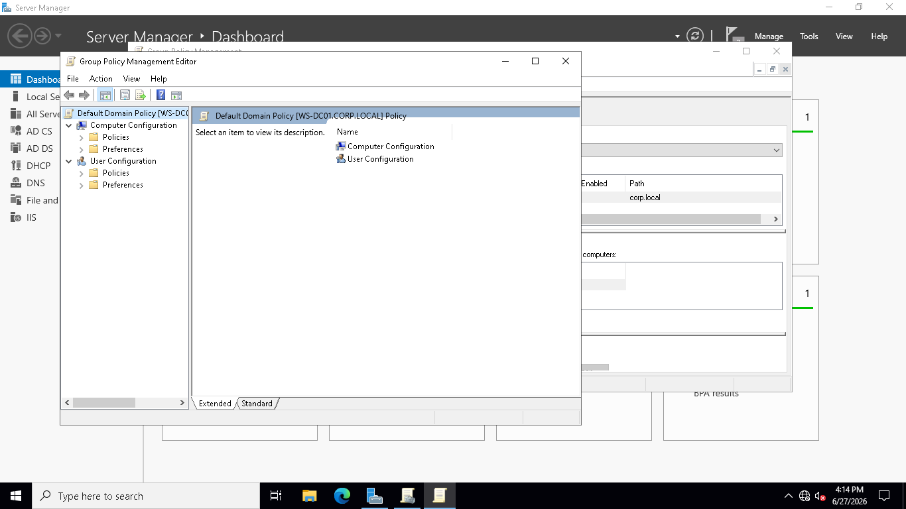

---

### Screenshot 24 – Certificate Auto-Enrollment Policy

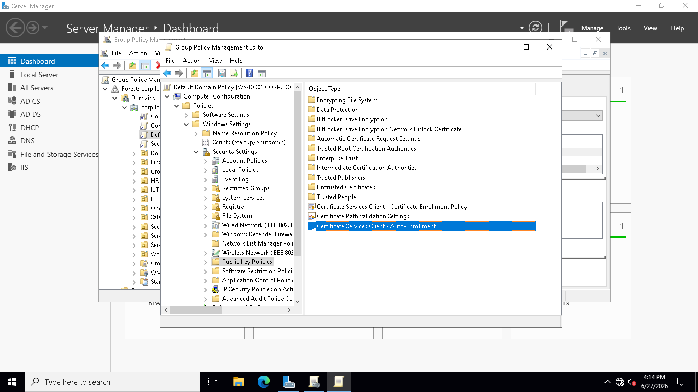

---

### Screenshot 25 – Auto-Enrollment Enabled

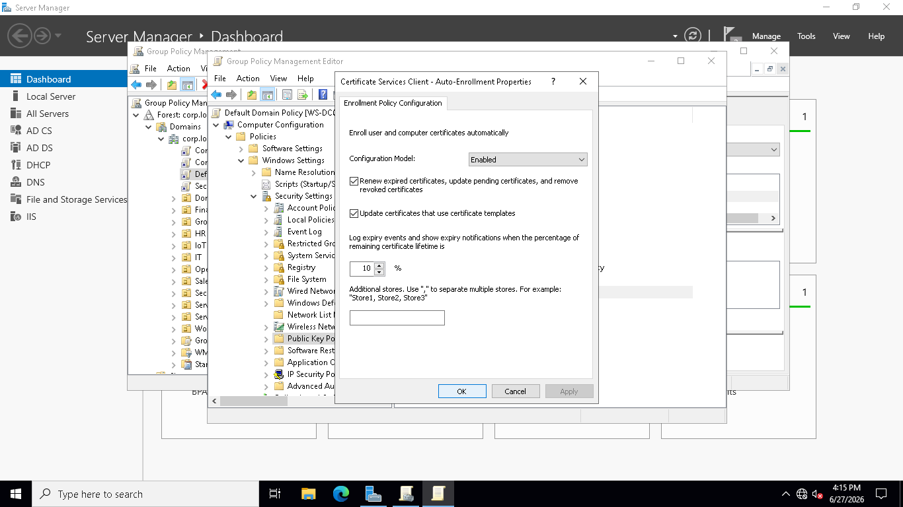

---

### Screenshot 26 – Group Policy Update

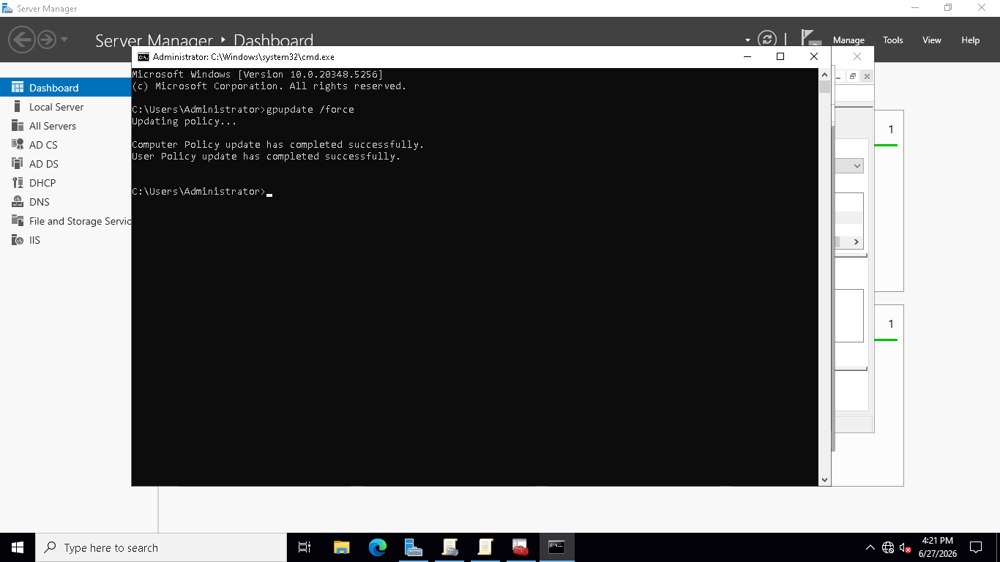

---

### Screenshot 27 – Certificate Store Verification

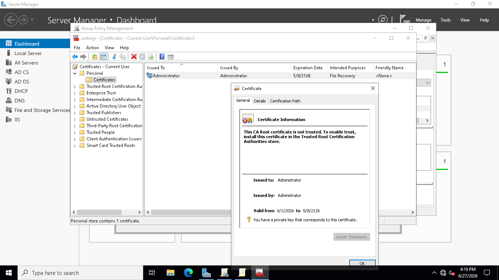

---

## Phase 4 Results

Certificate Auto-Enrollment was successfully configured through Active Directory Group Policy.

The updated Group Policy settings enabled automatic certificate enrollment for authorized domain users, providing centralized certificate deployment and lifecycle management without requiring manual certificate requests.

The PKI environment is now fully prepared for user certificate enrollment and verification.
## Skills Demonstrated

- Group Policy Administration
- Certificate Auto-Enrollment Configuration
- Enterprise Policy Management
- Active Directory Security Administration
- Public Key Infrastructure Management
- Enterprise Certificate Deployment

---

The successful implementation of Certificate Auto-Enrollment enables automated certificate provisioning throughout the Active Directory environment.

By integrating Certificate Services with Group Policy, certificate lifecycle management becomes centralized, reducing administrative effort while improving security, consistency, and operational efficiency.

The Public Key Infrastructure is now prepared to issue certificates to authorized domain users through the Enterprise Certification Authority.

---

# Phase 5 – User Certificate Enrollment

## Overview

With the Enterprise Root Certification Authority operational and Certificate Auto-Enrollment configured through Group Policy, the next stage focused on requesting and issuing a user certificate.

Certificate enrollment validates the functionality of the Public Key Infrastructure by demonstrating that authorized users can successfully obtain certificates issued by the Enterprise Certification Authority.

During this phase, the Certificates Management Console was used to initiate certificate enrollment, communicate with Active Directory Certificate Services, request a certificate based on the published User template, and verify successful certificate issuance.

Finally, the Certification Authority console was reviewed to confirm that the issued certificate had been recorded within the Certification Authority database.

---

## Objectives

The following objectives were completed during this phase:

- Open the Certificates Management Console
- Launch the Certificate Enrollment Wizard
- Use the Active Directory Enrollment Policy
- Request a User certificate
- Complete certificate enrollment
- Verify the issued certificate
- Validate certificate issuance from the Certification Authority

---

## Environment

| Component | Value |
|-----------|-------|
| Server | WS-DC01 |
| Enrollment Method | Active Directory Enrollment Policy |
| Certificate Template | User |
| Certificate Store | Current User |
| Certification Authority | Enterprise Root CA |

---

# Implementation

### Step 1 – Open the Certificates Management Console

The Microsoft Management Console (MMC) was used to access the Certificates snap-in for the current user.

The Certificates console provides centralized administration of personal certificates, trusted root certification authorities, intermediate certification authorities, and certificate enrollment operations.

This console is commonly used by administrators to review, request, renew, export, and validate digital certificates.

---

### Step 2 – Launch the Certificate Enrollment Wizard

The Certificate Enrollment Wizard was launched from the Personal certificate store.

The wizard automatically communicates with Active Directory to identify available enrollment policies and certificate templates that are published by the Enterprise Certification Authority.

This process provides a controlled and standardized method for requesting enterprise certificates.

---

### Step 3 – Select the Active Directory Enrollment Policy

The **Active Directory Enrollment Policy** was selected as the enrollment source.

This policy enables domain users to request certificates directly from the Enterprise Certification Authority using Active Directory authentication and published certificate templates.

Selecting the Active Directory Enrollment Policy ensures that certificate requests comply with enterprise enrollment policies and security requirements.

---

### Step 4 – Select the User Certificate Template

The published **User** certificate template was selected for enrollment.

The User certificate template supports user authentication, digital signatures, encryption, and secure communications within the enterprise environment.

Because the template had already been published by the Certification Authority, it became immediately available for enrollment through the Active Directory Enrollment Policy.

---

### Step 5 – Complete Certificate Enrollment

The certificate request was submitted to the Enterprise Certification Authority.

After validating the request and confirming that enrollment requirements had been satisfied, the Certification Authority successfully issued the user certificate.

Successful enrollment confirms that communication between Active Directory, Group Policy, Certificate Templates, and the Certification Authority is functioning correctly.

---

### Step 6 – Verify the Issued User Certificate

Following successful enrollment, the Personal certificate store was reviewed to verify that the issued certificate appeared within the current user's certificate container.

The certificate contained the expected subject information and was issued by the Enterprise Root Certification Authority, confirming successful certificate issuance.

Verification of the certificate store also confirmed that Certificate Auto-Enrollment and enterprise certificate services were functioning as expected.

---

### Step 7 – Verify Issued Certificates in the Certification Authority

The Certification Authority management console was reviewed to verify that the newly issued certificate appeared within the **Issued Certificates** container.

Successful registration within the Certification Authority database confirms that the certificate has been formally issued and is now managed by the Enterprise Public Key Infrastructure.

This administrative verification provides additional confirmation that certificate issuance was completed successfully.

---

## Screenshots

### Screenshot 28 – Certificates Management Console

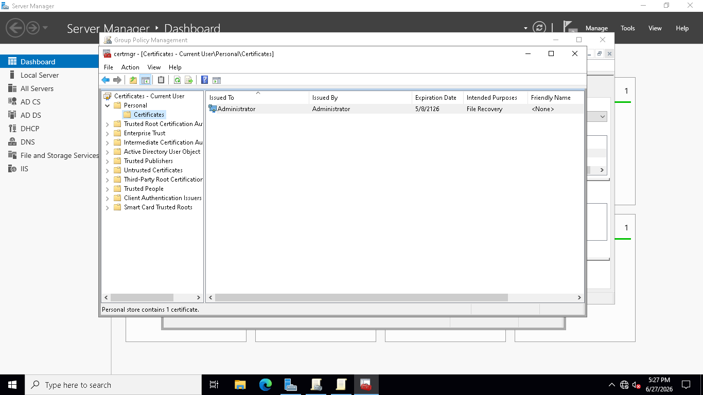

---

### Screenshot 29 – Certificate Enrollment Wizard

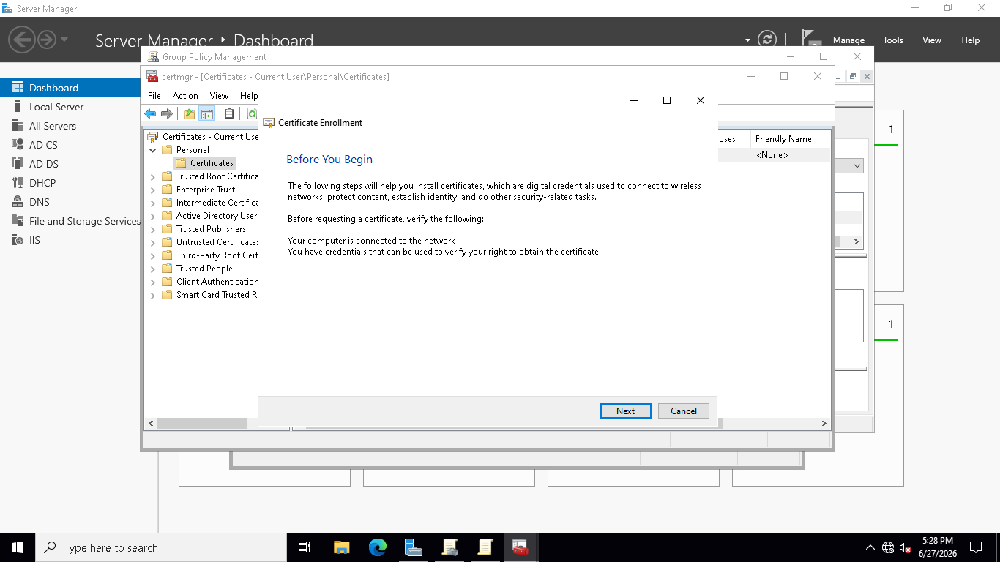

---

### Screenshot 30 – Active Directory Enrollment Policy

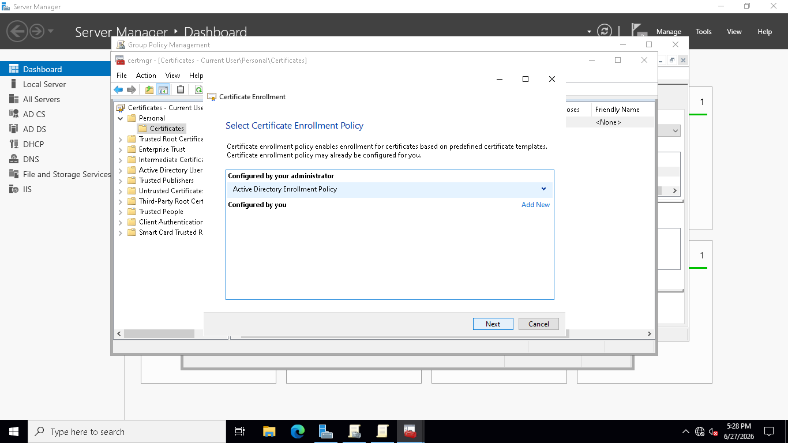

---

### Screenshot 31 – User Certificate Selected

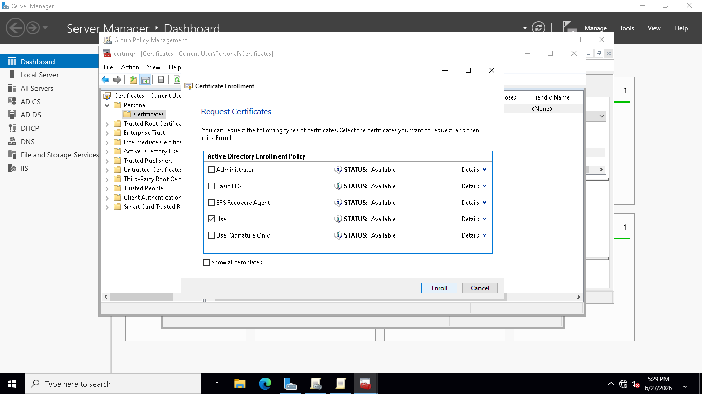

---

### Screenshot 32 – Certificate Enrollment Successful

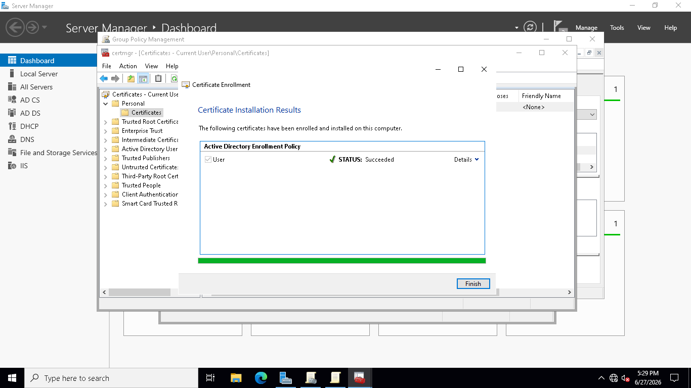

---

### Screenshot 33 – Issued User Certificate

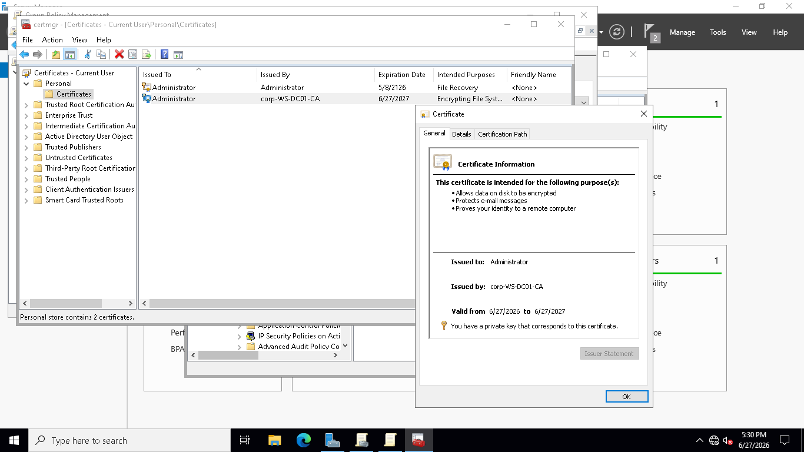

---

### Screenshot 34 – Issued Certificates Console

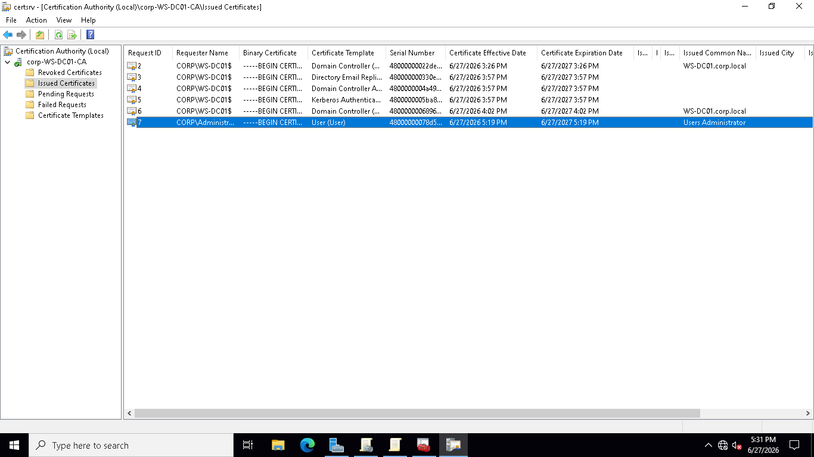

---

## Phase 5 Results

A user certificate was successfully requested, issued, and validated using the Enterprise Root Certification Authority.

The successful enrollment confirms that Active Directory Certificate Services, Certificate Templates, Group Policy, and Certificate Auto-Enrollment are fully integrated and functioning correctly.

The Certification Authority database accurately recorded the issued certificate, demonstrating successful certificate lifecycle initiation within the enterprise Public Key Infrastructure.

---

## Skills Demonstrated

- Enterprise Certificate Enrollment
- Certification Authority Administration
- Microsoft Management Console (MMC)
- Active Directory Enrollment Policy
- Certificate Lifecycle Management
- Public Key Infrastructure Validation
- Enterprise Identity Management

---

Successful certificate enrollment demonstrates that the Enterprise Public Key Infrastructure is fully operational and capable of issuing trusted digital certificates to authorized Active Directory users.

The next phase focuses on certificate lifecycle management by demonstrating certificate revocation and publishing an updated Certificate Revocation List (CRL).

---

# Phase 6 – Certificate Revocation and Certificate Revocation List (CRL) Management

## Overview

Certificate revocation is a critical component of Public Key Infrastructure because it enables administrators to invalidate certificates before their scheduled expiration date whenever trust can no longer be maintained.

Reasons for certificate revocation may include compromised private keys, user account termination, device decommissioning, security incidents, or administrative policy requirements.

During this phase, an issued user certificate was revoked to demonstrate certificate lifecycle management within an enterprise Public Key Infrastructure.

After revocation, a new **Certificate Revocation List (CRL)** was published to ensure that all domain members and PKI-enabled applications could identify the revoked certificate as no longer trusted.

Certificate revocation is one of the most important administrative responsibilities in a PKI environment because it prevents compromised or invalid certificates from being accepted during authentication or secure communications.

---

## Objectives

The following objectives were completed during this phase:

- Review issued certificates
- Revoke an issued certificate
- Specify a revocation reason
- Verify certificate revocation
- Publish a new Certificate Revocation List (CRL)
- Validate successful CRL publication

---

## Environment

| Component | Value |
|-----------|-------|
| Server | WS-DC01 |
| Certification Authority | Enterprise Root CA |
| Administrative Tool | Certification Authority Console |
| Revocation Method | Certification Authority |
| Validation Method | Certificate Revocation List (CRL) |

---

# Implementation

### Step 1 – Review Issued Certificates

The **Issued Certificates** container was reviewed from the Certification Authority management console.

This administrative review confirms that the certificate exists within the Certification Authority database before any lifecycle management operations are performed.

Reviewing issued certificates also provides administrators with certificate serial numbers, request identifiers, expiration dates, and issuance information.

---

### Step 2 – Initiate Certificate Revocation

The required certificate was selected from the Issued Certificates container.

The **Revoke Certificate** administrative action was initiated to permanently invalidate the selected certificate before its expiration date.

Revocation immediately changes the trust status of the certificate within the Certification Authority database.

---

### Step 3 – Specify the Revocation Reason

A revocation reason was selected during the revocation process.

Windows Server supports several revocation reasons including:

- Key Compromise
- CA Compromise
- Affiliation Changed
- Superseded
- Cease of Operation
- Certificate Hold

Selecting an appropriate revocation reason improves auditability and provides additional information for certificate validation systems.

---

### Step 4 – Verify Revoked Certificates

After completing the revocation process, the **Revoked Certificates** container was reviewed.

The revoked certificate appeared within the Certification Authority database, confirming that its trust status had been successfully updated.

The Certification Authority now recognizes the certificate as invalid for future authentication or secure communications.

---

### Step 5 – Publish a New Certificate Revocation List

Following certificate revocation, a new Certificate Revocation List (CRL) was published.

Publishing a new CRL distributes updated revocation information throughout the Public Key Infrastructure, allowing clients to verify whether certificates remain trusted.

This step is essential because certificate revocation is not recognized by clients until an updated CRL becomes available.

---

### Step 6 – Verify Successful CRL Publication

After publication completed successfully, the Certification Authority confirmed that a new Certificate Revocation List had been generated.

This verification ensures that all PKI-aware systems can retrieve current revocation information during certificate validation.

Successful CRL publication completes the certificate revocation lifecycle.

---

## Screenshots

### Screenshot 35 – Issued Certificates Before Revocation

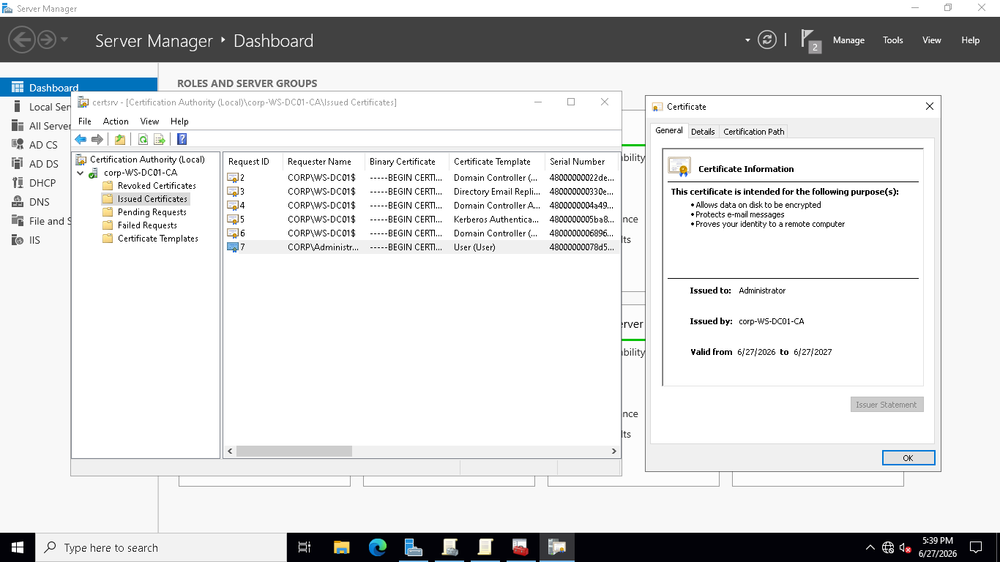

---

### Screenshot 36 – Revoke Certificate

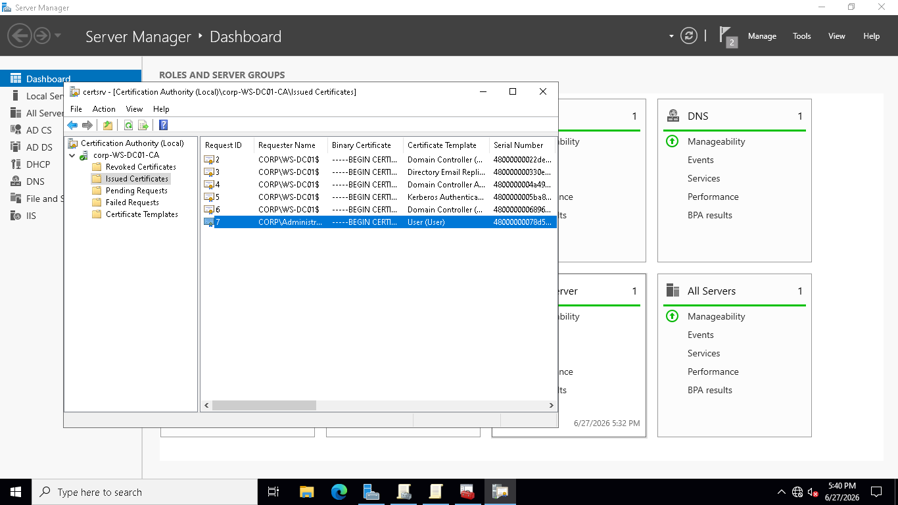

---

### Screenshot 37 – Certificate Revocation Reason

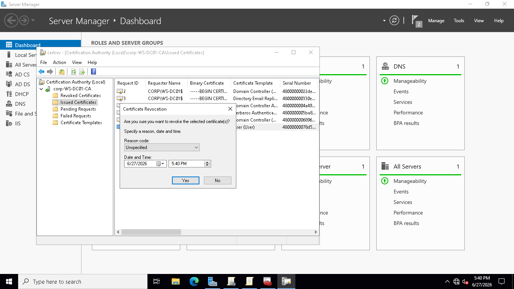

---

### Screenshot 38 – Revoked Certificates

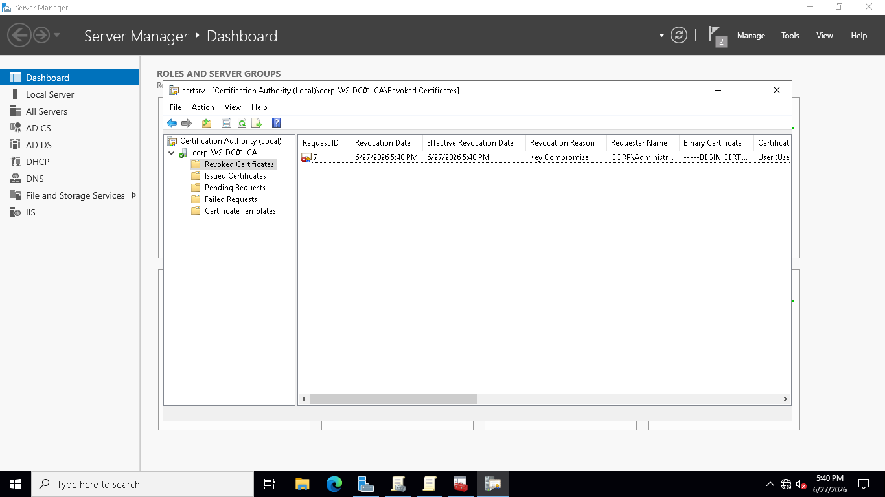

---

### Screenshot 39 – Publish New Certificate Revocation List

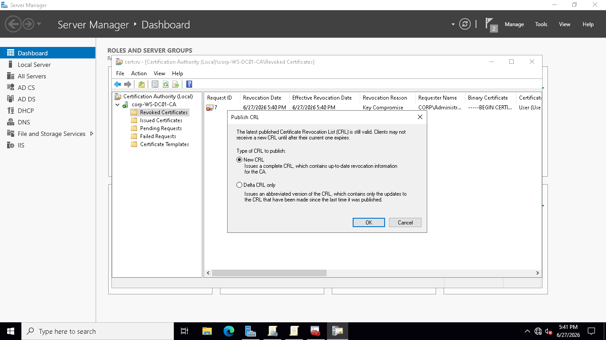

---

### Screenshot 40 – Certificate Revocation List Published

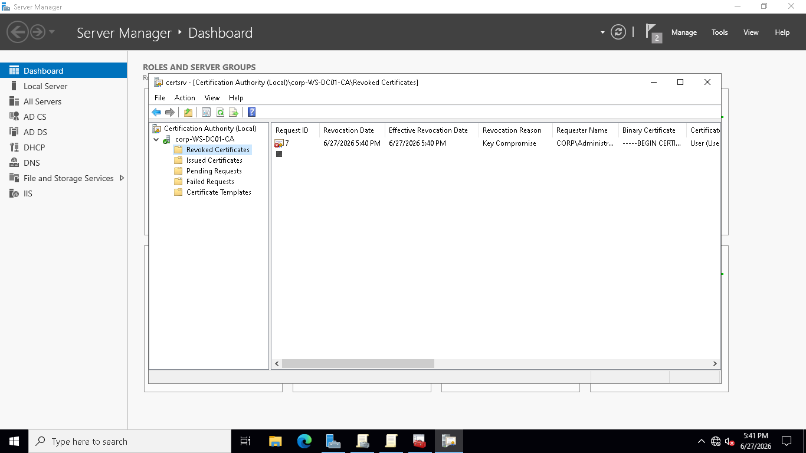

---

## Phase 6 Results

The issued user certificate was successfully revoked using the Certification Authority management console.

A new Certificate Revocation List (CRL) was published, ensuring that updated revocation information became available throughout the enterprise Public Key Infrastructure.

The successful completion of this phase demonstrates effective certificate lifecycle management and confirms that the Enterprise Certification Authority can properly invalidate certificates that should no longer be trusted.

---

## Skills Demonstrated

- Certificate Lifecycle Management
- Certificate Revocation Administration
- Certificate Revocation List (CRL) Management
- Enterprise PKI Administration
- Certification Authority Operations
- Microsoft PKI Security Management

---

Certificate revocation represents an essential operational function within every enterprise Public Key Infrastructure.

With certificate issuance and revocation successfully validated, the next phase focuses on protecting the Certification Authority by performing a secure backup of the CA database, private key, and configuration information.

---

# Phase 7 – Certification Authority Backup

## Overview

Protecting the Certification Authority is one of the most critical responsibilities of a PKI administrator.

The Certification Authority stores the private key, certificate database, issued certificate records, revoked certificate information, and configuration settings required to maintain trust throughout the enterprise.

During this phase, the Certification Authority Backup Wizard was used to create a secure backup of the Certification Authority database and private key.

The backup process ensures that the Certification Authority can be restored following hardware failure, operating system corruption, disaster recovery scenarios, or administrative migration activities.

---

## Objectives

The following objectives were completed during this phase:

- Launch the Certification Authority Backup Wizard
- Select backup components
- Configure the backup destination
- Protect the backup using a password
- Complete the Certification Authority backup
- Verify backup files

---

## Environment

| Component | Value |
|-----------|-------|
| Server | WS-DC01 |
| Backup Tool | Certification Authority Backup Wizard |
| Backup Components | CA Database and Private Key |
| Protection Method | Password Protected Backup |
| Certification Authority | Enterprise Root CA |

---

# Implementation

### Step 1 – Launch the Certification Authority Backup Wizard

The backup process was initiated from the Certification Authority management console.

The built-in Backup Wizard provides administrators with a secure method for protecting Certification Authority data while maintaining compatibility with future restoration procedures.

---

### Step 2 – Open the Backup Wizard

The Certification Authority Backup Wizard was launched to begin the backup operation.

The wizard guides administrators through selecting backup components, specifying storage locations, and protecting sensitive PKI information using encryption and password protection.

---

### Step 3 – Select Backup Components

The required backup components were selected.

The backup included:

- Certification Authority database
- Certification Authority private key
- Certificate database logs (where applicable)

Backing up both the database and private key ensures that complete Certification Authority functionality can be restored if required.

---

### Step 4 – Specify the Backup Location

A secure backup destination was selected.

Choosing an appropriate storage location ensures that backup files remain protected while remaining accessible for disaster recovery operations.

Enterprise environments commonly store Certification Authority backups on secured storage separate from the Certification Authority itself.

---

### Step 5 – Protect the Backup

A password was assigned to encrypt and protect the Certification Authority private key contained within the backup.

Protecting private key material is essential because unauthorized access to the Certification Authority private key could compromise the trust of the entire Public Key Infrastructure.

---

### Step 6 – Complete the Backup

The backup process was executed successfully.

Windows Server exported the Certification Authority database and encrypted private key to the selected backup location while confirming successful completion of the operation.

---

### Step 7 – Verify Backup Files

The backup location was reviewed to verify that the required backup files had been created successfully.

Verification confirmed that the Certification Authority backup was complete and available for future restoration if required.

---

## Screenshots

### Screenshot 41 – Certification Authority Backup

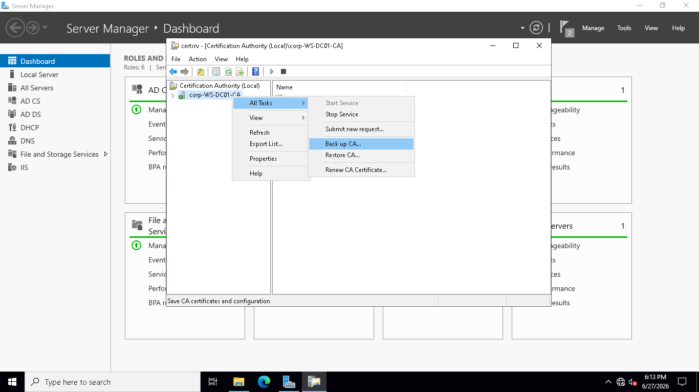

---

### Screenshot 42 – Certification Authority Backup Wizard

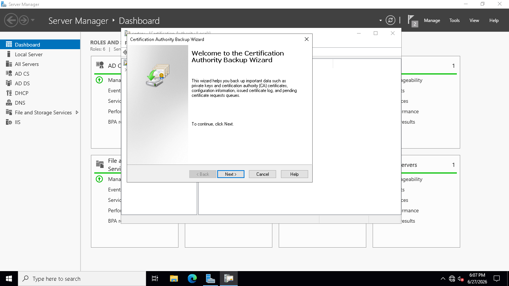

---

### Screenshot 43 – Backup Components Selected

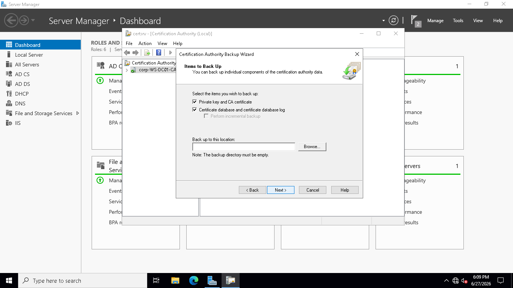

---

### Screenshot 44 – Backup Location


---

### Screenshot 45 – Backup Password

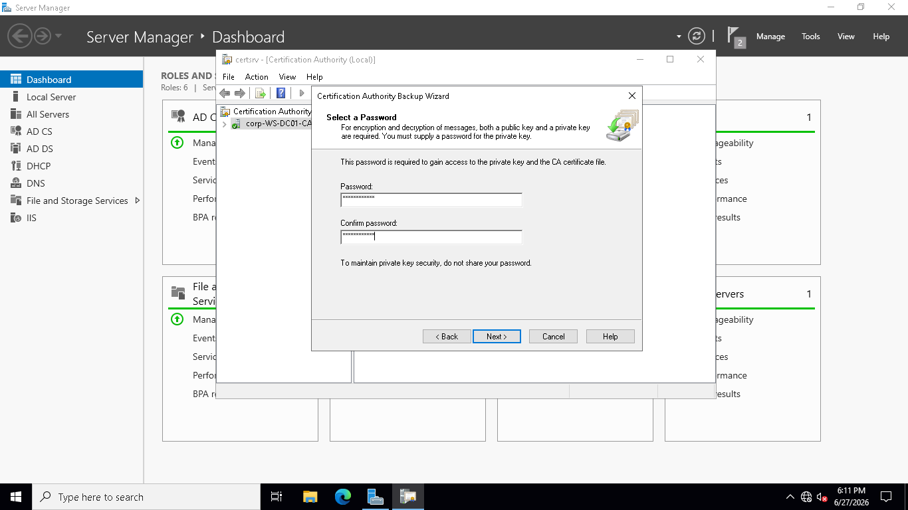

---

### Screenshot 46 – Certification Authority Backup Successful

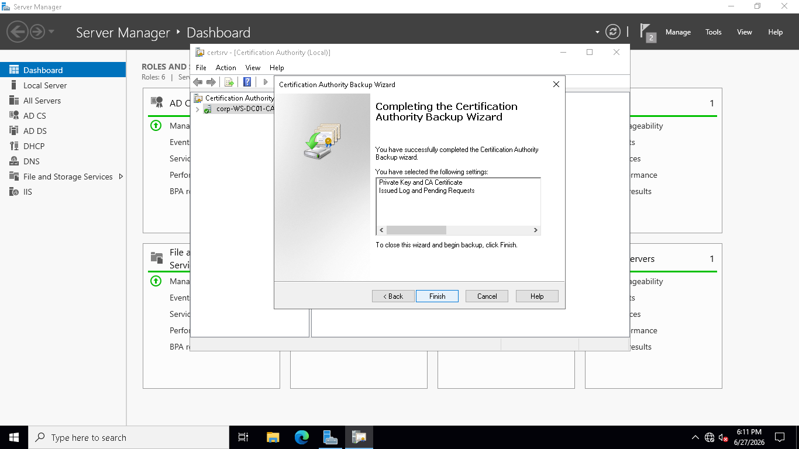

---

### Screenshot 47 – Certification Authority Backup Files


---

## Phase 7 Results

The Enterprise Root Certification Authority was successfully backed up using the built-in Certification Authority Backup Wizard.

The backup includes the Certification Authority database and encrypted private key, providing a secure recovery point for future disaster recovery or migration scenarios.

The successful completion of this phase demonstrates enterprise backup procedures for Microsoft Public Key Infrastructure.
## Skills Demonstrated

- Certification Authority Backup Administration
- Enterprise PKI Disaster Recovery
- Microsoft Certification Authority Management
- Secure Private Key Protection
- Backup Verification
- Enterprise Infrastructure Protection

---

Maintaining secure backups of the Certification Authority is an essential operational requirement for every enterprise Public Key Infrastructure.

A verified backup ensures that certificate services can be restored efficiently following hardware failures, system corruption, migration activities, or disaster recovery scenarios while preserving the integrity of the enterprise trust hierarchy.

The next phase focuses on validating the Enterprise Public Key Infrastructure using PowerShell administrative tools and CertUtil command-line utilities.

---

# Phase 8 – Enterprise PKI Validation Using PowerShell and CertUtil

## Overview

Following successful deployment and backup of the Enterprise Root Certification Authority, the Public Key Infrastructure was validated using Microsoft's native administrative tools.

PowerShell and CertUtil provide administrators with powerful command-line interfaces for verifying Certification Authority health, checking installed server roles, validating Certificate Services, and collecting detailed Public Key Infrastructure information.

Using command-line tools complements graphical administration by providing automation capabilities, scripting support, and advanced troubleshooting features commonly used in enterprise environments.

This validation confirms that the Certification Authority services are operational and that the enterprise PKI infrastructure is functioning correctly.

---

## Objectives

The following objectives were completed during this phase:

- Launch PowerShell with administrative privileges
- Verify the Certificate Services service status
- Confirm AD CS feature installation
- Validate Certification Authority connectivity
- Retrieve Certification Authority configuration information
- Examine Certification Authority details using CertUtil

---

## Environment

| Component | Value |
|-----------|-------|
| Server | WS-DC01 |
| Administrative Tools | Windows PowerShell, CertUtil |
| Certification Authority | Enterprise Root CA |
| Validation Method | Command-Line Administration |

---

# Implementation

### Step 1 – Launch Windows PowerShell

Windows PowerShell was opened using administrative privileges.

PowerShell provides administrators with a comprehensive scripting and automation platform capable of managing virtually every Windows Server component, including Active Directory Certificate Services.

Running PowerShell as an administrator ensures sufficient permissions to retrieve Certification Authority information and execute administrative validation commands.

---

### Step 2 – Verify the Certificate Services Service

The status of the **Certificate Services (CertSvc)** service was verified using PowerShell.

The CertSvc service is responsible for processing certificate requests, issuing certificates, maintaining the Certification Authority database, and publishing Certificate Revocation Lists.

A running service confirms that the Certification Authority is operational and capable of servicing certificate requests.

---

### Step 3 – Verify Active Directory Certificate Services Installation

PowerShell was used to confirm that the Active Directory Certificate Services role remained installed and operational.

Verifying installed Windows Server roles provides additional assurance that the required PKI components are present and functioning correctly following deployment and configuration.

---

### Step 4 – Validate Certification Authority Connectivity

The **CertUtil -ping** command was executed to verify communication with the Enterprise Certification Authority.

This validation confirms that administrative tools can successfully communicate with Certificate Services and that the Certification Authority is responding to management requests.

Connectivity verification is commonly performed during administrative troubleshooting and health assessments.

---

### Step 5 – Review Certification Authority Information

The **CertUtil -cainfo** command was executed to retrieve detailed information about the Certification Authority configuration.

The output includes information regarding the Certification Authority name, certificate validity, cryptographic configuration, database configuration, and operational status.

Reviewing this information provides administrators with an effective method for validating PKI configuration.

---

### Step 6 – Display Certification Authority Details

The **CertUtil -dump** command was executed to display comprehensive information regarding the Certification Authority and associated certificates.

This command provides low-level details frequently used for advanced troubleshooting, auditing, and enterprise PKI validation.

Successful execution confirms that the Certification Authority is functioning correctly and that certificate information can be retrieved through Microsoft's native administrative utilities.

---

## Screenshots

### Screenshot 48 – Windows PowerShell (Administrator)


---

### Screenshot 49 – Certificate Services Running

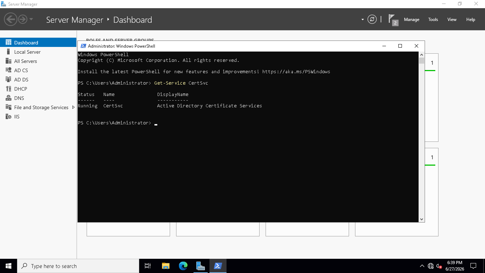

---

### Screenshot 50 – AD CS Feature Installed

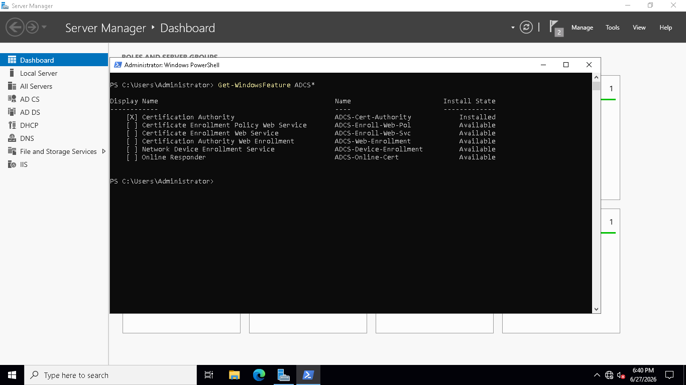

---

### Screenshot 51 – CertUtil Connectivity Test

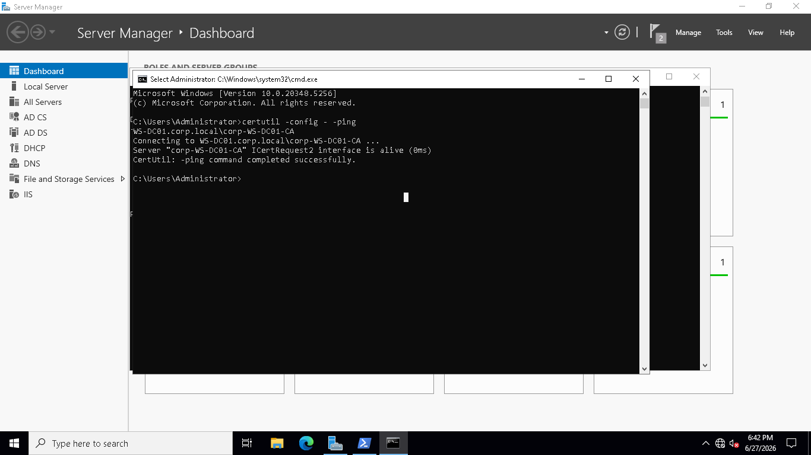

---

### Screenshot 52 – Certification Authority Information

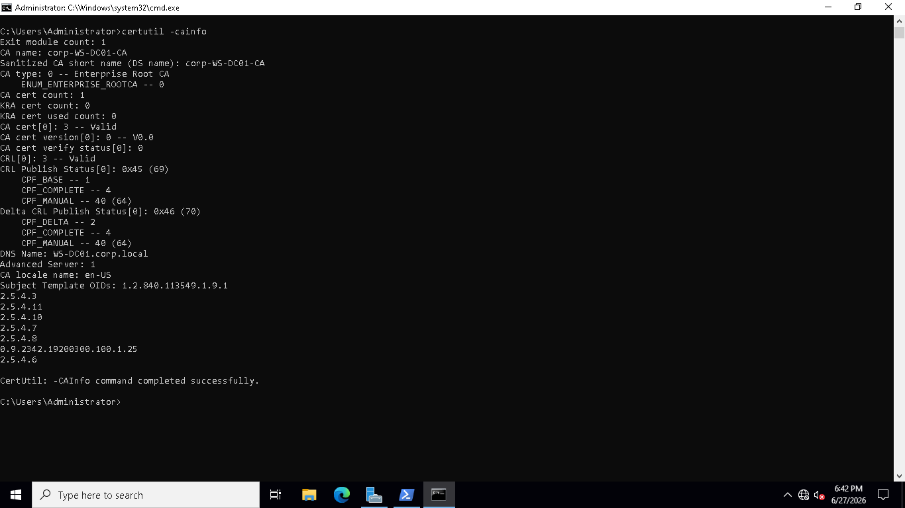

---

### Screenshot 53 – CertUtil Dump Output

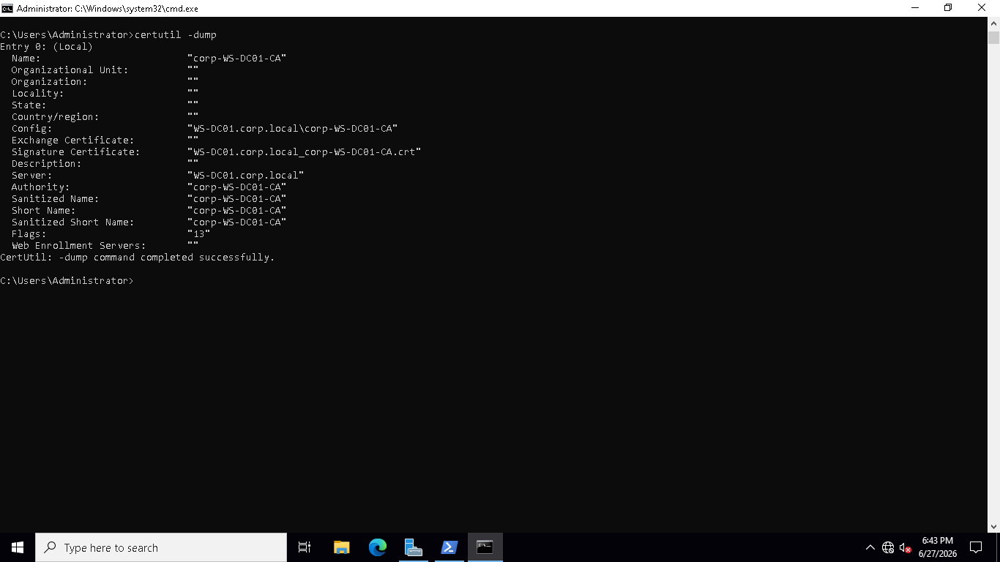

---

## Phase 8 Results

The Enterprise Public Key Infrastructure was successfully validated using both PowerShell and CertUtil.

Administrative verification confirmed that Certificate Services were running correctly, Active Directory Certificate Services remained installed, Certification Authority communication was successful, and detailed PKI configuration information could be retrieved using Microsoft's native command-line tools.

These validation procedures confirm that the Certification Authority is healthy and fully operational.

---

## Skills Demonstrated

- Windows PowerShell Administration
- CertUtil Administration
- Enterprise PKI Validation
- Windows Service Administration
- Microsoft PKI Troubleshooting
- Command-Line Infrastructure Management

---

Comprehensive validation using PowerShell and CertUtil confirms that the Enterprise Root Certification Authority is operating correctly and that the deployed Public Key Infrastructure is functioning as expected.

The next phase focuses on performing a complete operational validation of the deployed PKI environment using the Certification Authority management console.

---

# Phase 9 – Enterprise PKI Operational Validation

## Overview

Following deployment, certificate issuance, certificate revocation, backup, and command-line validation, a final operational review of the Enterprise Public Key Infrastructure was performed.

Operational validation ensures that all major Certification Authority components function together as an integrated enterprise PKI solution.

During this phase, the Certification Authority management console was used to perform a comprehensive review of the deployed Public Key Infrastructure.

The review focused on verifying the operational status of the Certification Authority, confirming successful certificate issuance, validating certificate revocation records, reviewing published certificate templates, and confirming that the enterprise PKI environment was functioning as designed.

Operational validation provides administrators with confidence that the Certification Authority can support day-to-day enterprise certificate services while maintaining security, reliability, and administrative integrity.

---

## Objectives

The following objectives were completed during this phase:

- Verify Certification Authority operational status
- Review issued certificates
- Review revoked certificates
- Verify published certificate templates
- Validate Enterprise PKI functionality
- Confirm operational readiness

---

## Environment

| Component | Value |
|-----------|-------|
| Server | WS-DC01 |
| Certification Authority | Enterprise Root CA |
| Validation Tool | Certification Authority Console |
| Directory Service | Active Directory Domain Services |

---

# Implementation

### Step 1 – Verify Certification Authority Operational Status

The Certification Authority management console was opened to verify that the Enterprise Root Certification Authority was operating normally.

Successful access to the console confirmed that the Certification Authority service was available and capable of performing certificate management operations.

---

### Step 2 – Review Issued Certificates

The **Issued Certificates** container was reviewed to confirm that certificates previously enrolled through the Enterprise Certification Authority remained recorded within the Certification Authority database.

Reviewing issued certificates verifies that certificate requests are processed correctly and that certificate lifecycle information is maintained accurately.

---

### Step 3 – Review Revoked Certificates

The **Revoked Certificates** container was examined to verify that previously revoked certificates remained listed within the Certification Authority database.

This validation confirms that certificate revocation information is retained correctly and will be included within Certificate Revocation Lists published by the Certification Authority.

---

### Step 4 – Review Published Certificate Templates

The **Certificate Templates** node was reviewed to confirm that the published User certificate template remained available for enterprise certificate enrollment.

Verifying template availability ensures that authorized users and computers can continue requesting certificates according to enterprise enrollment policies.

---

### Step 5 – Validate Enterprise PKI Environment

A final review of the Certification Authority confirmed that all primary PKI components were operating correctly.

The validation included verification of certificate issuance, certificate revocation, published templates, Certification Authority status, and Active Directory integration.

Successful completion of these administrative checks demonstrates that the Public Key Infrastructure is fully operational and ready for enterprise use.

---

## Screenshots

### Screenshot 54 – Certification Authority Operational Status

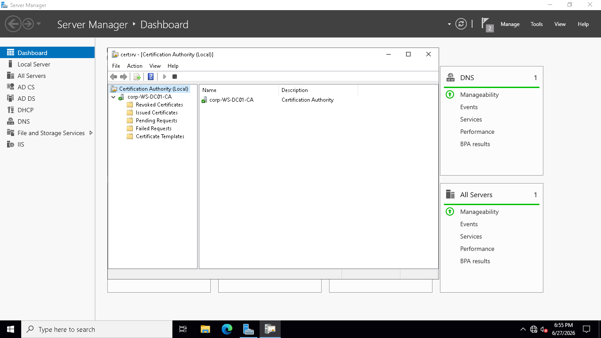

---

### Screenshot 55 – Issued Certificates

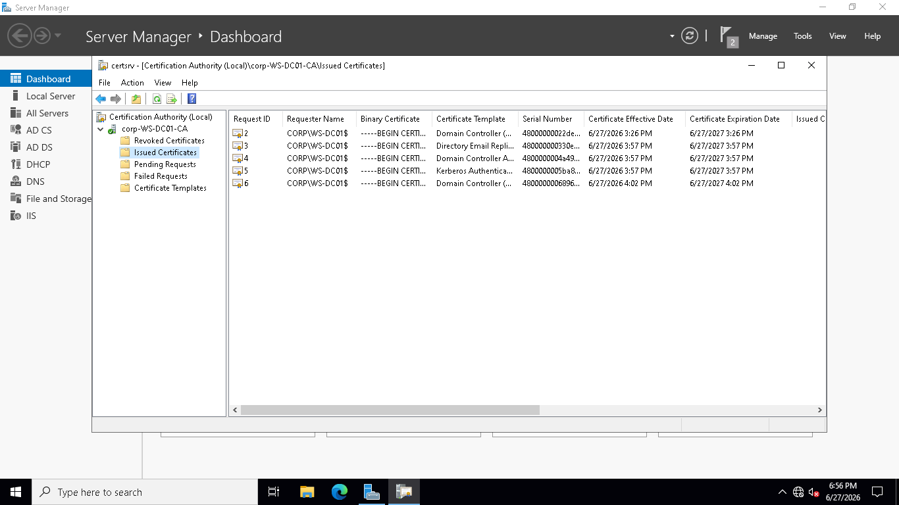

---

### Screenshot 56 – Revoked Certificates

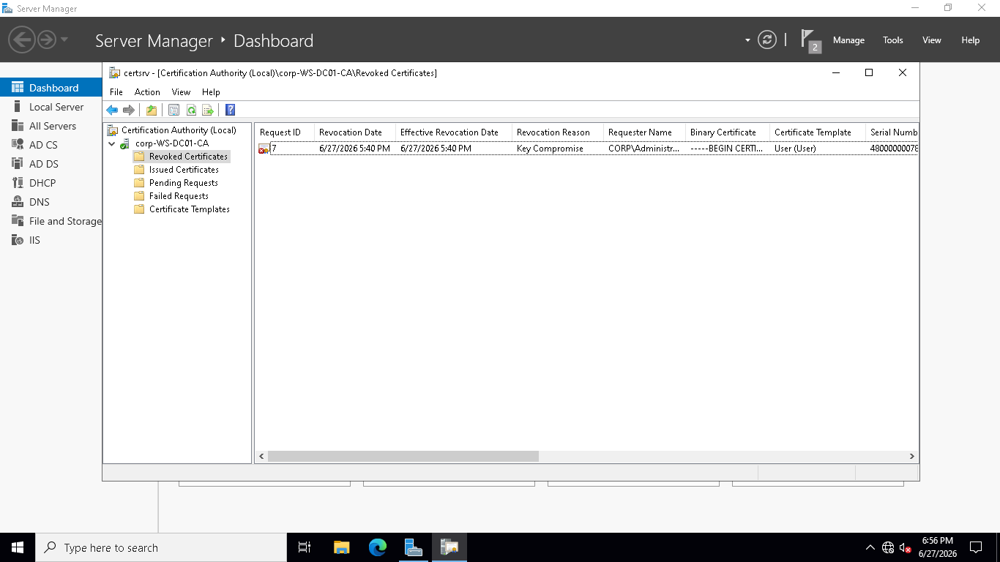

---

### Screenshot 57 – Published Certificate Templates

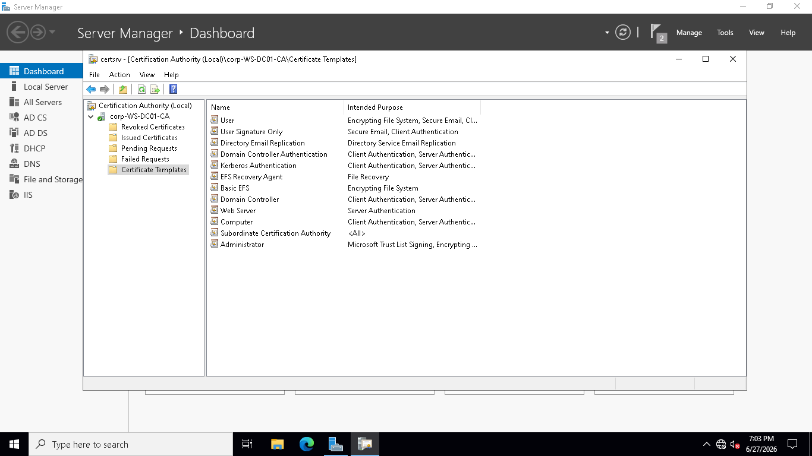

---

### Screenshot 58 – Enterprise PKI Validation

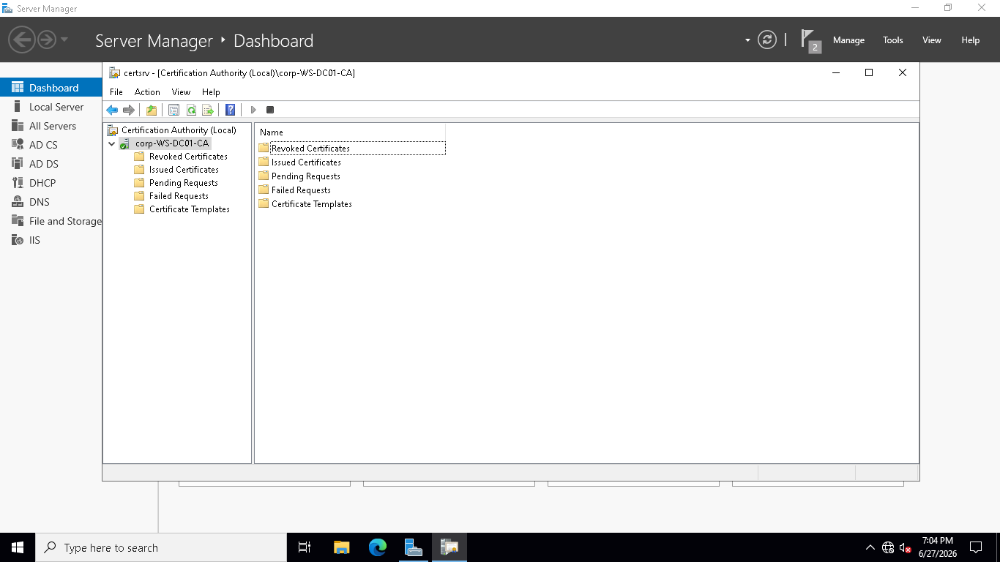

---

## Phase 9 Results

A comprehensive operational review confirmed that the Enterprise Root Certification Authority was functioning correctly.

Certificate issuance, certificate revocation, published certificate templates, Active Directory integration, and Certification Authority administration were successfully validated.

The Public Key Infrastructure is fully operational and capable of supporting secure enterprise certificate services.

---

## Skills Demonstrated

- Enterprise PKI Validation
- Certification Authority Administration
- Certificate Lifecycle Verification
- Active Directory Certificate Services Management
- Enterprise Infrastructure Validation
- Microsoft PKI Operations

---

The successful operational validation confirms that the Enterprise Public Key Infrastructure has been deployed correctly and is capable of supporting secure certificate services within the Active Directory environment.

The final phase focuses on reviewing the complete deployment, verifying service health, confirming backup availability, and documenting overall project completion.

---

# Phase 10 – Final Verification and Project Completion

## Overview

The final phase of the project consists of performing a comprehensive review of the deployed Enterprise Public Key Infrastructure.

The objective of this review is to verify the overall health of the Certification Authority, confirm that Certificate Services remain operational, validate the existence of Certification Authority backups, and ensure that the entire PKI deployment is ready for production-style administration.

Completing a final validation aligns with enterprise operational practices by confirming that all deployment activities have been successfully completed before transitioning the environment into ongoing administration.

---

## Objectives

The following objectives were completed during this phase:

- Perform a final Certification Authority review
- Verify Certificate Services status
- Confirm Certification Authority backup availability
- Validate overall PKI health
- Complete enterprise deployment documentation

---

## Environment

| Component | Value |
|-----------|-------|
| Server | WS-DC01 |
| Certification Authority | Enterprise Root CA |
| Validation Tools | Certification Authority Console, Windows Services |
| Backup Verification | Certification Authority Backup |

---

# Implementation

### Step 1 – Perform Final Certification Authority Review

The Certification Authority console was reviewed one final time to verify that all administrative components remained operational.

The review confirmed that issued certificates, revoked certificates, certificate templates, and Certification Authority configuration were available and functioning correctly.

---

### Step 2 – Verify Certificate Services

The **Certificate Services (CertSvc)** service was verified to ensure that it remained in the **Running** state.

Maintaining the operational status of this service is essential because it processes certificate requests, publishes Certificate Revocation Lists, and manages the Certification Authority database.

---

### Step 3 – Verify Certification Authority Backup

The previously created Certification Authority backup was reviewed to confirm that backup files remained available for disaster recovery purposes.

Verification of backup availability provides assurance that the Certification Authority can be restored if required, protecting the integrity of the enterprise trust infrastructure.

---

## Screenshots

### Screenshot 59 – Final Certification Authority Review

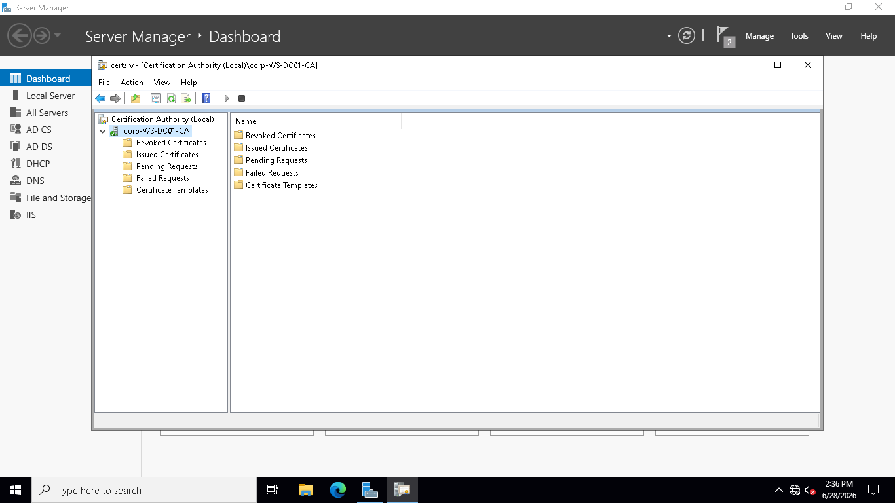

---

### Screenshot 60 – Certificate Services Running

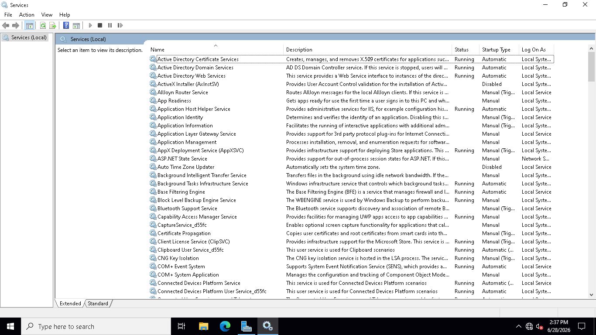

---

### Screenshot 61 – Certification Authority Backup Verification


---

## Phase 10 Results

The final operational review confirmed that the Enterprise Root Certification Authority was fully functional and ready for ongoing administration.

Certificate Services remained operational, enterprise certificate management components were functioning correctly, and verified Certification Authority backups were available to support disaster recovery requirements.

The deployment successfully demonstrated the implementation and administration of an enterprise Public Key Infrastructure integrated with Active Directory Domain Services.

---

# Overall Project Results

The Active Directory Certificate Services deployment was successfully completed within a Windows Server 2022 Active Directory environment.

Throughout the project, an Enterprise Root Certification Authority was deployed, certificate templates were published, automatic certificate enrollment was configured through Group Policy, user certificates were successfully issued, certificate revocation procedures were demonstrated, updated Certificate Revocation Lists were published, Certification Authority backups were created, and the complete PKI environment was validated using both graphical management tools and command-line administrative utilities.

The completed implementation demonstrates the deployment and administration of a secure enterprise Public Key Infrastructure following Microsoft best practices for Active Directory-integrated Certificate Services.

---

# Skills Demonstrated

- Windows Server 2022 Administration
- Active Directory Certificate Services (AD CS)
- Enterprise Public Key Infrastructure (PKI)
- Enterprise Root Certification Authority Deployment
- Certificate Template Administration
- Certificate Auto-Enrollment
- Certificate Lifecycle Management
- Certificate Revocation and CRL Management
- Certification Authority Backup and Recovery
- Group Policy Administration
- PowerShell Administration
- CertUtil Administration
- Enterprise PKI Validation
- Windows Security Administration
- Microsoft Infrastructure Administration

---

# Conclusion

This project demonstrates the complete deployment, configuration, administration, validation, and operational management of an **Enterprise Public Key Infrastructure (PKI)** using **Active Directory Certificate Services** on **Windows Server 2022**.

The implementation covers the full certificate lifecycle, beginning with Certification Authority deployment and continuing through certificate template management, automated certificate enrollment, certificate issuance, certificate revocation, Certificate Revocation List publication, Certification Authority backup, command-line validation, and final operational verification.

By completing this lab, practical experience was gained in deploying and administering Microsoft's enterprise PKI solution using industry-standard administrative tools and best practices. The project reflects real-world responsibilities commonly performed by Windows System Administrators, Infrastructure Administrators, and Enterprise PKI Administrators responsible for maintaining secure authentication and certificate-based trust within Active Directory environments.

This implementation serves as a comprehensive portfolio project demonstrating hands-on experience with enterprise Public Key Infrastructure deployment, Microsoft Certificate Services administration, and Windows Server security infrastructure.
