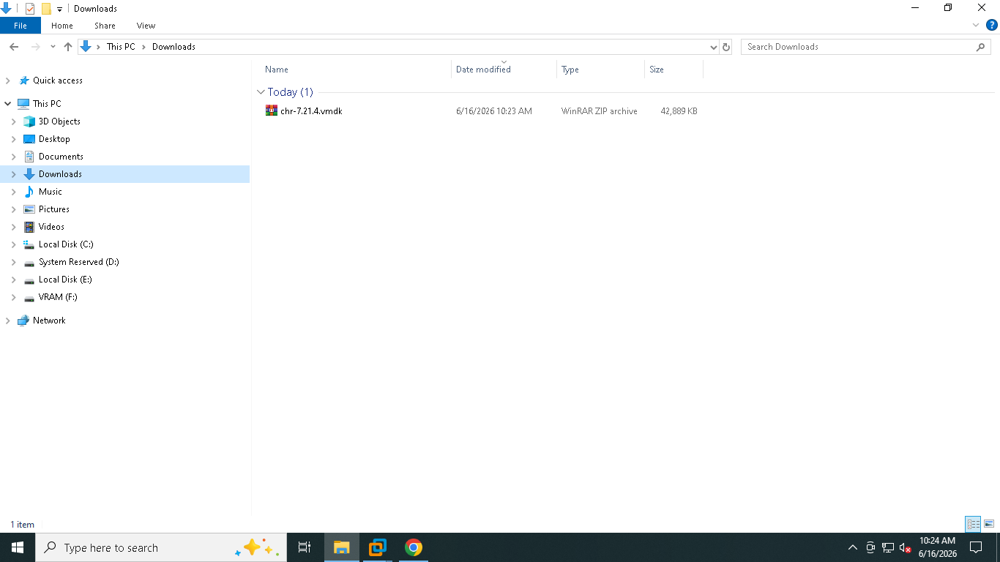
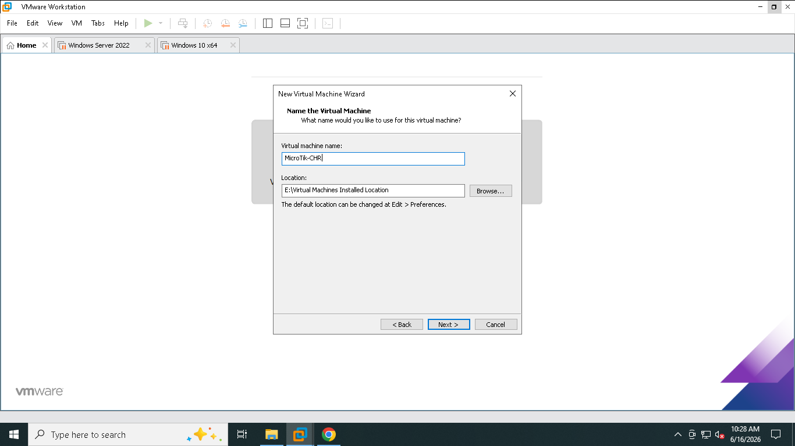
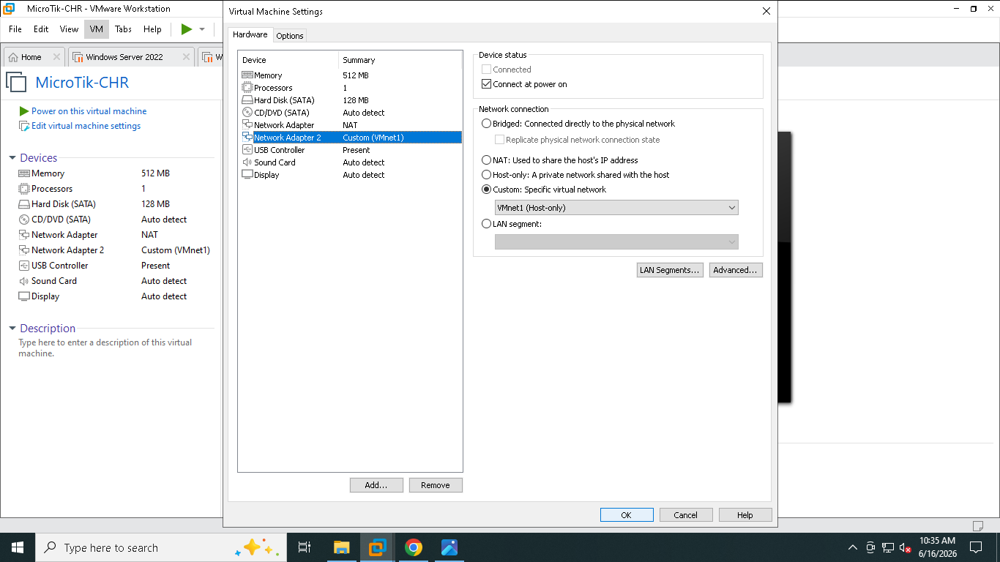
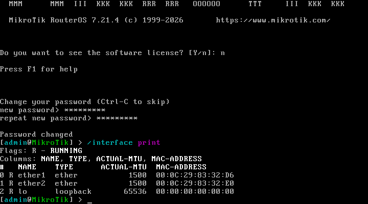
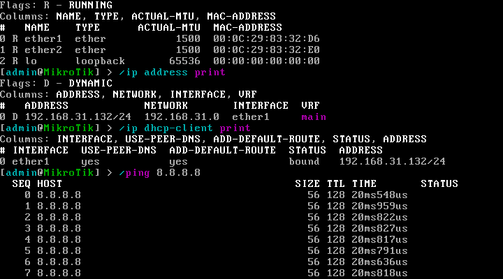
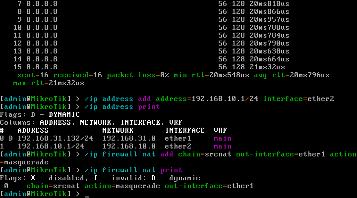
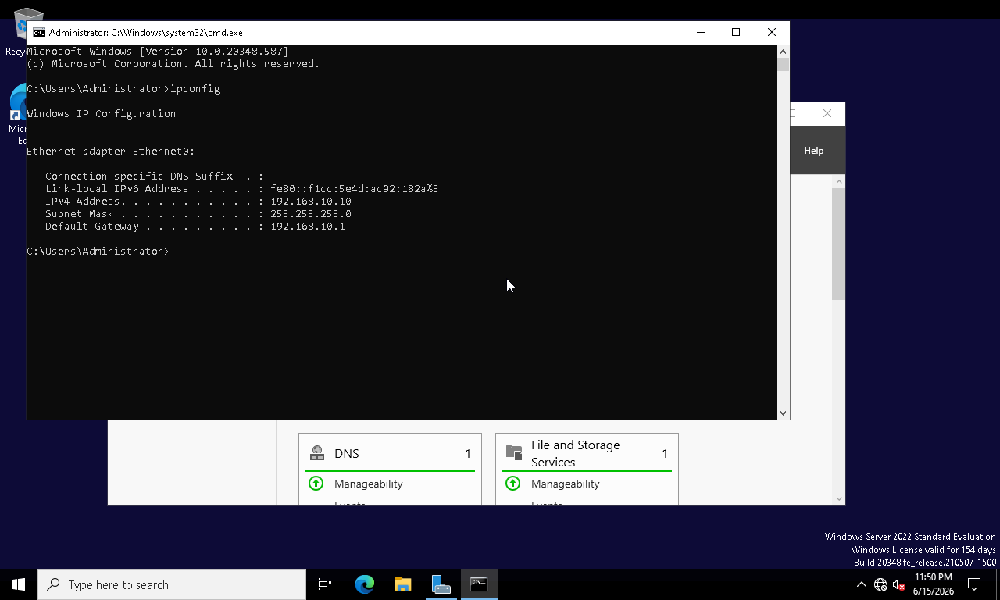
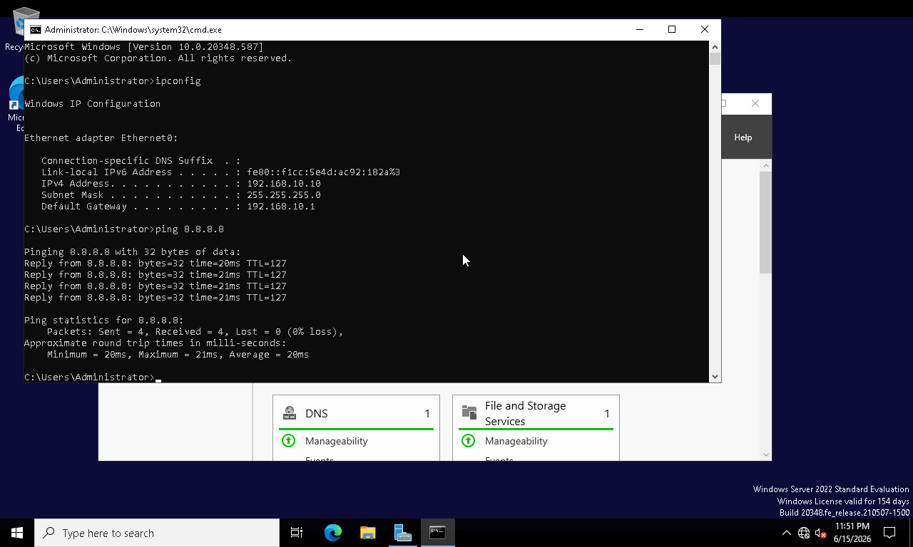
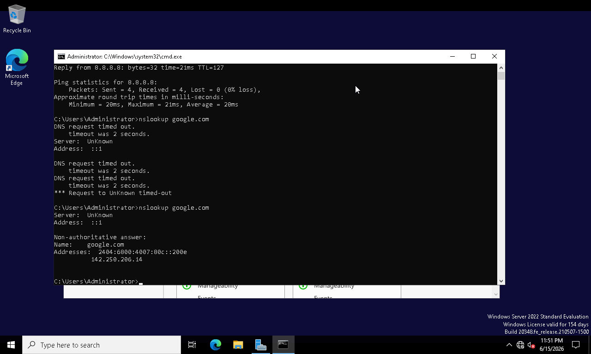
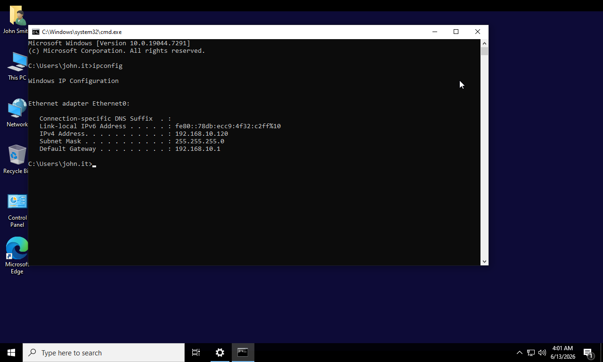

# Phase 01 - Router Integration for Windows Lab VMs

## Overview

This phase focused on deploying and configuring a MikroTik Cloud Hosted Router (CHR) to provide routing and Internet access for the Windows Server lab environment.

A dual-homed MikroTik CHR virtual machine was deployed within VMware Workstation. The router was configured with separate WAN and LAN interfaces, Network Address Translation (NAT) was implemented, and routing functionality was validated. Internet connectivity and DNS resolution were successfully verified from both the Domain Controller and Windows 10 workstation.

---

## Objectives

* Deploy MikroTik CHR Router
* Configure WAN connectivity
* Configure LAN gateway services
* Implement NAT (Masquerade)
* Provide Internet access to lab VMs
* Configure routing between networks
* Verify DNS resolution
* Validate end-to-end connectivity

---

## Environment

| Component         | Value              |
| ----------------- | ------------------ |
| Router            | MikroTik CHR       |
| Hypervisor        | VMware Workstation |
| WAN Network       | VMnet8 NAT         |
| WAN Subnet        | 192.168.31.0/24    |
| LAN Network       | VMnet1 Host-Only   |
| LAN Subnet        | 192.168.10.0/24    |
| Gateway           | 192.168.10.1       |
| Domain Controller | WS-DC01            |
| Workstation       | WIN10-01           |

---

## Implementation Steps

### 1. Download MikroTik CHR

The MikroTik Cloud Hosted Router image was downloaded and prepared for deployment.

### 2. Create Router Virtual Machine

A new virtual machine was created in VMware Workstation using the MikroTik CHR virtual disk.

### 3. Configure Network Adapters

Two virtual network adapters were configured:

* WAN Interface → VMnet8 (NAT)
* LAN Interface → VMnet1 (Host-Only)

### 4. Verify Router Interfaces

Router interfaces were validated to ensure both network adapters were operational.

### 5. Verify WAN Connectivity

Internet connectivity was verified from the router by testing communication with public IP addresses.

### 6. Configure LAN Interface

The LAN interface was configured with:

* Address: 192.168.10.1/24

This address serves as the default gateway for all lab systems.

### 7. Configure NAT

Masquerade NAT was configured to allow systems on the private lab network to access external networks through the WAN interface.

### 8. Configure Windows Server Network Settings

Static IP addressing and gateway configuration were verified on the Domain Controller.

### 9. Verify Server Internet Connectivity

Internet access was successfully validated from the Domain Controller.

### 10. Verify DNS Resolution

DNS functionality was tested and confirmed using external name resolution queries.

### 11. Configure Windows Workstation Network Settings

The Windows 10 workstation was configured to utilize the MikroTik gateway and internal DNS services.

### 12. Verify Workstation Internet Access

Internet connectivity and name resolution were validated from the workstation.

---

## Screenshots

### Screenshot 01 - MikroTik CHR Download

### Screenshot 02 - Router VM Creation

### Screenshot 03 - Router Network Adapters

### Screenshot 04 - Router Interfaces

### Screenshot 05 - Router Internet Connectivity Test

### Screenshot 06 - Router LAN Interface Configuration

### Screenshot 07 - NAT Configuration

### Screenshot 08 - Server Network Configuration

### Screenshot 09 - Server Internet Connectivity

### Screenshot 10 - DNS Resolution Verification

### Screenshot 11 - Workstation Network Configuration

### Screenshot 12 - Workstation Internet Access

---

## Results

* MikroTik CHR deployed successfully
* WAN and LAN interfaces configured
* NAT implemented successfully
* Private lab network routed successfully
* Domain Controller gained Internet access
* Windows Workstation gained Internet access
* DNS resolution verified
* End-to-end connectivity validated

---

## Skills Demonstrated

* VMware Networking
* Router Deployment
* MikroTik RouterOS Administration
* NAT Configuration
* TCP/IP Troubleshooting
* Routing Fundamentals
* Enterprise Network Services
* Windows Server Networking
* DNS Verification
* Infrastructure Administration
