# Phase 01 - Infrastructure Configuration

## Overview

This phase focused on preparing the enterprise Windows Server environment and deploying the first Domain Controller for the organization.

The infrastructure was built using VMware Workstation Pro and Windows Server 2022 Standard Evaluation. Active Directory Domain Services (AD DS) was installed and configured to create the corporate domain `corp.local`.

---

## Objectives

* Deploy Windows Server 2022
* Install Active Directory Domain Services (AD DS)
* Promote the server to a Domain Controller
* Create the `corp.local` domain
* Verify successful domain deployment

---

## Environment

| Component        | Value                                   |
| ---------------- | --------------------------------------- |
| Hypervisor       | VMware Workstation Pro                  |
| Server Name      | WS-DC01                                 |
| Operating System | Windows Server 2022 Standard Evaluation |
| Domain           | corp.local                              |

---

## Implementation Steps

### 1. Open Server Manager

Server Manager was used as the primary administration console for role deployment.

### 2. Add Active Directory Domain Services

The AD DS role was installed using the Add Roles and Features Wizard.

### 3. Promote Server to Domain Controller

After installation, the server was promoted to a Domain Controller.

### 4. Create New Forest

A new forest named `corp.local` was created.

### 5. Verify Domain Services

Administrative tools and domain functionality were verified after reboot.

---

## Screenshots

### Screenshot 01 - Server Manager Dashboard

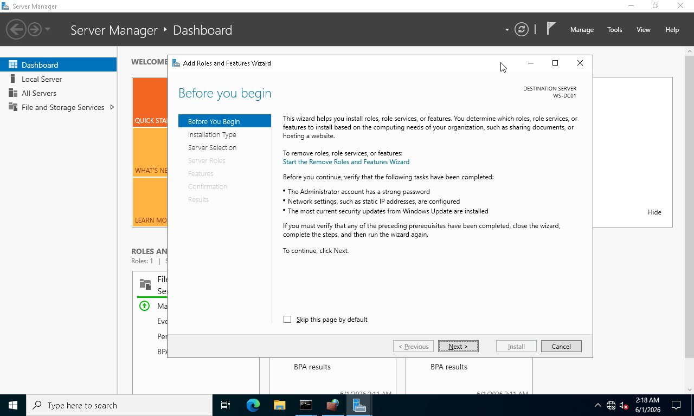

### Screenshot 02 - Role Based Installation

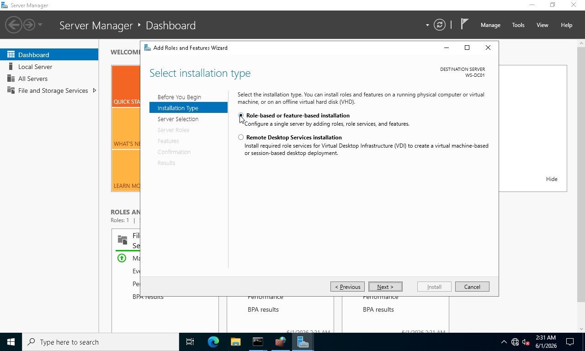

### Screenshot 03 - Server Selection

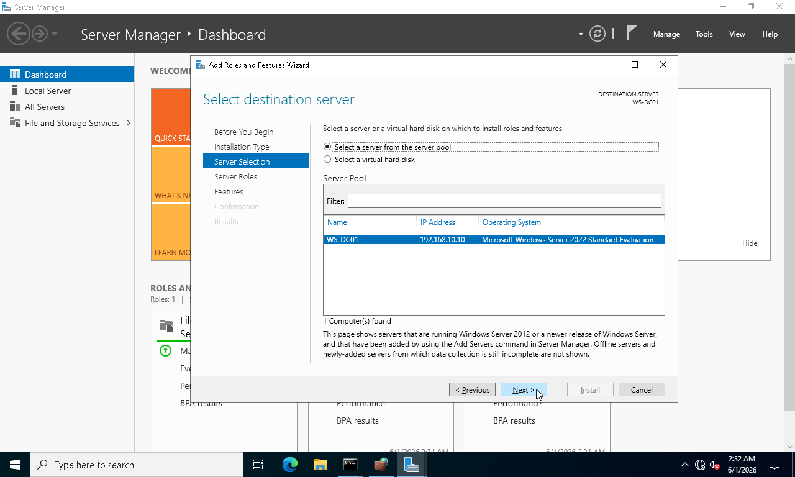

### Screenshot 04 - AD DS Role Selected

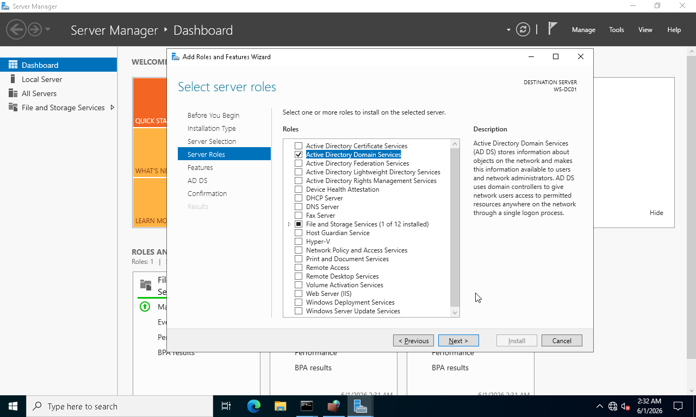

### Screenshot 05 - Installation Confirmation

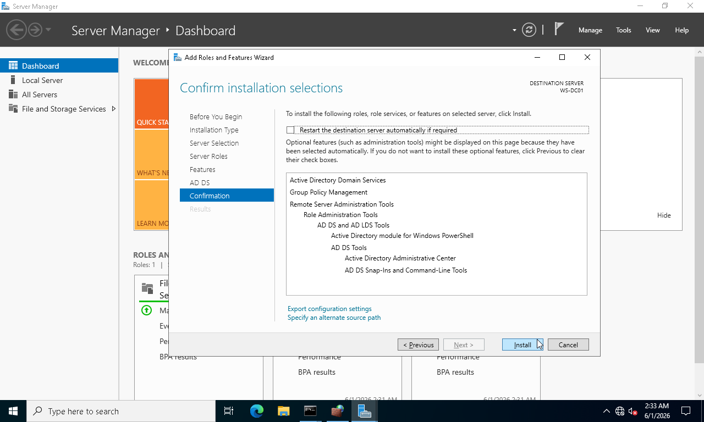

### Screenshot 06 - AD DS Installation Successful

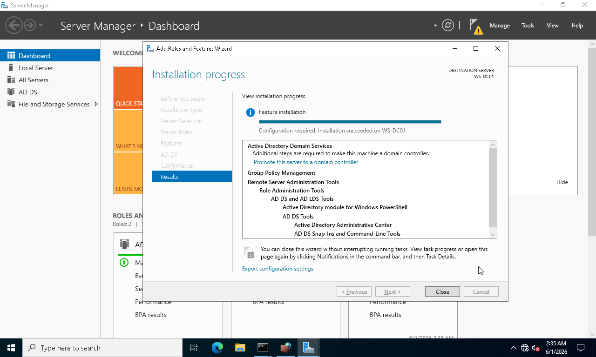

### Screenshot 07 - Domain Controller Promotion

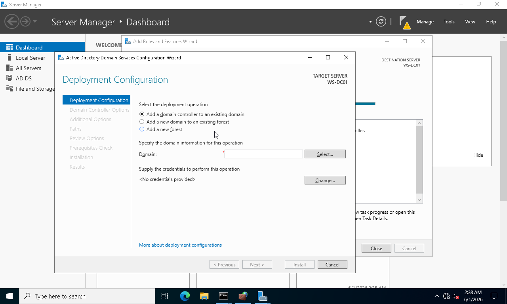

### Screenshot 08 - New Forest Creation

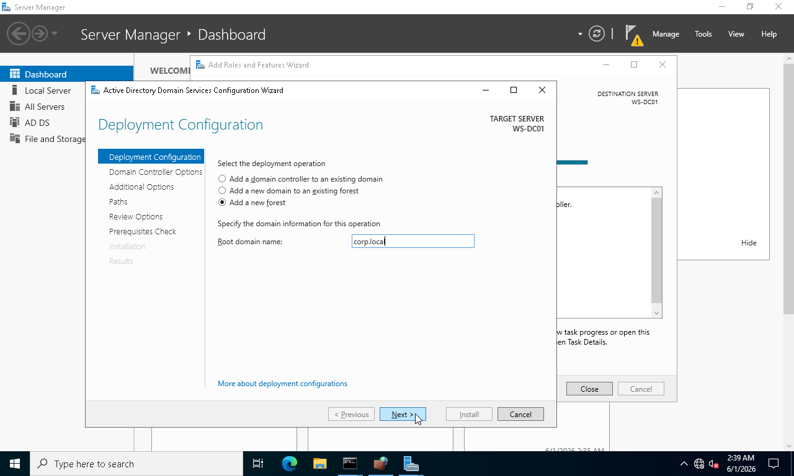

### Screenshot 09 - Domain Controller Options

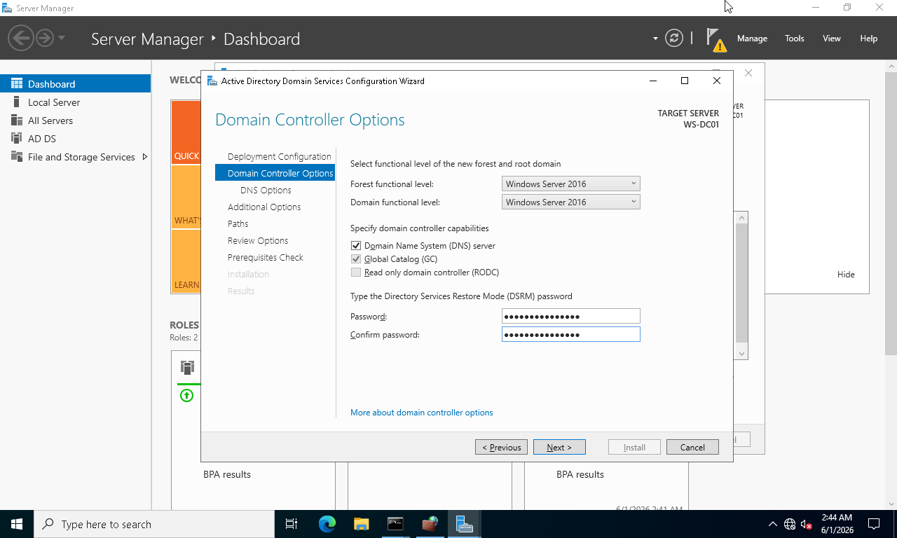

### Screenshot 10 - NetBIOS Verification

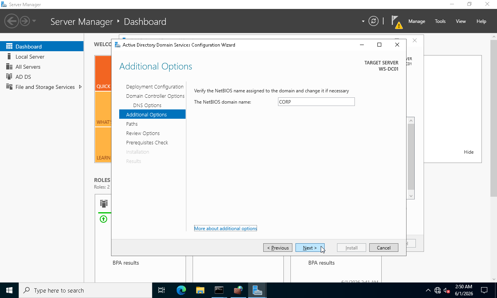

### Screenshot 11 - Prerequisite Check

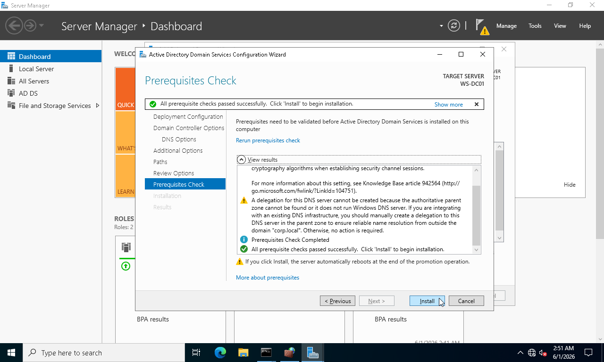

### Screenshot 12 - Domain Controller Login

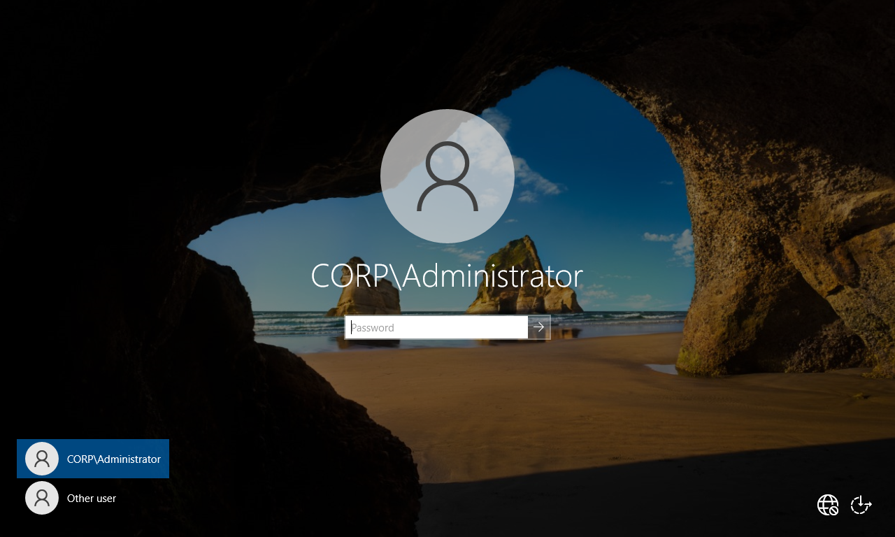

### Screenshot 13 - Administrative Tools Available

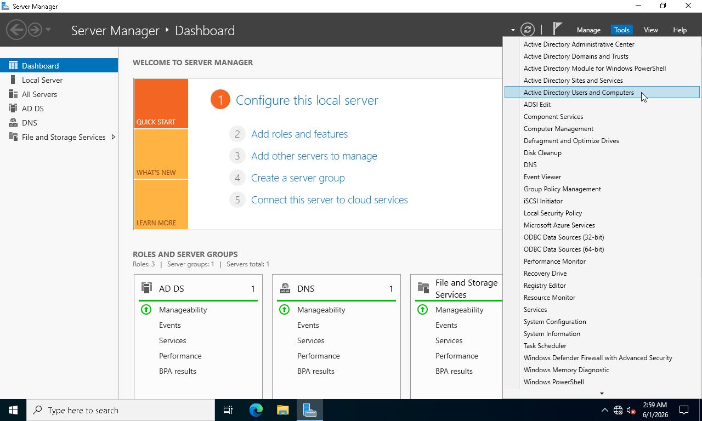

### Screenshot 14 - Domain Created Successfully

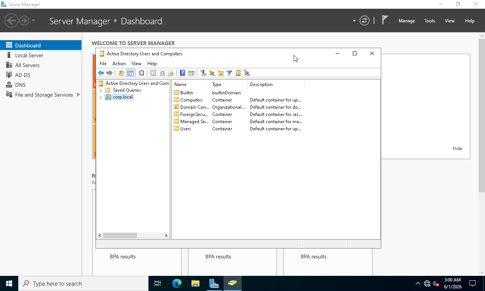

---

## Results

* Active Directory successfully deployed
* Domain Controller operational
* Domain `corp.local` created
* Administrative tools available
* Environment ready for enterprise administration

---

## Skills Demonstrated

* Windows Server Deployment
* Active Directory Installation
* Domain Controller Promotion
* Forest Creation
* Enterprise Infrastructure Setup

