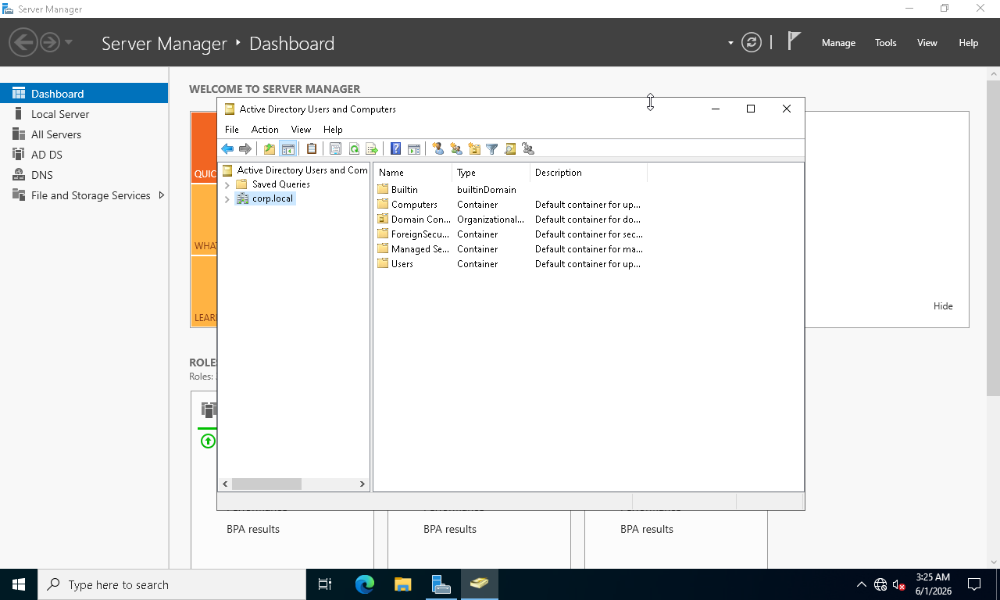
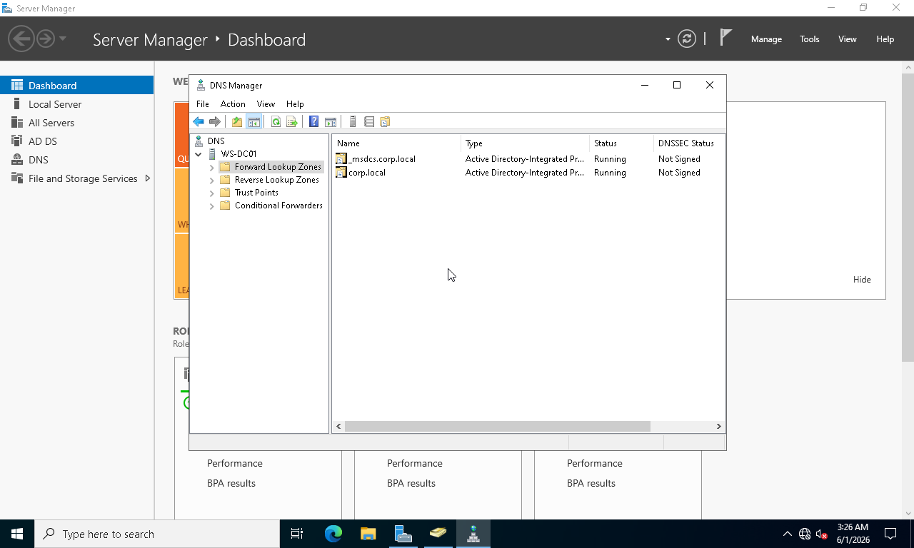
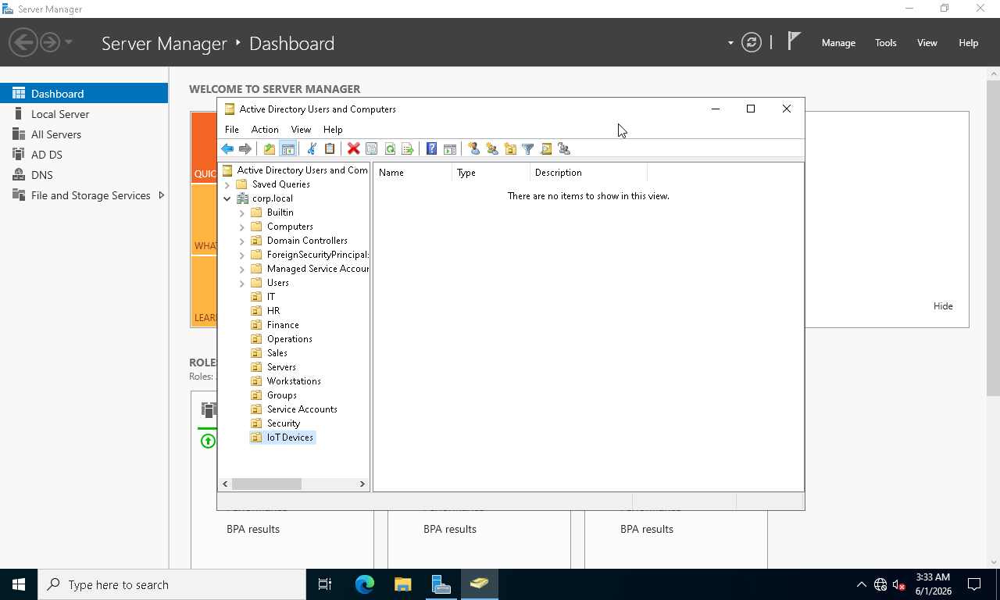
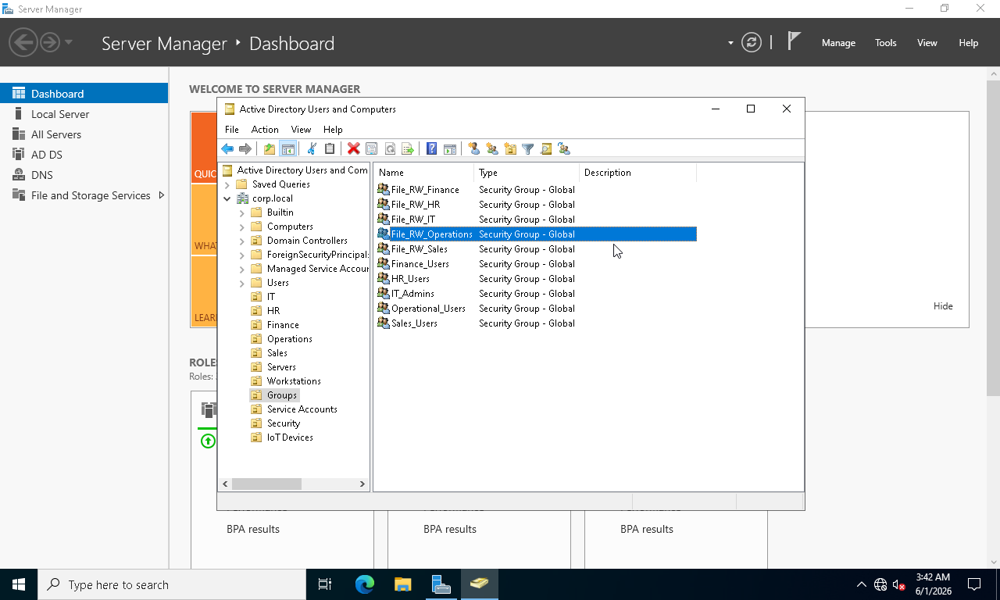
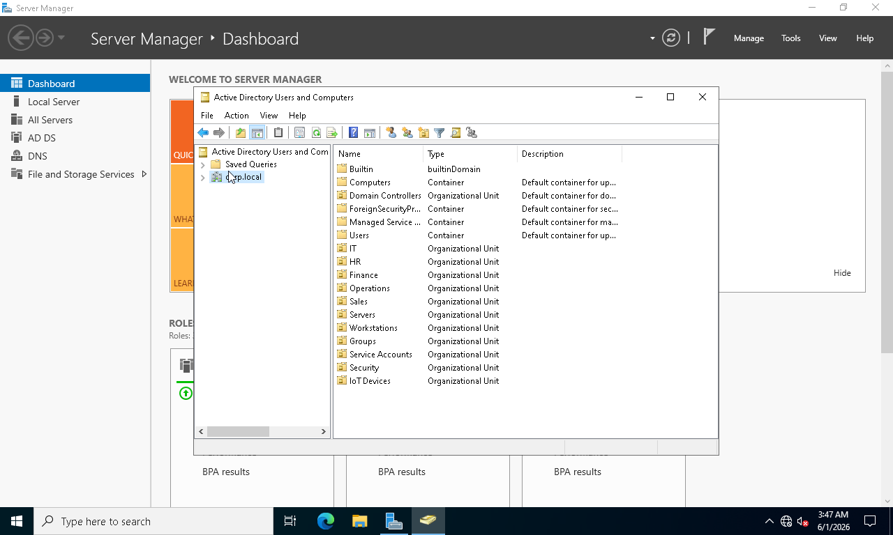
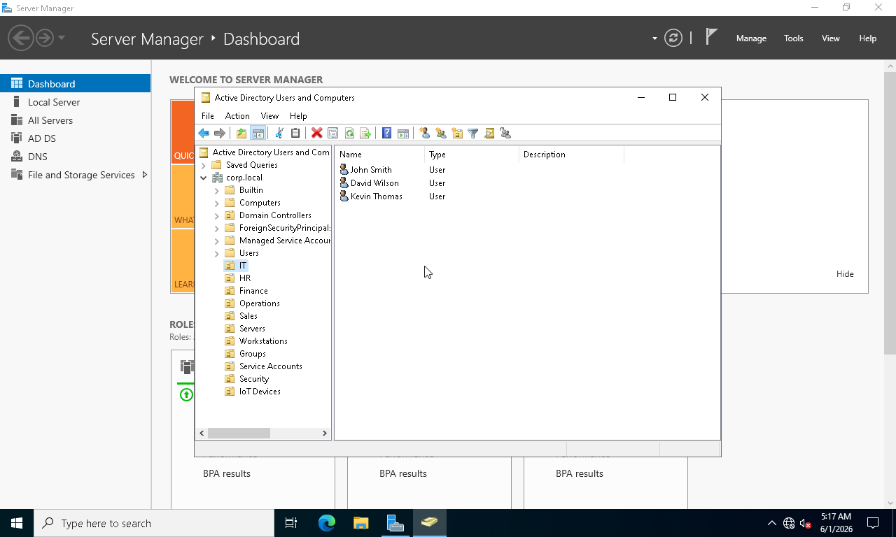
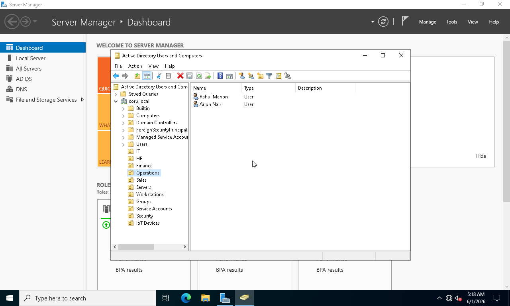
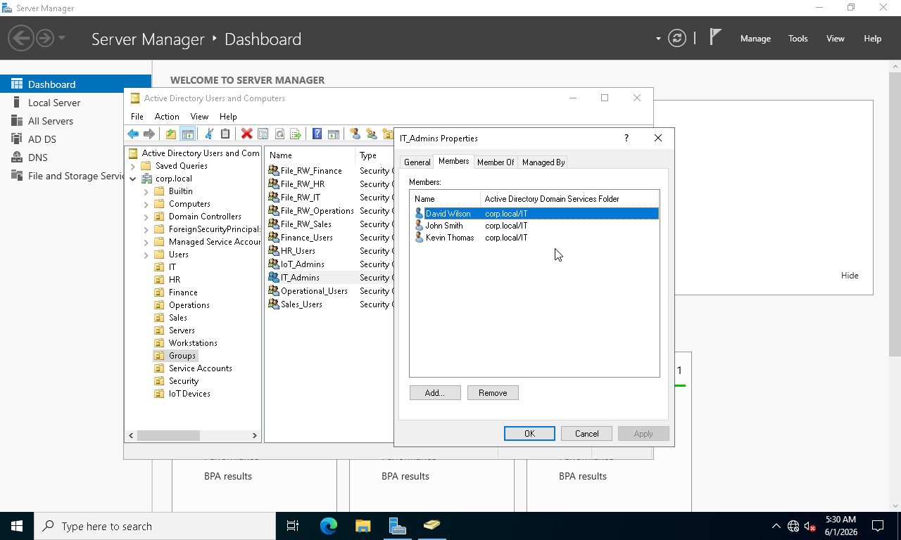
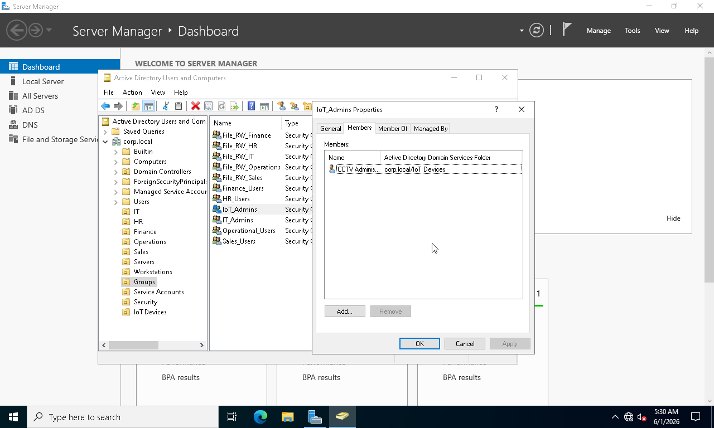

# Phase 02 - Active Directory Administration

## Overview

This phase focused on configuring and administering Active Directory Domain Services (AD DS) after the successful deployment of the Domain Controller.

An enterprise Organizational Unit (OU) structure was created to represent different business departments. Security groups were implemented to simplify permission management, and user accounts were provisioned for multiple departments within the organization.

DNS functionality was also verified to ensure proper Active Directory integration and name resolution.

---

## Objectives

* Verify Active Directory functionality
* Verify DNS integration with Active Directory
* Create Organizational Units (OUs)
* Create departmental security groups
* Create user accounts for business departments
* Configure group memberships for administrative delegation

---

## Environment

| Component         | Value                            |
| ----------------- | -------------------------------- |
| Domain Controller | WS-DC01                          |
| Domain Name       | corp.local                       |
| Directory Service | Active Directory Domain Services |
| DNS Service       | Microsoft DNS                    |

---

## Implementation Steps

### 1. Verify Active Directory Domain

Active Directory Users and Computers (ADUC) was used to verify the successful deployment of the corp.local domain.

### 2. Verify DNS Configuration

DNS Manager was used to confirm that the required forward lookup zones were present and functioning correctly.

### 3. Create Organizational Unit Structure

An enterprise OU hierarchy was designed to separate administrative objects and departmental resources.

Departments included:

* IT
* HR
* Finance
* Sales
* Operations

### 4. Create Security Groups

Department-specific security groups were created to support role-based administration and future access control requirements.

### 5. Create User Accounts

User accounts were created for each department and organized within their respective OUs.

### 6. Configure Group Memberships

Administrative users were assigned to appropriate security groups to simplify permission management and delegation.

---

## Screenshots

### Screenshot 15 - Active Directory Domain View

### Screenshot 16 - DNS Forward Lookup Zones

### Screenshot 17 - Enterprise OU Structure

### Screenshot 18 - Security Groups Created

### Screenshot 19 - Enterprise OU Hierarchy

### Screenshot 20 - IT Users Created

### Screenshot 21 - HR Users Created

### Screenshot 22 - Finance Users Created

### Screenshot 23 - Sales Users Created

### Screenshot 24 - Operations Users Created

### Screenshot 25 - IT Admin Group Membership

### Screenshot 26 - IoT Admin Group Membership

---

## Results

* Active Directory verified and operational
* DNS integration confirmed
* Enterprise OU hierarchy implemented
* Departmental security groups created
* User accounts provisioned successfully
* Group-based administration configured

---

## Skills Demonstrated

* Active Directory Administration
* Organizational Unit Design
* User Account Management
* Security Group Administration
* DNS Verification
* Identity and Access Management (IAM)
* Role-Based Administration

