# Phase 03 - DHCP Services

## Overview

This phase focused on deploying and configuring Dynamic Host Configuration Protocol (DHCP) services within the enterprise environment.

The DHCP Server role was installed on the Domain Controller, authorized within Active Directory, and configured to automatically assign IP addresses to client systems. A corporate DHCP scope was created, DNS options were configured, and lease functionality was verified to ensure successful client connectivity.

---

## Objectives

* Install the DHCP Server role
* Authorize DHCP in Active Directory
* Create and configure a DHCP scope
* Configure DNS-related DHCP options
* Verify IP address assignment
* Validate DHCP lease functionality

---

## Environment

| Component     | Value       |
| ------------- | ----------- |
| Server Name   | WS-DC01     |
| Domain        | corp.local  |
| Service       | DHCP Server |
| Client System | WIN10-01    |

---

## Implementation Steps

### 1. Install DHCP Server Role

The DHCP Server role was installed using the Add Roles and Features Wizard.

### 2. Complete Post-Installation Configuration

Post-deployment tasks were completed to integrate DHCP with Active Directory.

### 3. Authorize DHCP Server

The DHCP server was authorized within the Active Directory environment to allow lease distribution.

### 4. Create DHCP Scope

A new scope named Corporate-LAN was created to manage client IP assignments.

### 5. Configure Scope Options

DNS configuration settings were defined to ensure proper domain name resolution for clients.

### 6. Activate Scope

The scope was activated and made available for client systems.

### 7. Verify DHCP Operation

Address pool allocation, scope options, and lease activity were reviewed to validate functionality.

---

## Screenshots

### Screenshot 27 - DHCP Role Selected

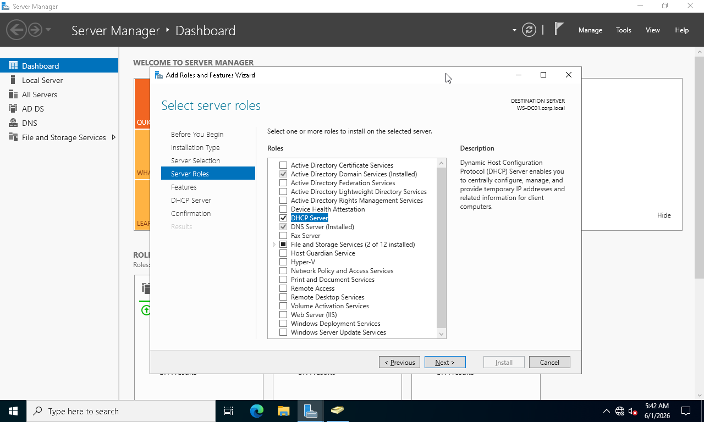

### Screenshot 28 - DHCP Installation Successful

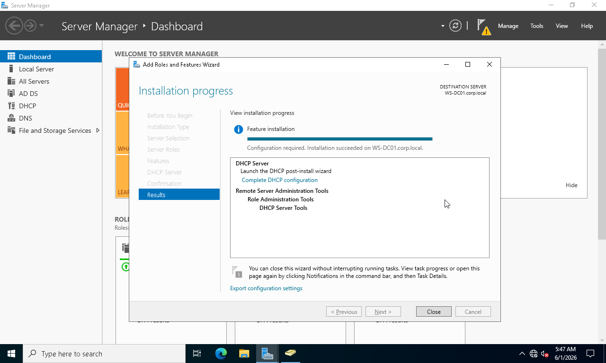

### Screenshot 29 - DHCP Post Installation

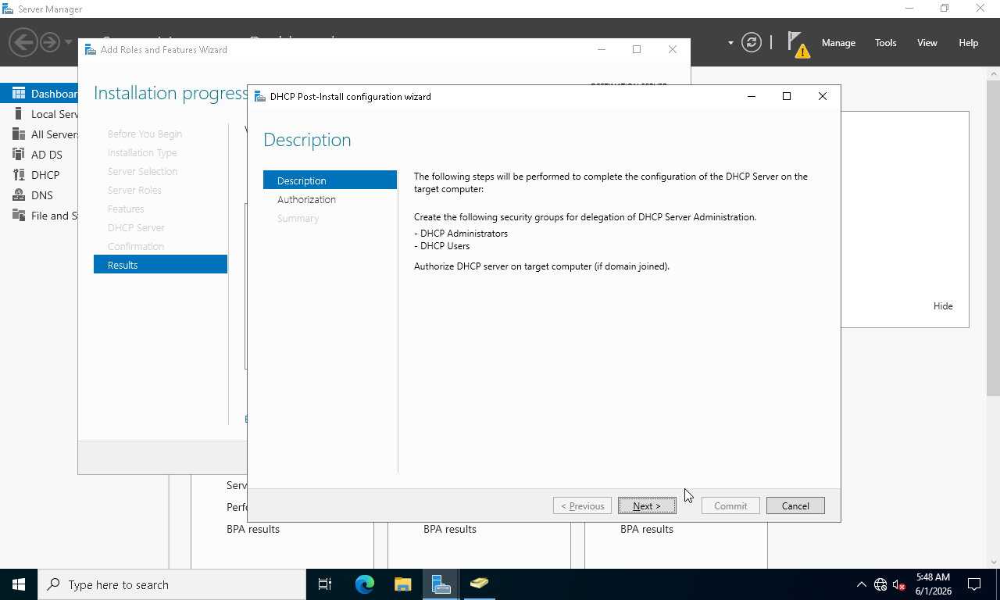

### Screenshot 30 - DHCP Authorized

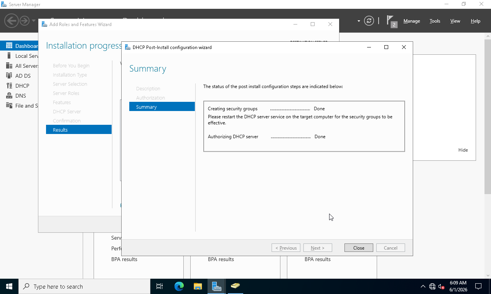

### Screenshot 31 - DHCP Management Console

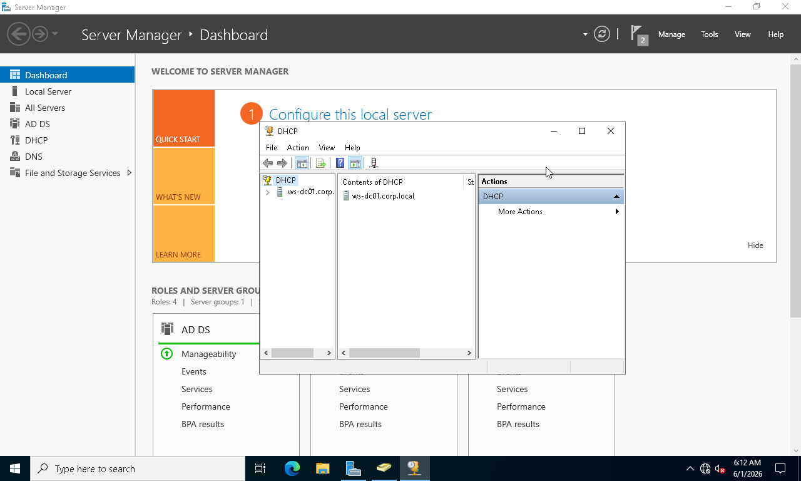

### Screenshot 32 - New Scope Wizard

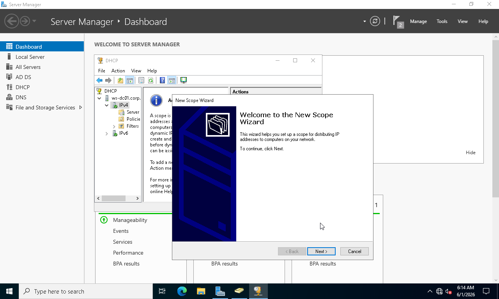

### Screenshot 33 - Corporate LAN Scope

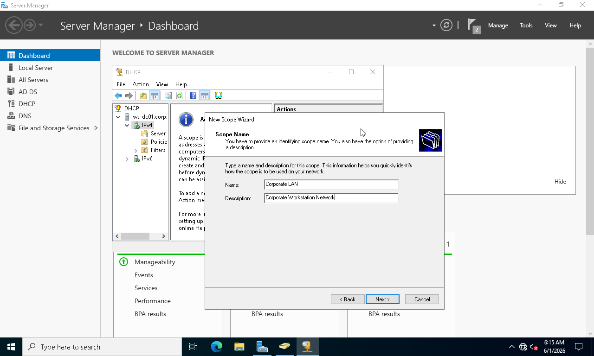

### Screenshot 34 - Scope IP Range Configuration

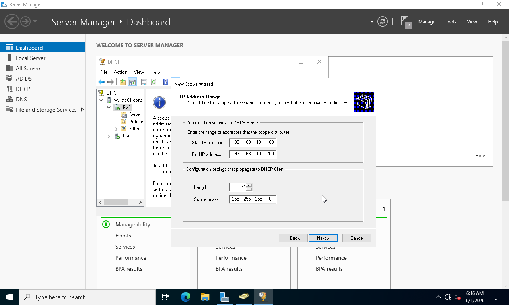

### Screenshot 35 - Scope Options Configuration

### Screenshot 36 - DHCP DNS Options

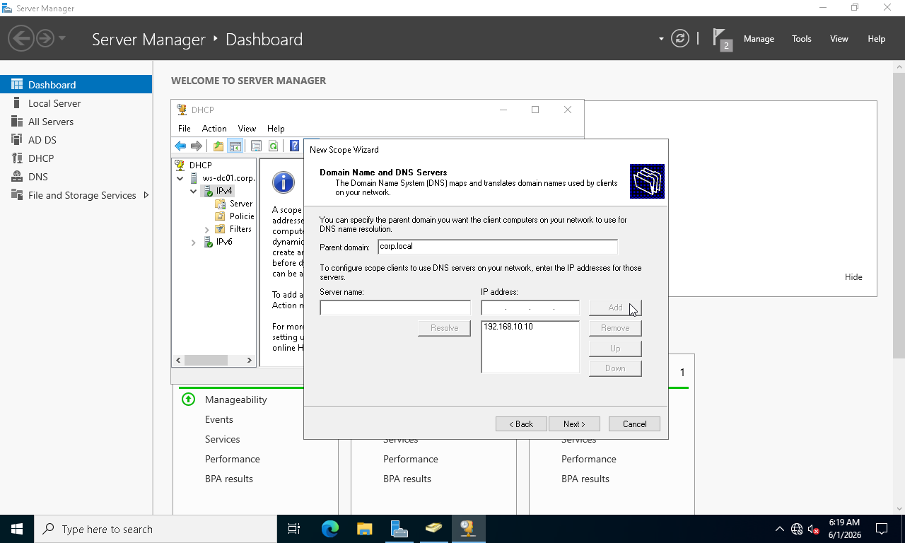

### Screenshot 37 - Scope Activated

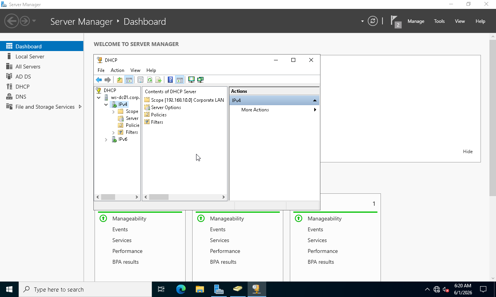

### Screenshot 72 - DHCP Scope Overview

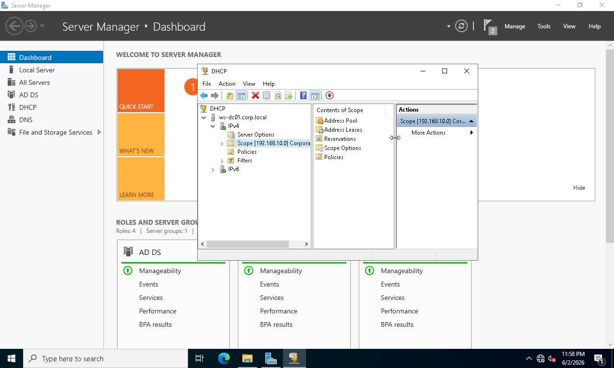

### Screenshot 73 - DHCP Address Pool

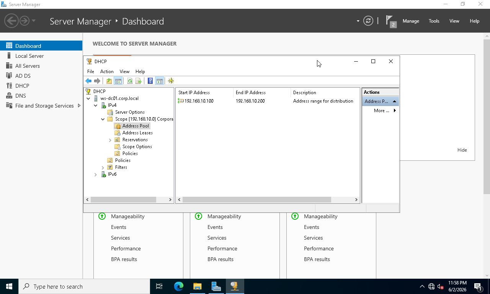

### Screenshot 74 - DHCP Scope Options

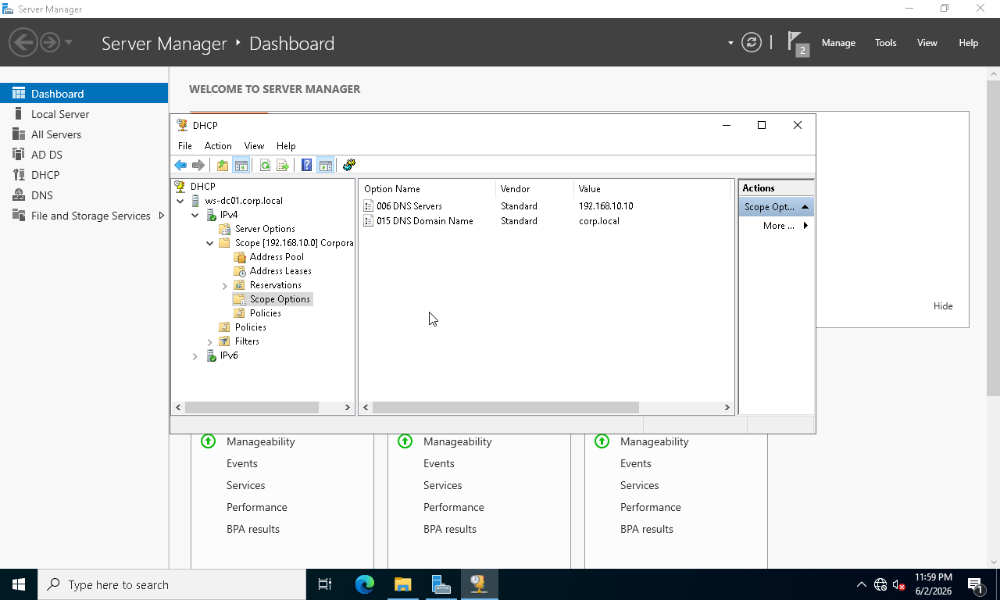

### Screenshot 75 - DHCP Client Lease Verification

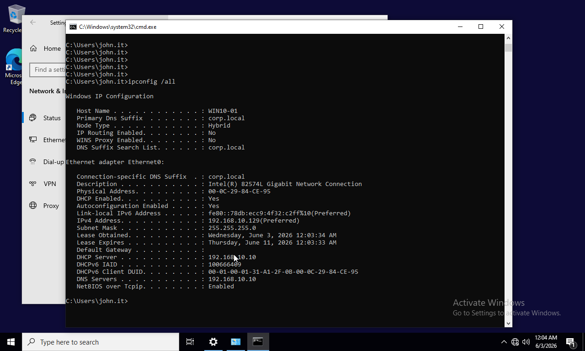

---

## Results

* DHCP Server successfully deployed
* DHCP authorized within Active Directory
* Corporate LAN scope configured
* DNS options assigned through DHCP
* Client systems received IP addresses automatically
* Lease functionality verified successfully

---

## Skills Demonstrated

* DHCP Deployment
* DHCP Scope Configuration
* DHCP Authorization
* IP Address Management (IPAM)
* DNS Integration
* Network Services Administration
* Enterprise Windows Server Administration

