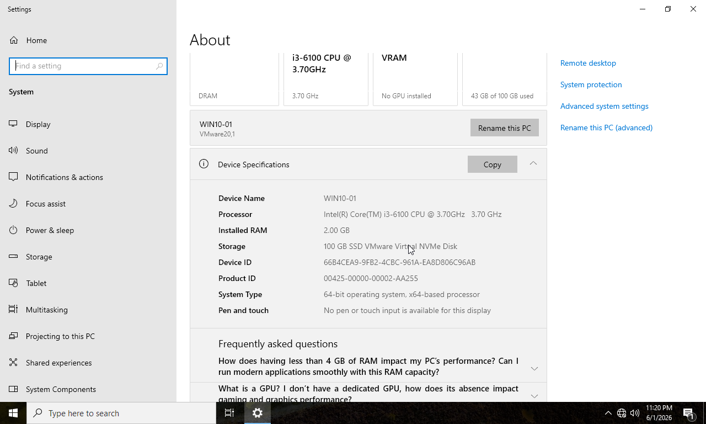
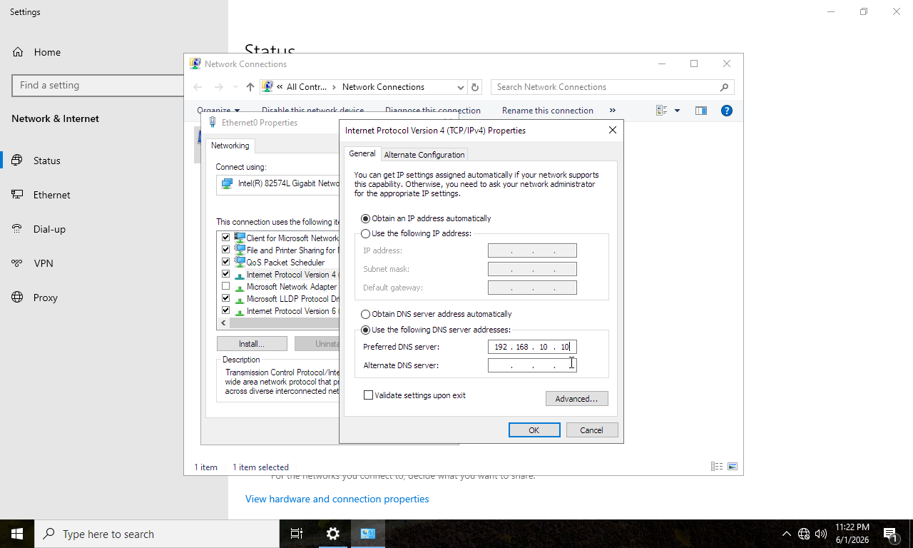
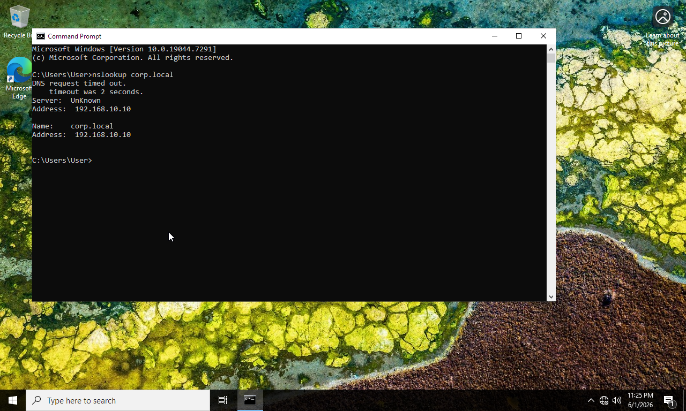
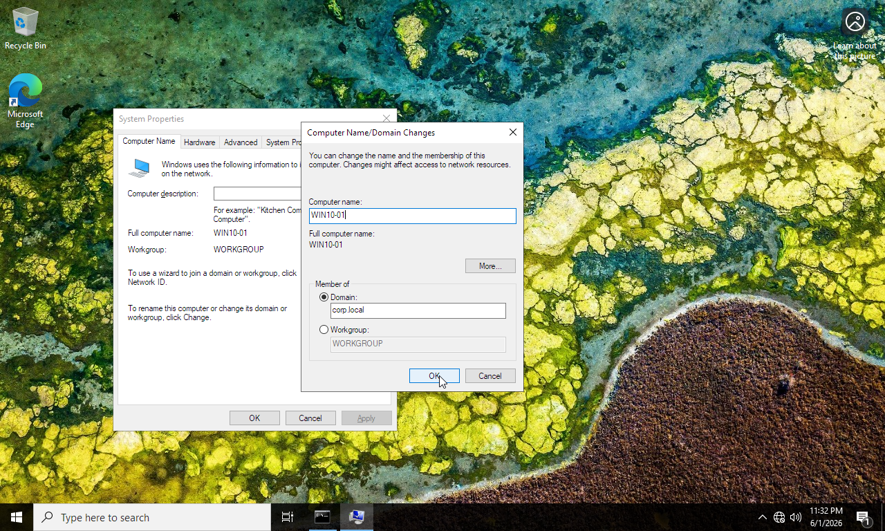
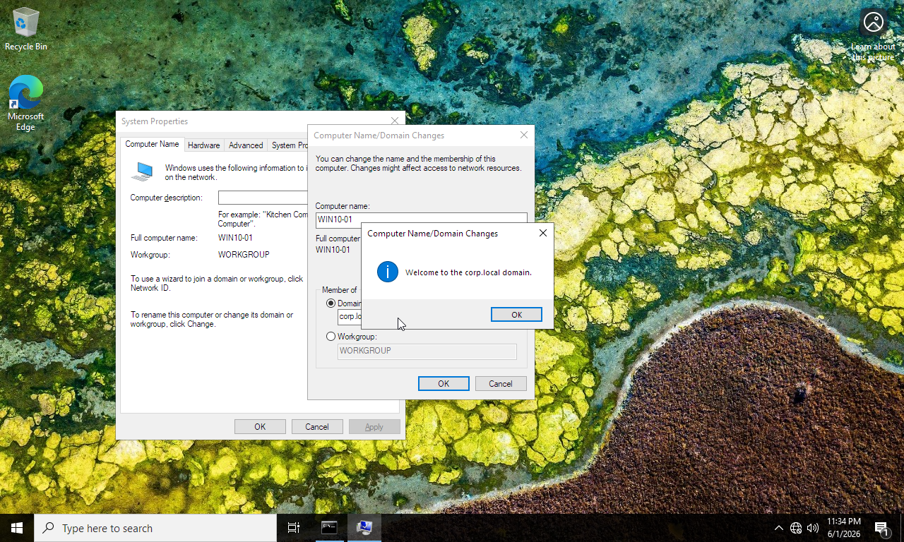
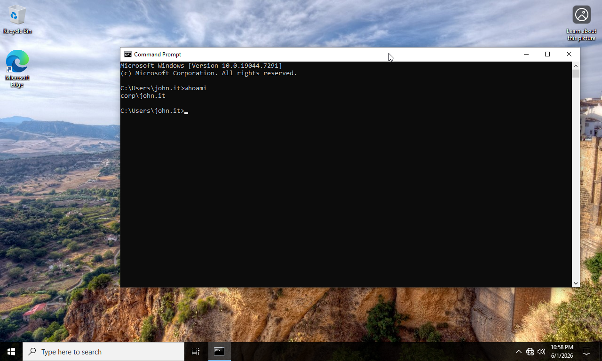

# Phase 04 - Domain Join and Client Management

## Overview

This phase focused on integrating a Windows 10 Enterprise LTSC workstation into the Active Directory domain environment.

The client system was configured to use the Domain Controller as its DNS server, domain name resolution was verified, and the workstation was successfully joined to the corp.local domain. Authentication using domain user accounts was then validated.

---

## Objectives

* Prepare the client workstation for domain integration
* Configure DNS settings
* Verify domain name resolution
* Join the workstation to Active Directory
* Validate domain authentication
* Confirm successful user logon

---

## Environment

| Component         | Value                      |
| ----------------- | -------------------------- |
| Domain Controller | WS-DC01                    |
| Client Hostname   | WIN10-01                   |
| Client OS         | Windows 10 Enterprise LTSC |
| Domain            | corp.local                 |

---

## Implementation Steps

### 1. Rename Workstation

The client computer was configured with the hostname WIN10-01.

### 2. Configure DNS Settings

The workstation was configured to use the Domain Controller as its primary DNS server.

### 3. Verify Name Resolution

The nslookup utility was used to verify successful DNS resolution of the corp.local domain.

### 4. Join Domain

The workstation was joined to the Active Directory domain.

### 5. Verify Domain Membership

Successful domain join confirmation was verified.

### 6. Validate Domain Authentication

A domain user account was used to log in to the workstation.

---

## Screenshots

### Screenshot 38 - Workstation Renamed

### Screenshot 39 - Client DNS Settings

### Screenshot 40 - DNS Resolution Verification

### Screenshot 41 - Domain Join Request

### Screenshot 42 - Domain Join Successful

### Screenshot 43 - Domain User Login

---

## Results

* Client workstation successfully renamed
* DNS configuration completed
* Domain name resolution verified
* Workstation joined to Active Directory
* Domain authentication functioning correctly
* Users able to log on using domain credentials

---

## Skills Demonstrated

* Active Directory Client Integration
* Domain Join Operations
* DNS Client Configuration
* Windows Workstation Administration
* Authentication and Authorization
* Enterprise Endpoint Management

