# Phase 05 - Group Policy Management

## Overview

This phase focused on implementing and managing Group Policy Objects (GPOs) within the Active Directory environment.

Security and user experience policies were deployed using Group Policy Management. Password policies were configured to strengthen domain security, a corporate login banner was implemented to display organizational notices, and a standardized desktop wallpaper was deployed to domain users.

Policy application was verified using gpupdate and gpresult tools.

---

## Objectives

* Configure domain password policies
* Deploy a corporate login banner
* Deploy a standardized desktop wallpaper
* Verify policy application
* Validate Group Policy processing

---

## Environment

| Component         | Value                                  |
| ----------------- | -------------------------------------- |
| Domain Controller | WS-DC01                                |
| Domain            | corp.local                             |
| Management Tool   | Group Policy Management Console (GPMC) |
| Client System     | WIN10-01                               |

---

## Implementation Steps

### 1. Open Group Policy Management

The Group Policy Management Console (GPMC) was used to manage domain policies.

### 2. Configure Password Policy

Password complexity, minimum password length, and related security settings were configured through the Default Domain Policy.

### 3. Verify Password Policy

Group Policy updates were applied and verified using gpupdate and gpresult.

### 4. Create Corporate Login Banner

A security notice banner was configured using Group Policy administrative templates.

### 5. Verify Login Banner

The client workstation was updated and tested to confirm the banner appeared during logon.

### 6. Deploy Corporate Wallpaper

A shared network location was configured to host a standardized desktop wallpaper.

### 7. Configure Wallpaper Policy

A dedicated Group Policy Object was created and linked to deploy the wallpaper.

### 8. Verify Wallpaper Deployment

Policy updates were applied and validated on the client workstation.

---

## Screenshots

### Screenshot 44 - Group Policy Management Console

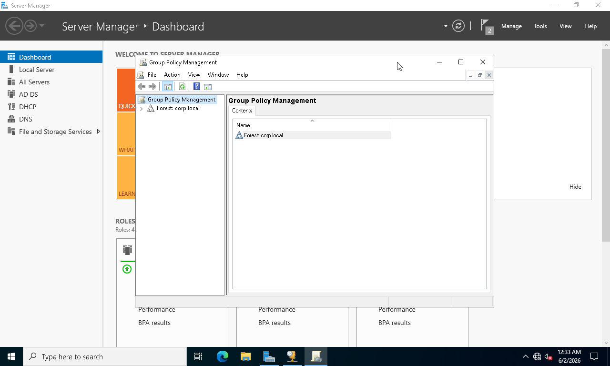

### Screenshot 45 - Default Domain Policy

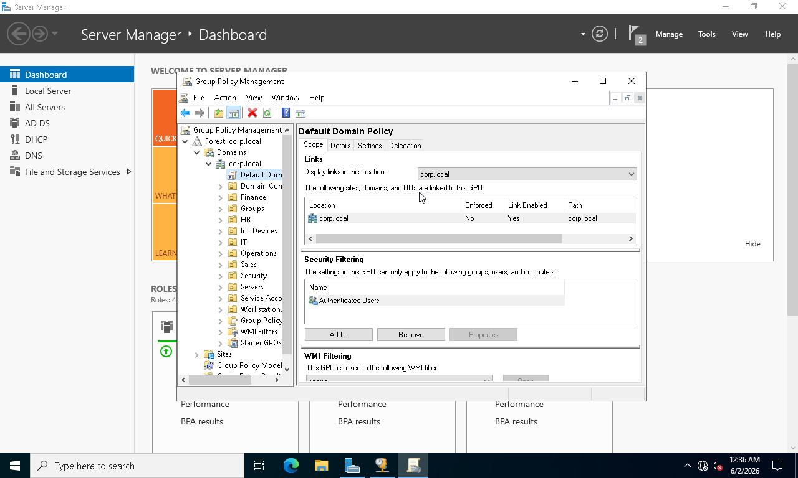

### Screenshot 46 - Password Policy Location

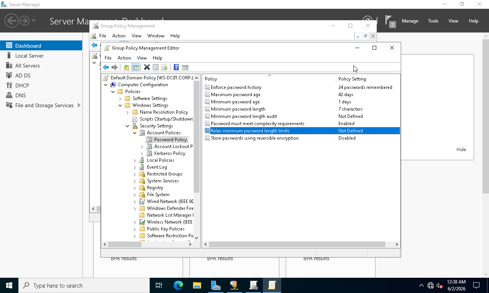

### Screenshot 47 - Password Policy Configured

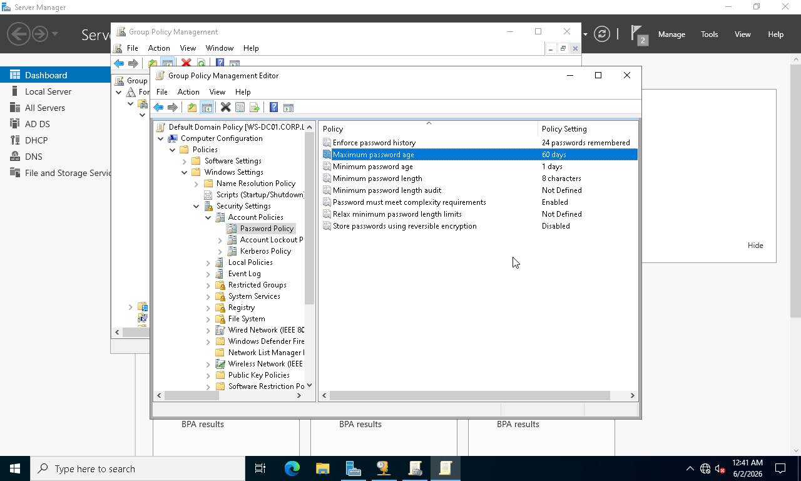

### Screenshot 48 - Group Policy Update

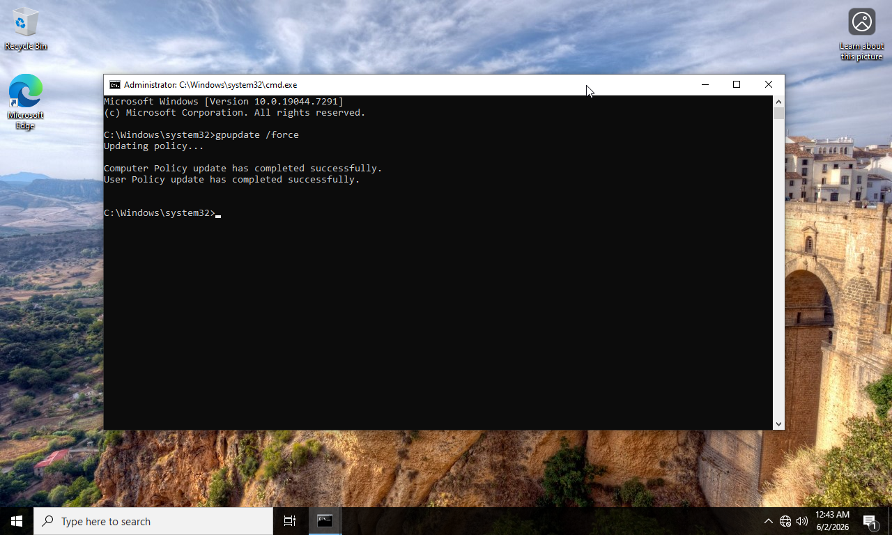

### Screenshot 49 - Password Policy Verification

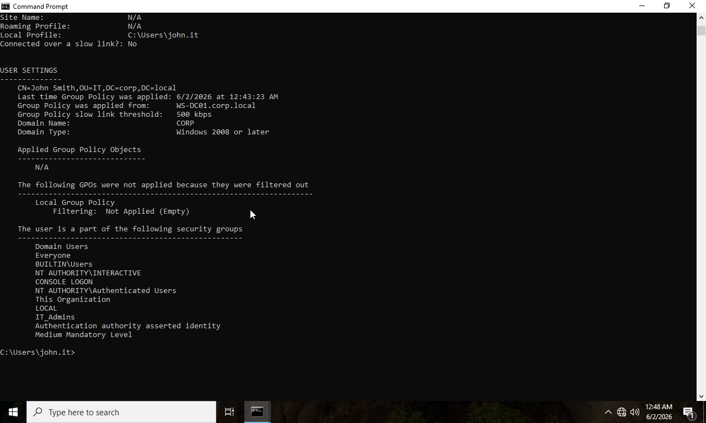

### Screenshot 50 - Corporate Login Banner GPO

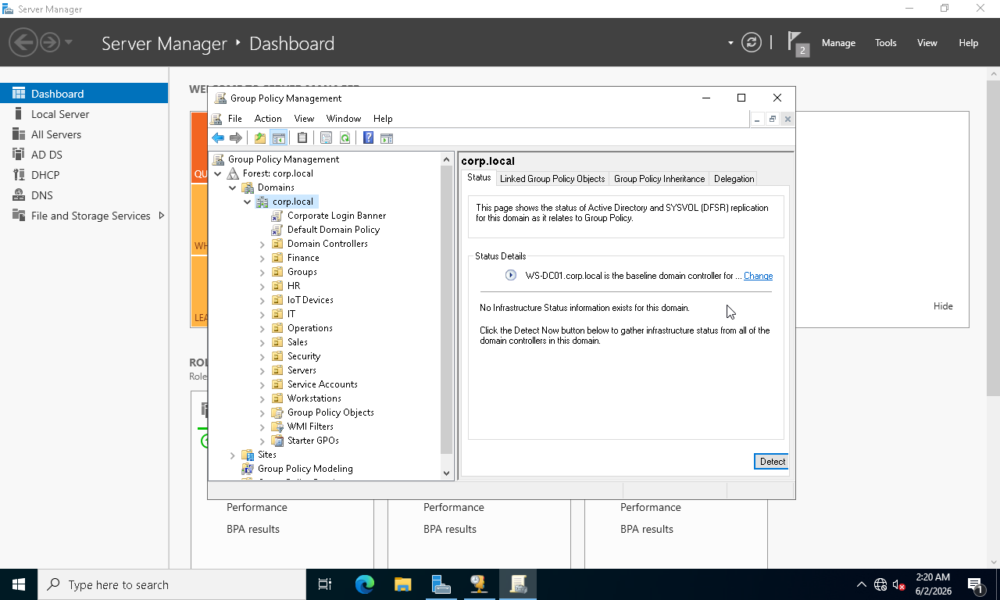

### Screenshot 51 - Login Banner Text

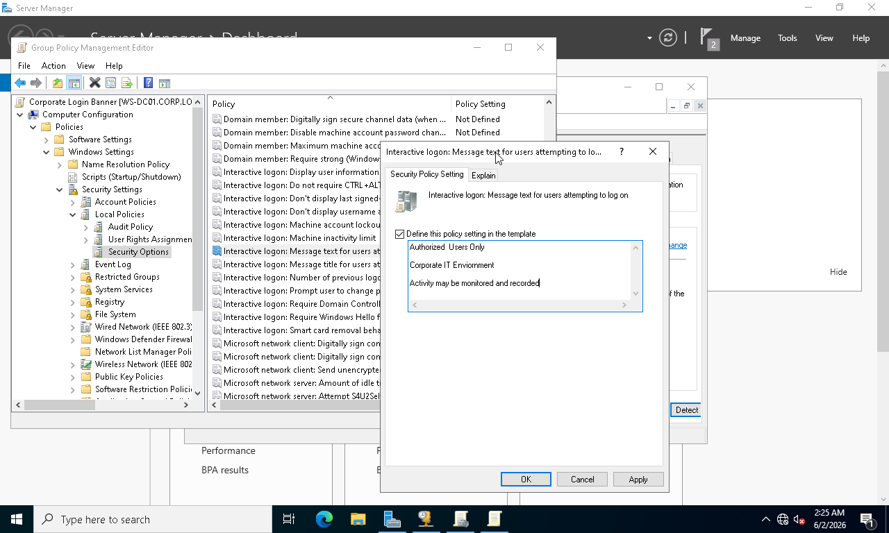

### Screenshot 52 - Login Banner Title

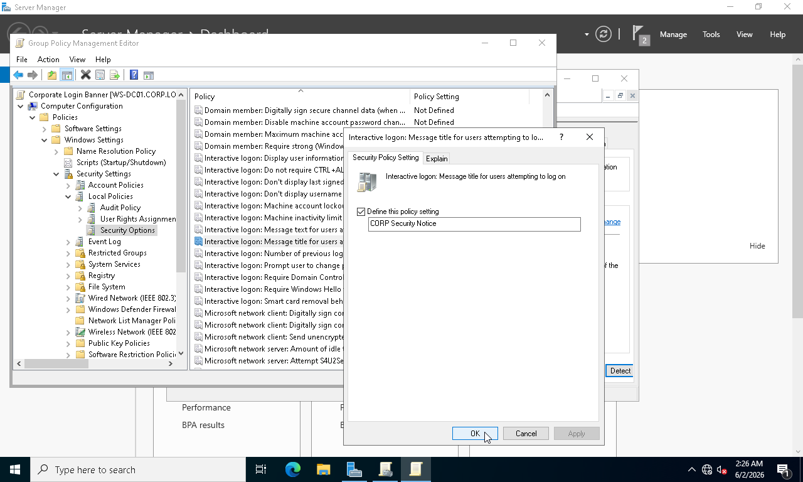

### Screenshot 53 - Login Banner Policy Update

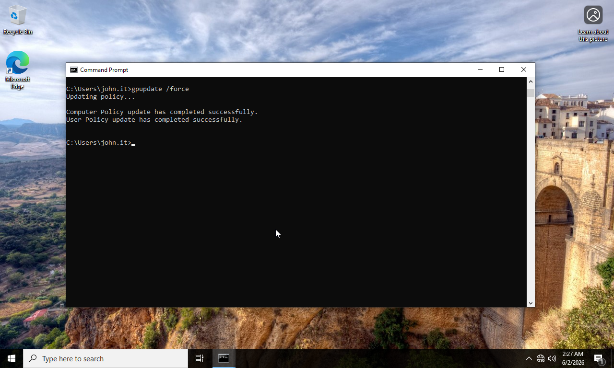

### Screenshot 54 - Login Banner Working

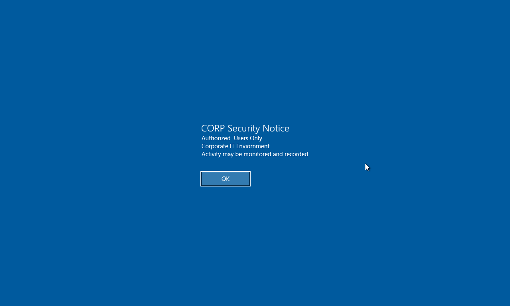

### Screenshot 55 - Wallpaper Share

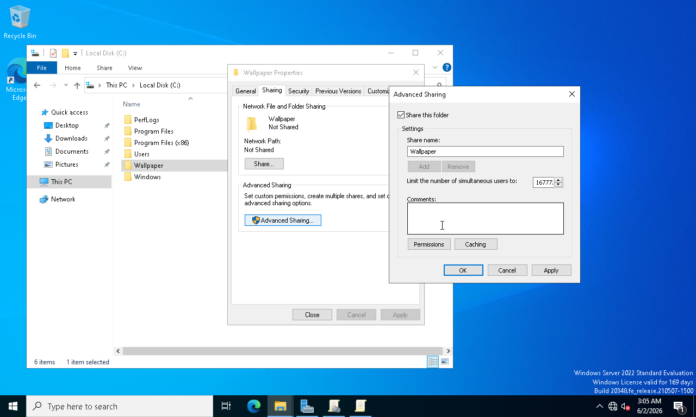

### Screenshot 56 - Wallpaper Share Permissions

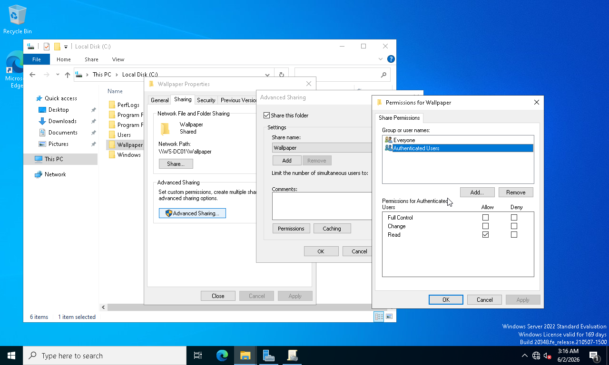

### Screenshot 57 - Wallpaper GPO Created

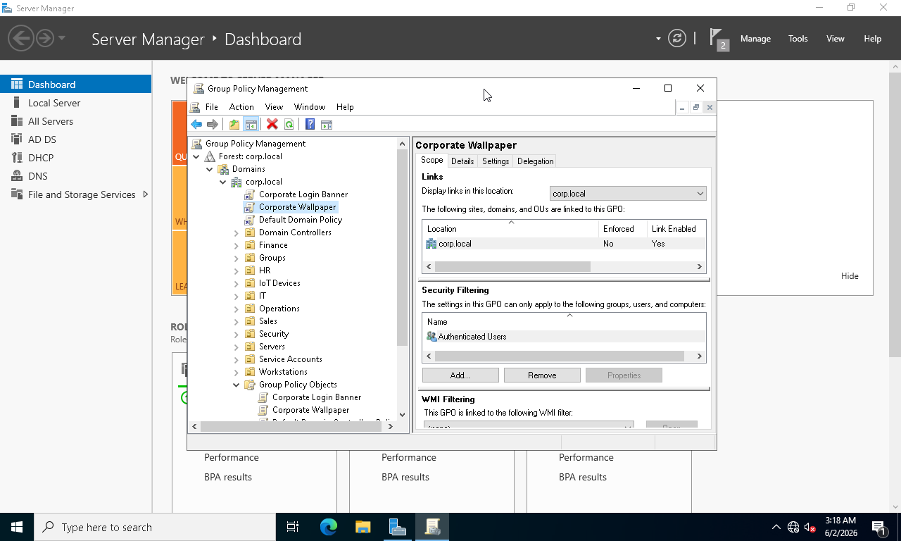

### Screenshot 58 - Wallpaper Policy Configured

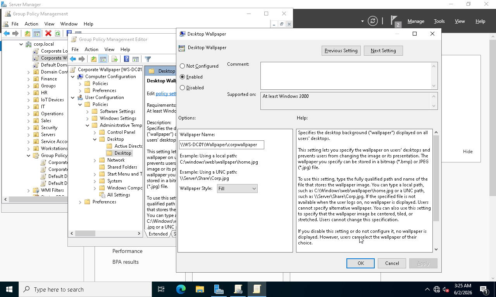

### Screenshot 59 - Wallpaper Policy Update

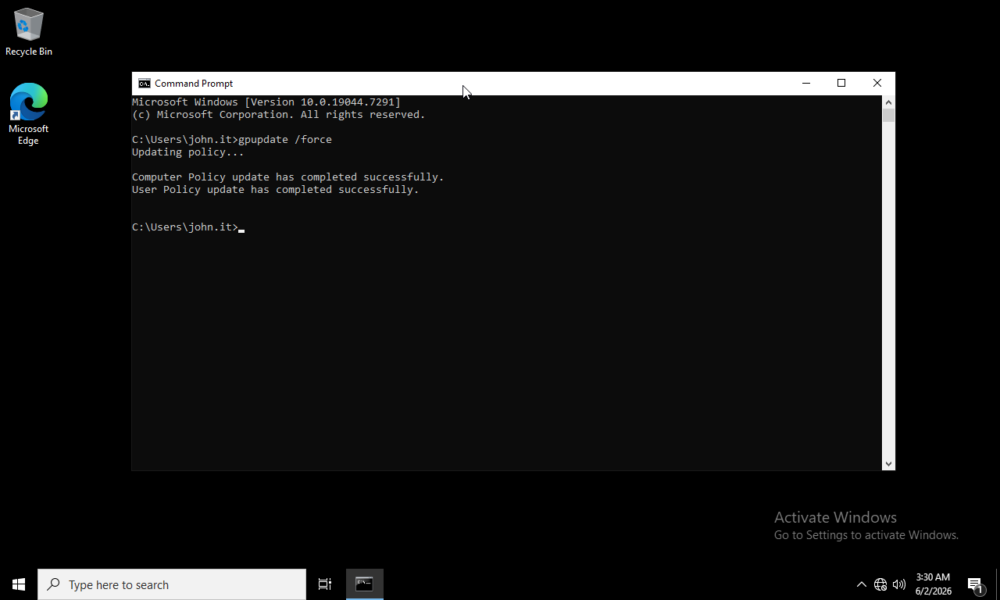

### Screenshot 60 - Corporate Wallpaper Working

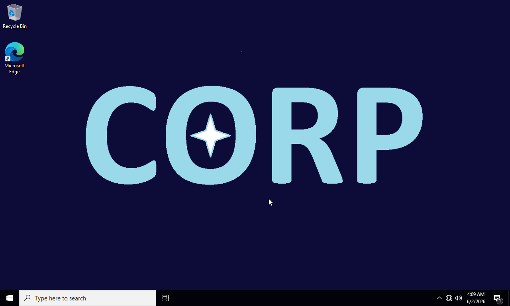

---

## Results

* Password policies successfully configured
* Domain security settings enforced
* Corporate login banner deployed
* Desktop wallpaper deployed through Group Policy
* Policy application verified successfully
* Centralized management of user settings achieved

---

## Skills Demonstrated

* Group Policy Administration
* Security Policy Management
* Password Policy Configuration
* User Environment Management
* Desktop Standardization
* Policy Troubleshooting
* Enterprise Windows Administration

