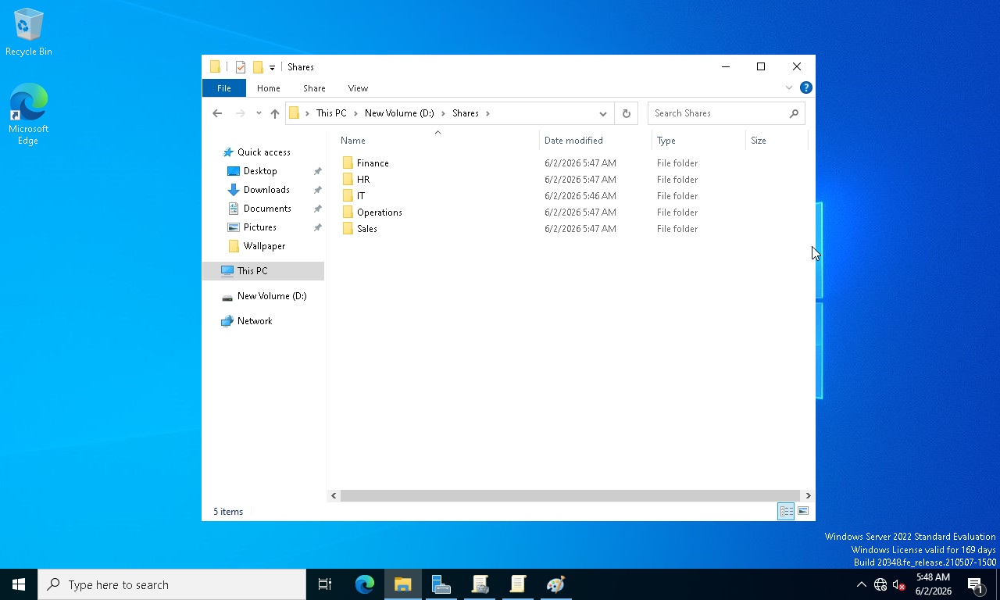
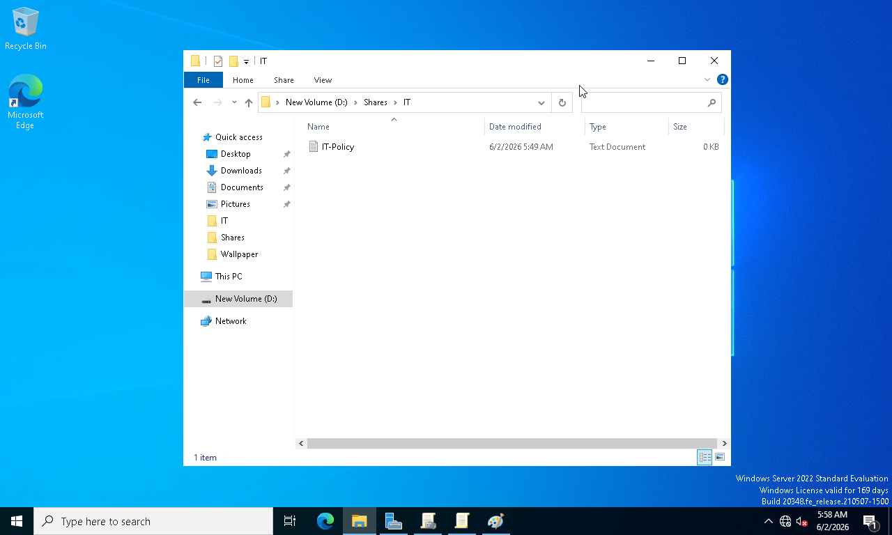
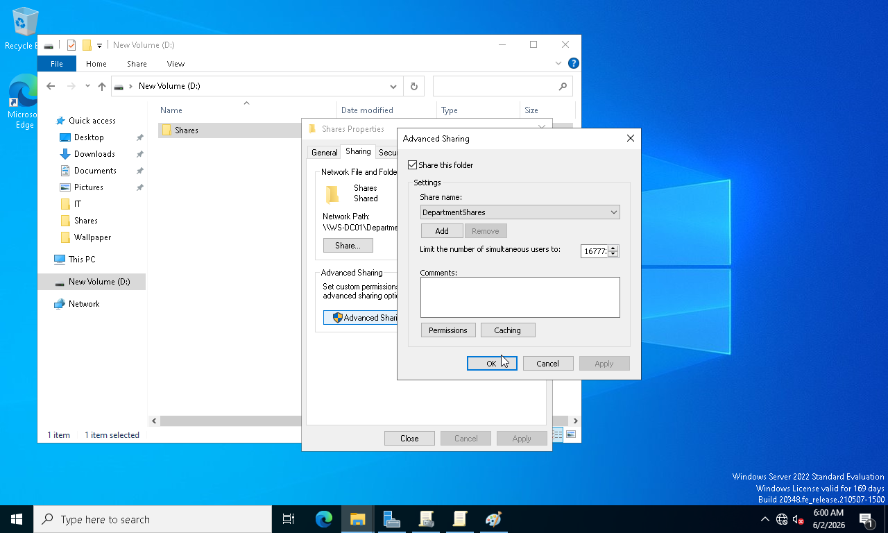
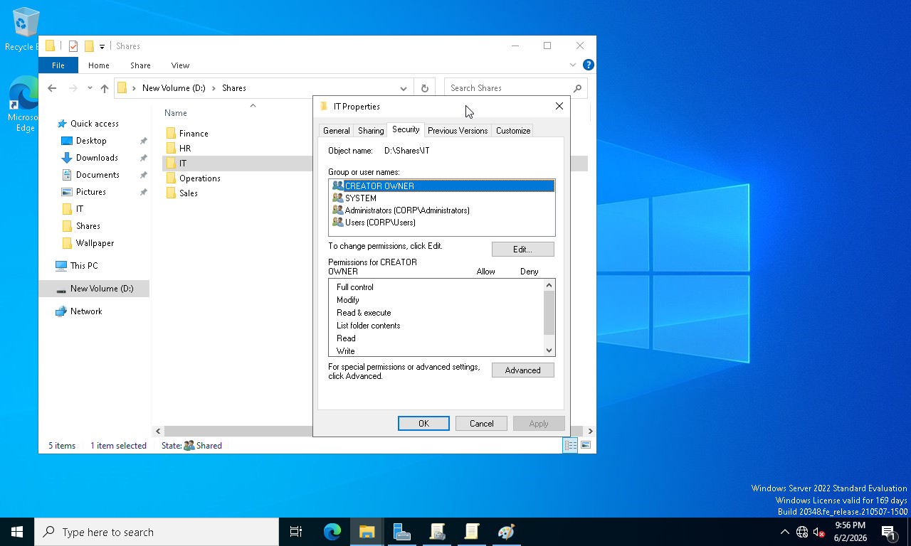
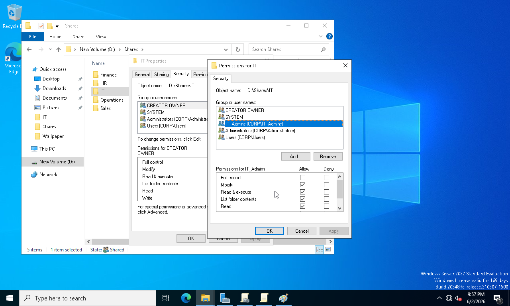
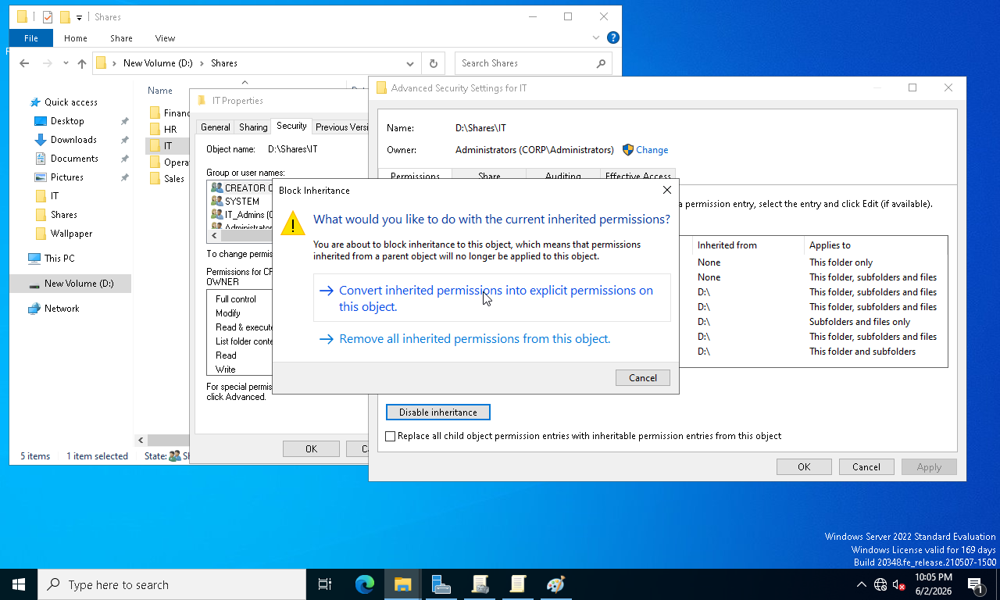
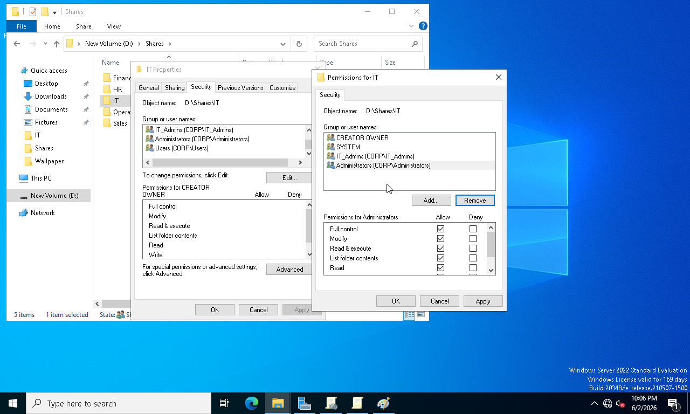
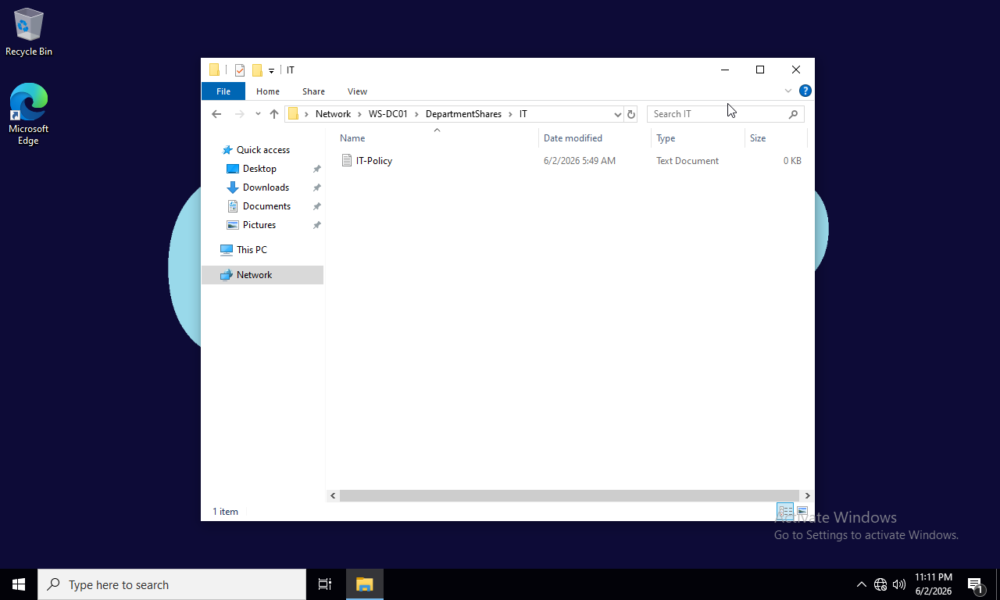
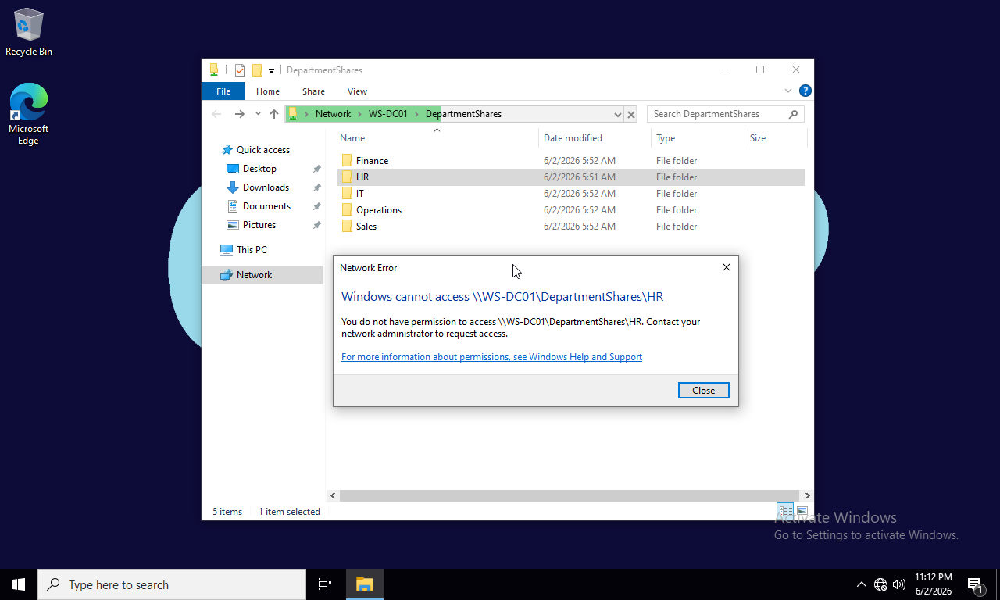
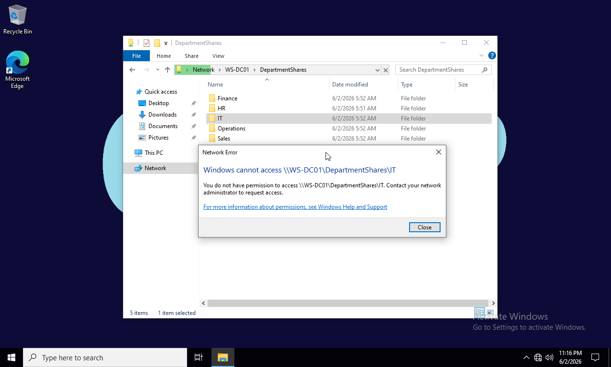

# Phase 06 - File Server and NTFS Permissions

## Overview

This phase focused on implementing centralized file sharing and access control within the enterprise environment.

Departmental shared folders were created and published through the file server. NTFS permissions were configured using security groups to ensure users could access only the resources required for their roles. Permission inheritance was modified where necessary to implement Role-Based Access Control (RBAC) principles.

Access validation testing was performed using departmental user accounts to confirm that permissions were functioning correctly.

---

## Objectives

* Create departmental shared folders
* Configure network shares
* Implement NTFS permissions
* Manage permission inheritance
* Apply Role-Based Access Control (RBAC)
* Validate user access permissions

---

## Environment

| Component      | Value                     |
| -------------- | ------------------------- |
| Server Name    | WS-DC01                   |
| Domain         | corp.local                |
| Service        | File and Storage Services |
| Access Control | NTFS Permissions          |
| Client System  | WIN10-01                  |

---

## Implementation Steps

### 1. Create Departmental Folder Structure

A dedicated folder structure was created to store departmental resources and shared data.

### 2. Create Department Files

Sample files and resources were created within departmental folders to support access testing.

### 3. Configure Network Shares

Folders were shared across the network to allow domain users to access resources from client systems.

### 4. Review Default NTFS Permissions

Existing NTFS permissions were reviewed before implementing custom access controls.

### 5. Configure Security Group Permissions

Departmental security groups were assigned appropriate NTFS permissions based on business requirements.

### 6. Manage Permission Inheritance

Inheritance was disabled where necessary to provide more granular access control.

### 7. Secure Departmental Resources

Folder permissions were finalized to enforce least-privilege access principles.

### 8. Validate User Access

User accounts from different departments were tested to verify successful access control implementation.

---

## Screenshots

### Screenshot 61 - Share Folder Structure

### Screenshot 62 - Department Files Created

### Screenshot 63 - Network Share Created

### Screenshot 64 - Default NTFS Permissions

### Screenshot 65 - Group Permissions Assigned

### Screenshot 66 - Disable Inheritance

### Screenshot 67 - Secured Department Folder

### Screenshot 68 - IT Department Access Success

### Screenshot 69 - HR Access Denied

### Screenshot 70 - HR Department Access Success

### Screenshot 71 - IT Access Denied

---

## Results

* Departmental file shares successfully deployed
* NTFS permissions configured correctly
* Security groups integrated with file access controls
* Permission inheritance managed successfully
* RBAC principles implemented
* User access validated through testing

---

## Skills Demonstrated

* Windows File Server Administration
* NTFS Permission Management
* Shared Folder Administration
* Access Control Management
* Permission Inheritance Configuration
* Role-Based Access Control (RBAC)
* Enterprise Windows Administration
