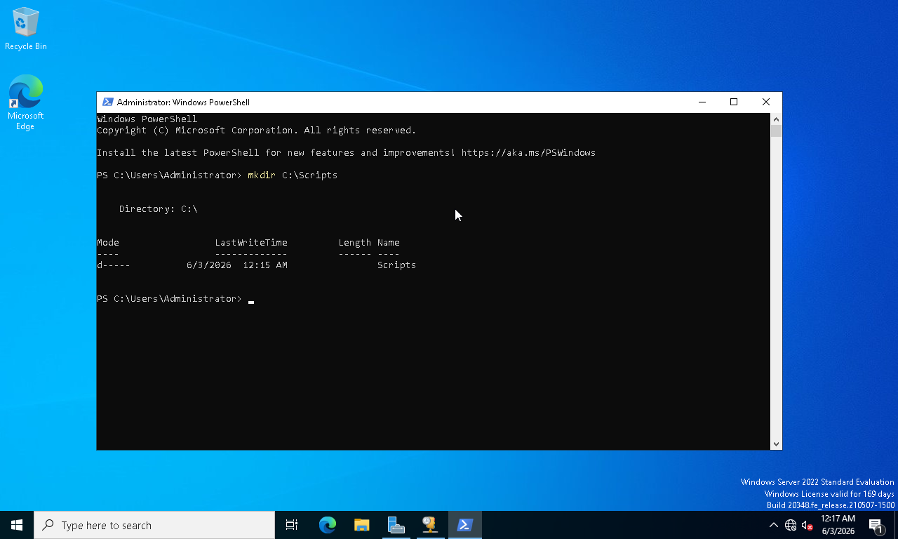
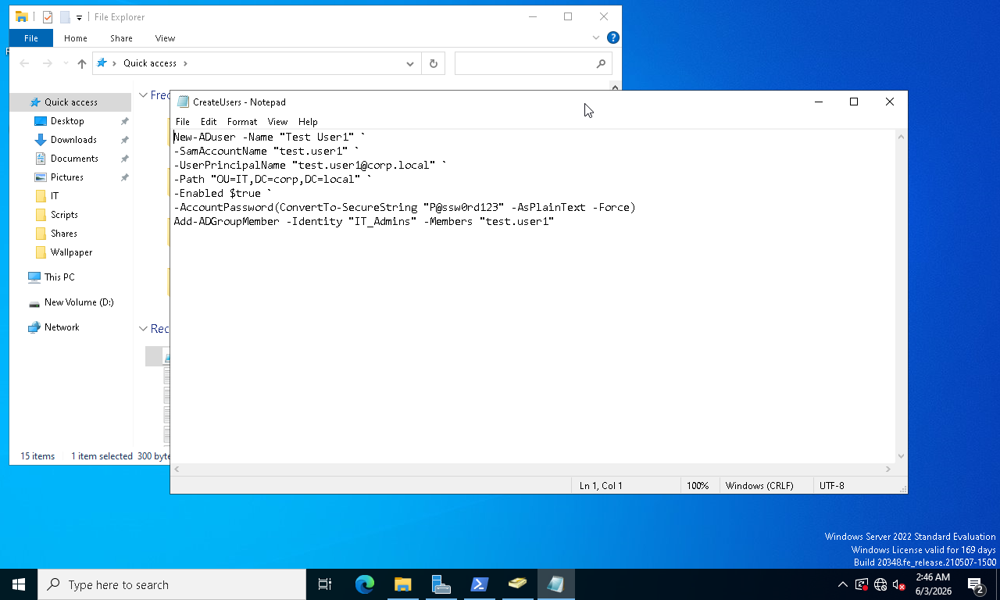
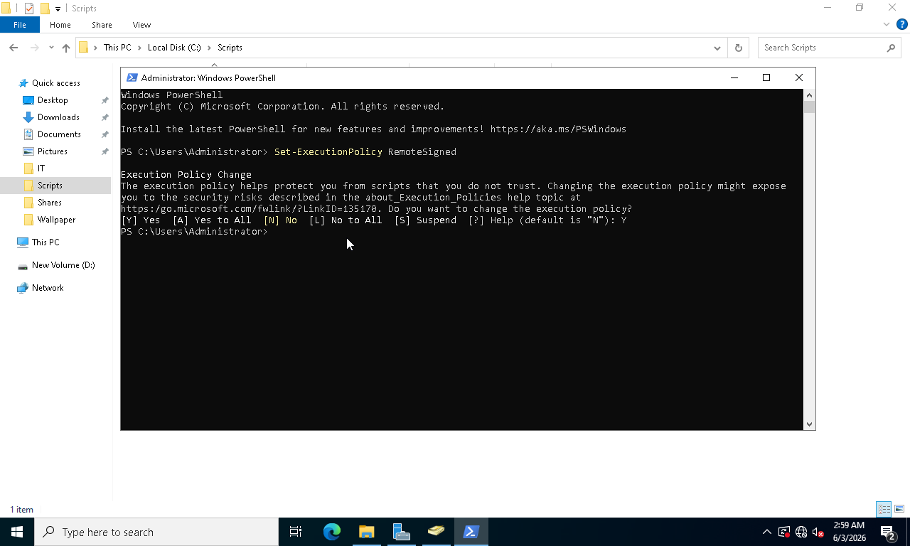
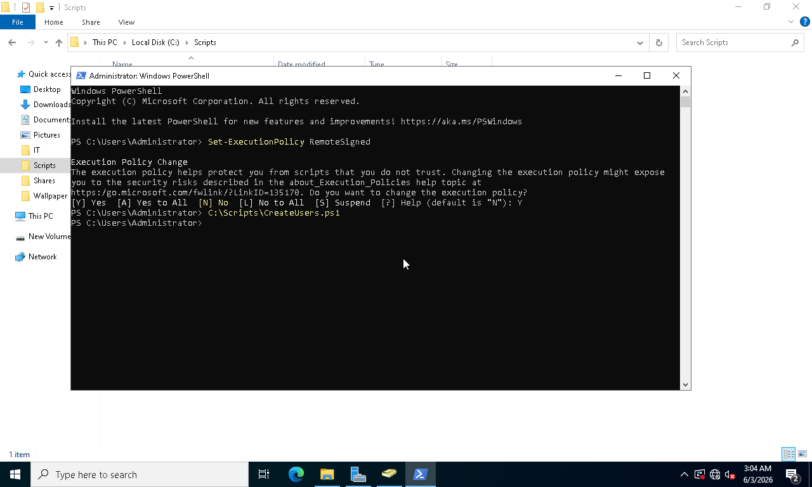
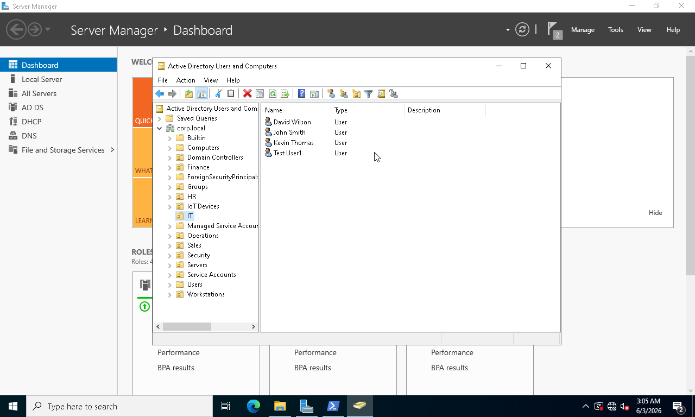
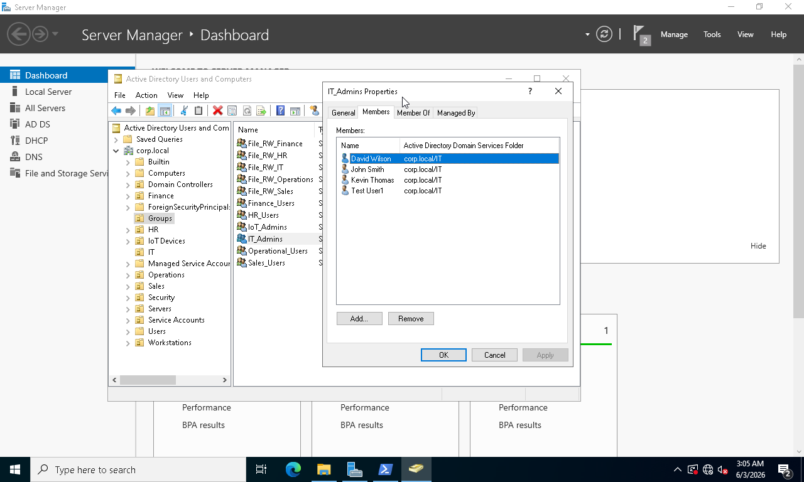
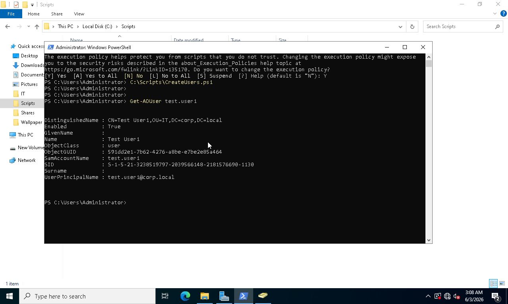
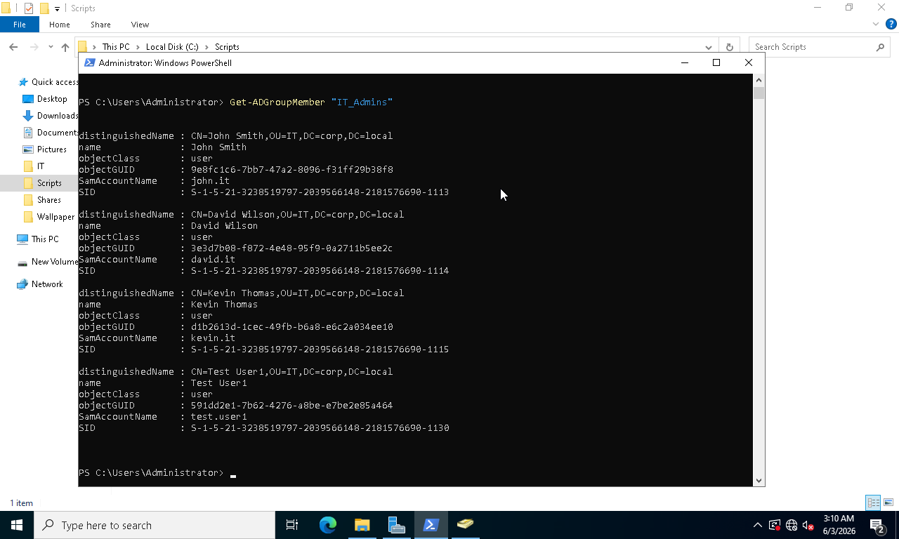
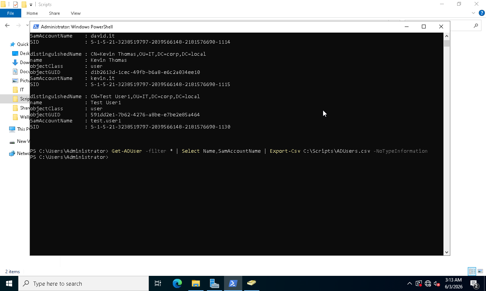
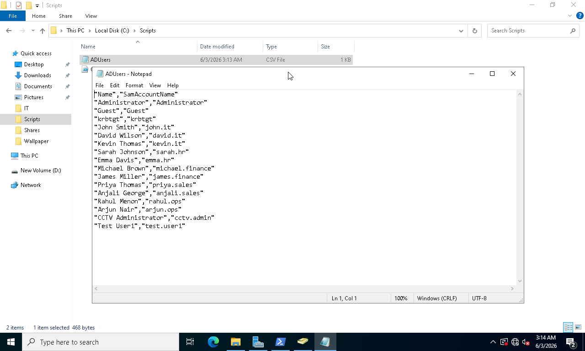

# Phase 07 - PowerShell Administration

## Overview

This phase focused on automating Active Directory administration tasks using Windows PowerShell.

PowerShell scripts were developed to automate user provisioning and group membership assignments within the Active Directory environment. Administrative reporting was also implemented to retrieve user information and export Active Directory data to CSV format for auditing and documentation purposes.

The objective was to reduce manual administrative effort while improving consistency and efficiency through automation.

---

## Objectives

* Create PowerShell administration scripts
* Automate user account creation
* Automate security group assignments
* Query Active Directory objects
* Generate administrative reports
* Export Active Directory data to CSV

---

## Environment

| Component         | Value                            |
| ----------------- | -------------------------------- |
| Domain Controller | WS-DC01                          |
| Domain            | corp.local                       |
| Automation Tool   | Windows PowerShell               |
| Directory Service | Active Directory Domain Services |

---

## Implementation Steps

### 1. Create Scripts Directory

A dedicated location was created to store PowerShell administration scripts.

### 2. Develop User Provisioning Script

A PowerShell script was created to automate Active Directory user account creation.

### 3. Configure PowerShell Execution Policy

Execution policy settings were reviewed and configured to allow script execution.

### 4. Execute Automation Script

The provisioning script was executed to create user accounts automatically.

### 5. Verify User Creation

Active Directory was reviewed to confirm successful user provisioning.

### 6. Automate Group Membership Assignment

PowerShell commands were used to assign users to security groups.

### 7. Query Active Directory Objects

Get-ADUser and Get-ADGroupMember commands were used to retrieve directory information.

### 8. Generate Administrative Reports

User account information was exported to CSV format to support reporting and auditing requirements.

---

## Screenshots

### Screenshot 76 - Scripts Folder Created

### Screenshot 77 - PowerShell User Provisioning Script

### Screenshot 78 - PowerShell Execution Policy

### Screenshot 79 - Script Executed Successfully

### Screenshot 80 - User Created by Script

### Screenshot 81 - Group Membership Automated

### Screenshot 82 - Get-ADUser Output

### Screenshot 83 - Get-ADGroupMember Output

### Screenshot 84 - CSV Report Generated

### Screenshot 85 - Active Directory User Report

---

## Results

* User provisioning automated successfully
* Security group assignments automated
* Active Directory queries executed through PowerShell
* Administrative reporting implemented
* CSV exports generated successfully
* Manual administrative effort reduced through automation

---

## Skills Demonstrated

* Windows PowerShell Administration
* Active Directory Automation
* User Provisioning Automation
* Group Membership Management
* PowerShell Scripting
* Administrative Reporting
* CSV Data Export
* Enterprise Windows Administration
