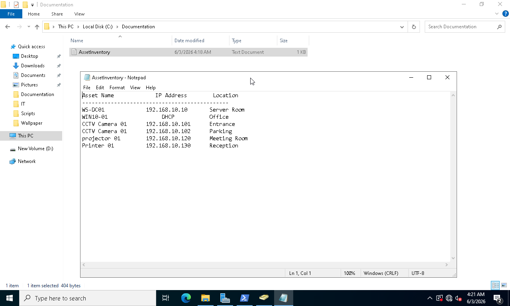
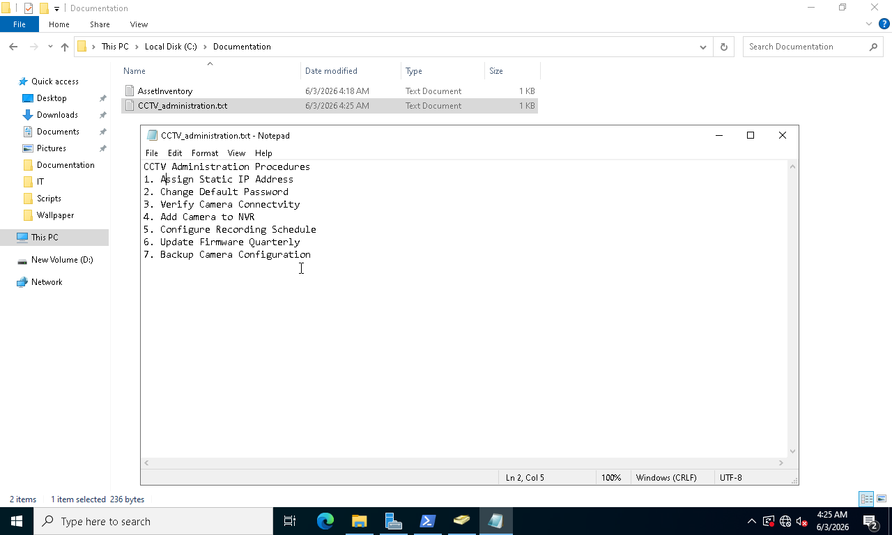
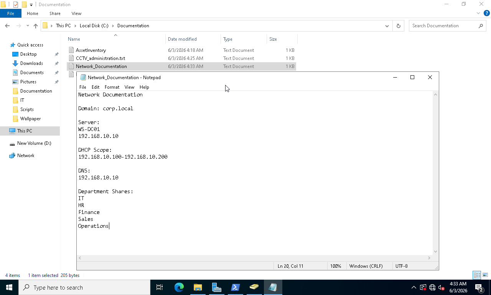
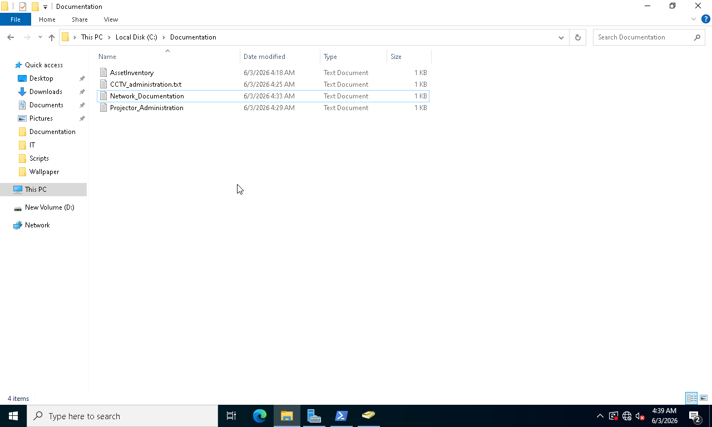
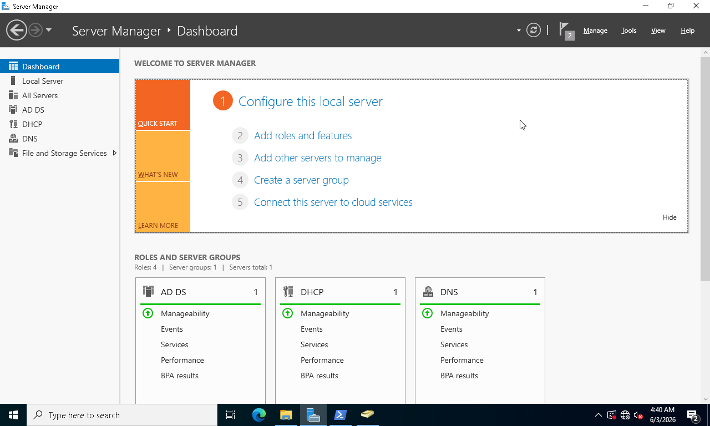
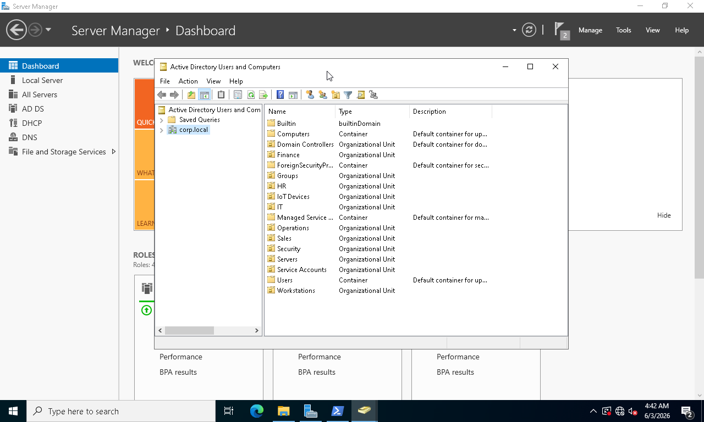
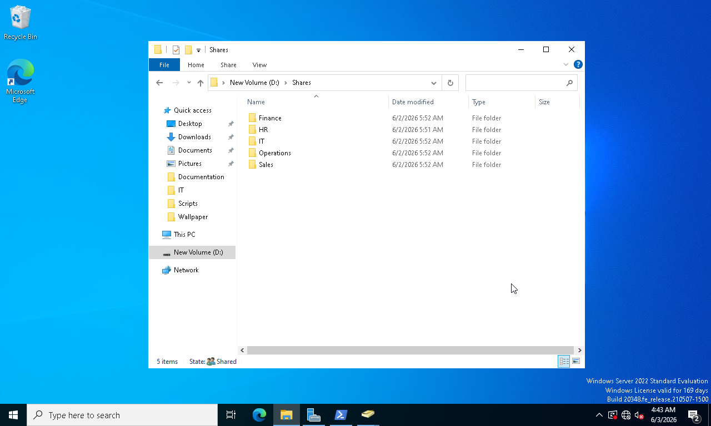
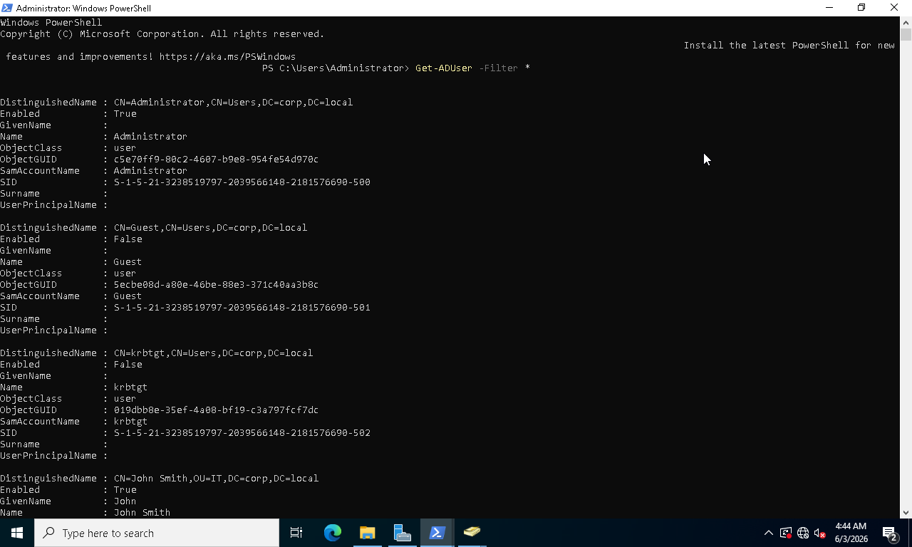

# Phase 08 - IT and IoT Administration Documentation

## Overview

This phase focused on creating operational documentation to support enterprise IT administration and IoT device management.

Administrative records were developed to document organizational assets, network infrastructure, server resources, and IoT-related systems. Proper documentation improves operational efficiency, simplifies troubleshooting, supports audits, and assists future administrators in maintaining the environment.

The objective was to establish structured documentation practices commonly used in enterprise IT operations.

---

## Objectives

* Create IT asset inventory documentation
* Document IoT device administration procedures
* Maintain network infrastructure documentation
* Organize administrative records
* Verify enterprise environment documentation
* Support operational readiness and knowledge transfer

---

## Environment

| Component              | Value                     |
| ---------------------- | ------------------------- |
| Domain Controller      | WS-DC01                   |
| Domain                 | corp.local                |
| Documentation Platform | Windows File Services     |
| Client System          | WIN10-01                  |
| Documentation Scope    | IT and IoT Administration |

---

## Implementation Steps

### 1. Create Asset Inventory

An inventory was developed to document enterprise hardware and technology assets.

### 2. Document CCTV Administration

Administrative information for CCTV systems was recorded to support monitoring and maintenance operations.

### 3. Document Projector Administration

Projector assets and management procedures were documented for operational support.

### 4. Create Network Documentation

Network configuration information was documented to assist future administration and troubleshooting.

### 5. Organize Documentation Repository

A centralized documentation structure was created to store administrative records.

### 6. Verify Server Infrastructure

Server resources and management tools were reviewed and documented.

### 7. Verify Active Directory Environment

The final Active Directory structure was documented for operational reference.

### 8. Verify Shared Resource Structure

File shares and departmental resources were documented.

### 9. Verify User Administration Records

Active Directory user accounts and organizational resources were reviewed and documented.

---

## Screenshots

### Screenshot 86 - Asset Inventory

### Screenshot 87 - CCTV Administration

### Screenshot 88 - Projector Administration

### Screenshot 89 - Network Documentation

### Screenshot 90 - Documentation Repository

### Screenshot 91 - Server Infrastructure Review

### Screenshot 92 - Final Active Directory Structure

### Screenshot 93 - Final Shared Resource Structure

### Screenshot 94 - Active Directory User Verification

---

## Results

* Asset inventory documentation completed
* IoT administration records created
* Network documentation maintained
* Documentation repository organized
* Active Directory environment documented
* Operational records prepared for future administration

---

## Skills Demonstrated

* IT Documentation
* Asset Management
* IoT Administration
* Network Documentation
* Operational Documentation
* Technical Record Keeping
* Infrastructure Administration
* Enterprise IT Operations
