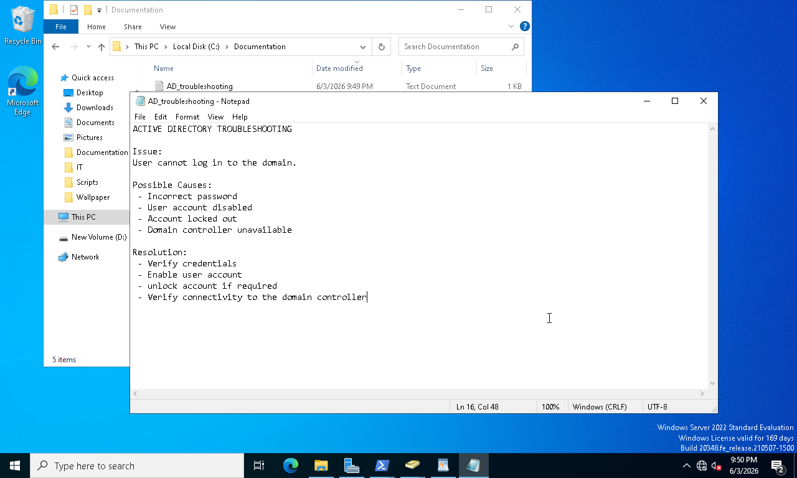
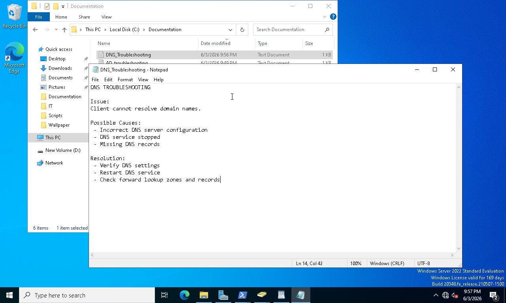
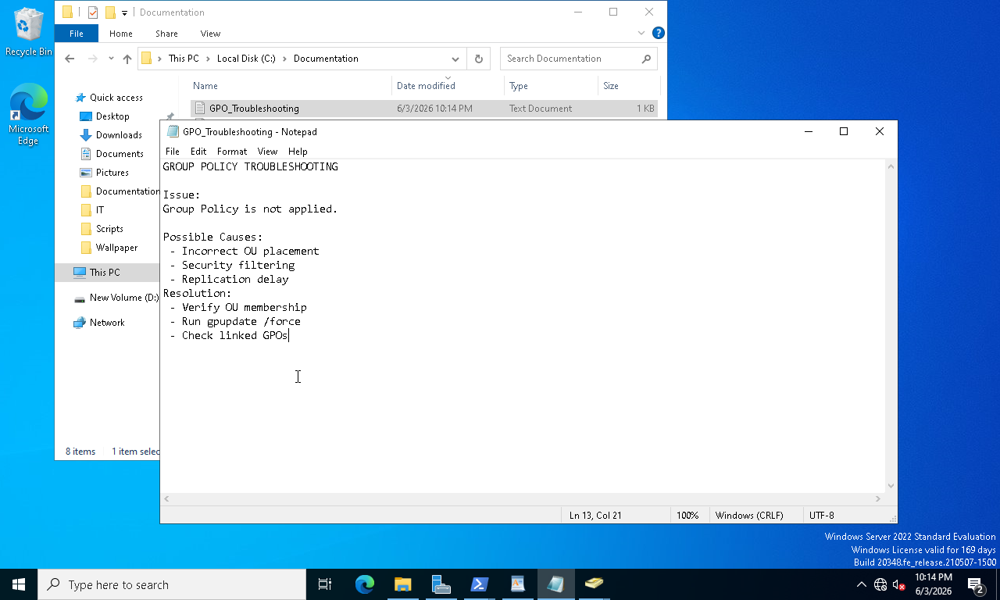
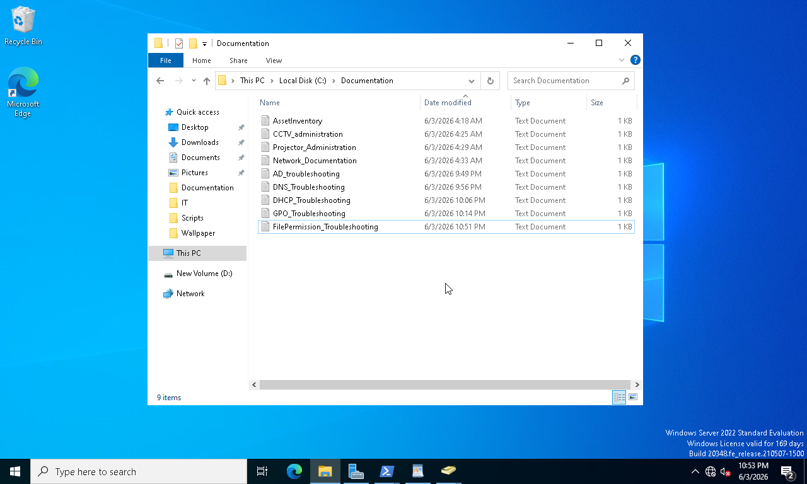

# Phase 09 - Troubleshooting and Operations

## Overview

This phase focused on troubleshooting common enterprise infrastructure issues and maintaining operational documentation.

Administrative procedures were developed to identify, analyze, and resolve issues related to Active Directory, DNS, DHCP, Group Policy, and file access permissions. Operational records were also maintained to support incident response, system maintenance, and future administrative activities.

The objective was to strengthen troubleshooting skills and establish operational practices commonly used by enterprise IT administrators.

---

## Objectives

* Troubleshoot Active Directory issues
* Troubleshoot DNS resolution problems
* Troubleshoot DHCP-related issues
* Troubleshoot Group Policy processing
* Troubleshoot file access and permission issues
* Maintain operational documentation

---

## Environment

| Component         | Value                            |
| ----------------- | -------------------------------- |
| Domain Controller | WS-DC01                          |
| Domain            | corp.local                       |
| Client System     | WIN10-01                         |
| Directory Service | Active Directory Domain Services |
| Operational Area  | Enterprise IT Operations         |

---

## Implementation Steps

### 1. Troubleshoot Active Directory

Administrative tools were used to verify domain functionality, user objects, group memberships, and organizational units.

### 2. Troubleshoot DNS Services

DNS configuration and name resolution were reviewed to ensure proper communication between clients and domain services.

### 3. Troubleshoot DHCP Services

DHCP scope configuration, address allocation, and lease activity were reviewed to identify potential issues.

### 4. Troubleshoot Group Policy

Group Policy processing was validated using administrative tools and client-side verification methods.

### 5. Troubleshoot File Access Permissions

NTFS permissions, security groups, and share permissions were reviewed to identify access control issues.

### 6. Maintain Operations Documentation

Administrative records and operational documentation were organized to support future maintenance and troubleshooting activities.

---

## Screenshots

### Screenshot 95 - Active Directory Troubleshooting

### Screenshot 96 - DNS Troubleshooting

### Screenshot 97 - DHCP Troubleshooting

### Screenshot 98 - Group Policy Troubleshooting

### Screenshot 99 - File Permission Troubleshooting

### Screenshot 100 - Operations Documentation Repository

---

## Results

* Active Directory issues successfully analyzed
* DNS functionality verified and tested
* DHCP services reviewed and validated
* Group Policy processing confirmed
* File permission issues investigated and documented
* Operational documentation repository established

---

## Skills Demonstrated

* Windows Server Troubleshooting
* Active Directory Troubleshooting
* DNS Troubleshooting
* DHCP Troubleshooting
* Group Policy Analysis
* NTFS Permission Troubleshooting
* Incident Investigation
* Enterprise IT Operations
