# Windows Server Security Hardening Lab

## Overview

This project focused on implementing and validating security hardening controls within a Windows Server 2022 enterprise environment.

Security controls were reviewed and verified through Group Policy, Windows Defender, Windows Firewall, Security Auditing, Advanced Audit Policies, Event Monitoring, and Security Verification procedures. The objective was to strengthen the security posture of the server while developing practical enterprise security administration skills commonly required in production environments.

---

## Objectives

* Review password security policies
* Verify account lockout protection
* Verify security auditing configuration
* Validate Windows Defender protection
* Review Windows Firewall configuration
* Review User Rights Assignments
* Verify Advanced Audit Policies
* Monitor security-related events
* Perform security verification and reporting

---

## Environment

| Component | Value |
|------------|--------|
| Server Name | WS-DC01 |
| Operating System | Windows Server 2022 Standard Evaluation |
| Domain | corp.local |
| Management Tool | Group Policy Management |
| Security Platform | Windows Defender |
| Firewall | Windows Firewall with Advanced Security |
| Monitoring Tool | Event Viewer |

---

# Phase 01 - Password Policy Hardening

## Overview

This phase focused on reviewing and validating password policy settings configured within the Default Domain Policy.

Strong password policies are one of the most important controls used to protect enterprise identities against unauthorized access and credential-based attacks.

---

## Objectives

* Verify password complexity requirements
* Verify password history configuration
* Review enterprise authentication controls
* Confirm policy application

---

## Implementation Steps

### 1. Open Default Domain Policy

The Default Domain Policy was opened through Group Policy Management.

### 2. Navigate to Password Policy

Password Policy settings were accessed through:

```text
Computer Configuration
→ Policies
→ Windows Settings
→ Security Settings
→ Account Policies
→ Password Policy
```

### 3. Review Password Security Configuration

Password security settings were reviewed to verify compliance with enterprise security standards.

---

## Screenshots

### Screenshot 01 - Default Domain Policy Opened

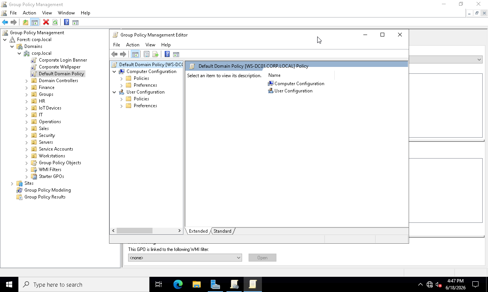

### Screenshot 02 - Password Policy Location

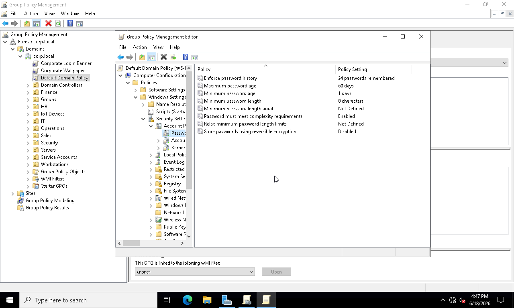

### Screenshot 03 - Password Policy Configured

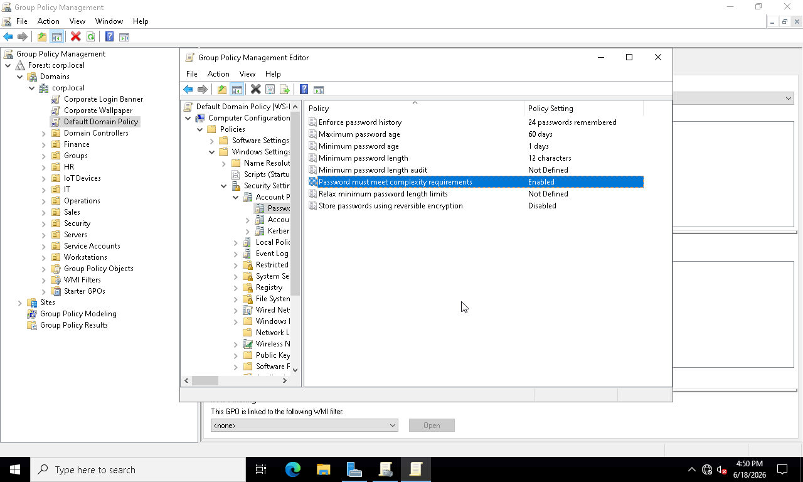

---

## Results

* Password policy reviewed successfully
* Enterprise authentication controls verified
* Security baseline validated
* Group Policy configuration confirmed

---

## Skills Demonstrated

* Group Policy Administration
* Password Policy Management
* Windows Security Administration
* Enterprise Authentication Controls

---

# Phase 02 - Account Lockout Policy

## Overview

This phase focused on reviewing account lockout settings designed to protect the environment from brute-force authentication attacks.

Account lockout controls help prevent repeated password guessing attempts by temporarily locking user accounts after a defined number of failed logon attempts.

---

## Objectives

* Verify account lockout settings
* Review lockout threshold configuration
* Review lockout duration settings
* Confirm Group Policy application

---

## Implementation Steps

### 1. Navigate to Account Lockout Policy

Account Lockout Policy settings were accessed through Group Policy Management.

### 2. Review Lockout Settings

Lockout threshold, lockout duration, and reset counter settings were reviewed.

### 3. Apply Group Policy Updates

Group Policy settings were refreshed to ensure current configurations were active.

### 4. Verify Applied Policies

Policy application was verified using GPResult.

---

## Screenshots

### Screenshot 04 - Account Lockout Policy Location

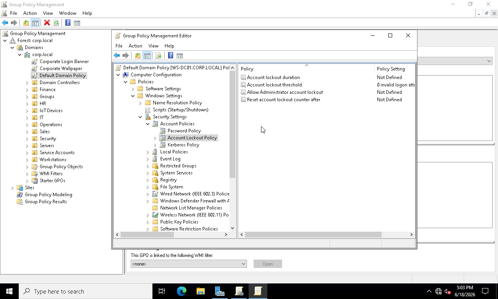

### Screenshot 05 - Account Lockout Policy Configured

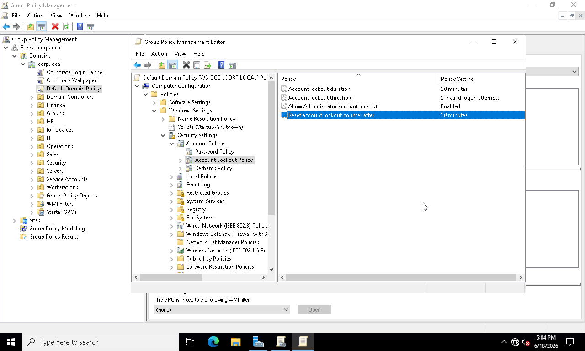

### Screenshot 06 - GPUpdate Successful

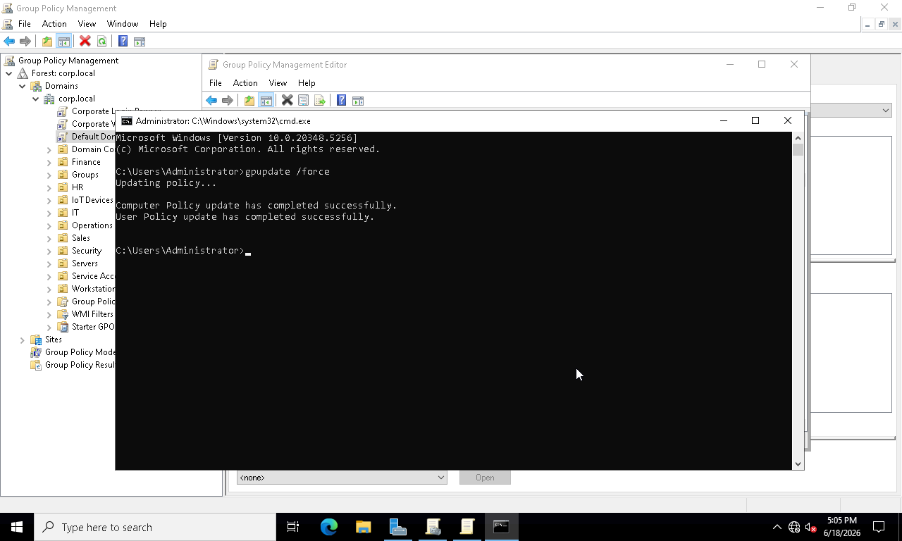

### Screenshot 07 - GPResult Verification

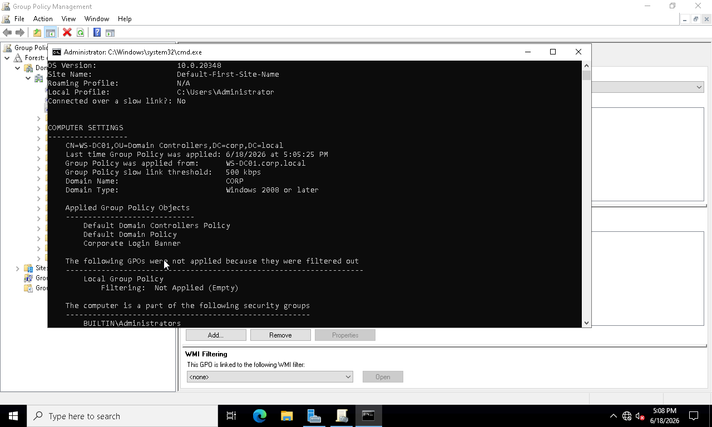

---

## Results

* Account lockout protection verified
* Brute-force attack mitigation confirmed
* Group Policy application validated
* Authentication security controls reviewed

---

## Skills Demonstrated

* Account Security Management
* Authentication Security
* Group Policy Administration
* Windows Security Administration

---

# Phase 03 - Audit Policy Configuration

## Overview

This phase focused on configuring and validating security auditing settings used to monitor authentication activity and administrative operations.

Security auditing provides visibility into important events occurring within the Windows environment and supports operational monitoring and incident investigation.

---

## Objectives

* Configure audit policies
* Verify event generation
* Validate security logging
* Confirm audit functionality

---

## Implementation Steps

### 1. Create Security Hardening GPO

A dedicated security hardening Group Policy Object was created for security-related configuration management.

### 2. Access Audit Policy Settings

Audit Policy settings were accessed through Group Policy Management.

### 3. Configure Security Auditing

Security auditing categories were reviewed and configured.

### 4. Refresh Group Policy

Group Policy settings were refreshed.

### 5. Verify Security Events

Event Viewer was reviewed to confirm audit event generation.

---

## Screenshots

### Screenshot 08 - Security Hardening GPO Created

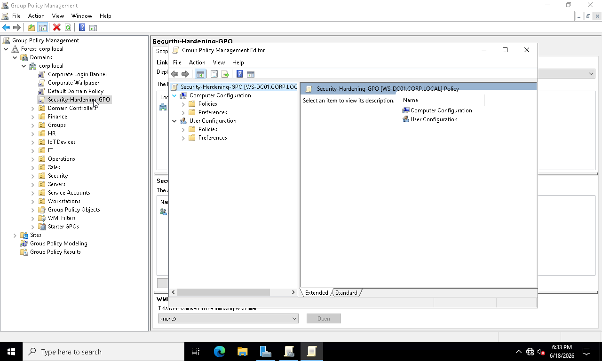

### Screenshot 09 - Audit Policy Location

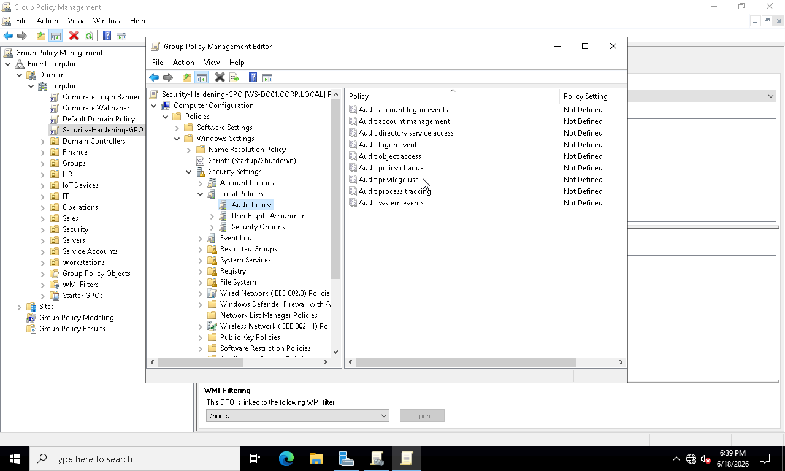

### Screenshot 10 - Audit Policy Configured

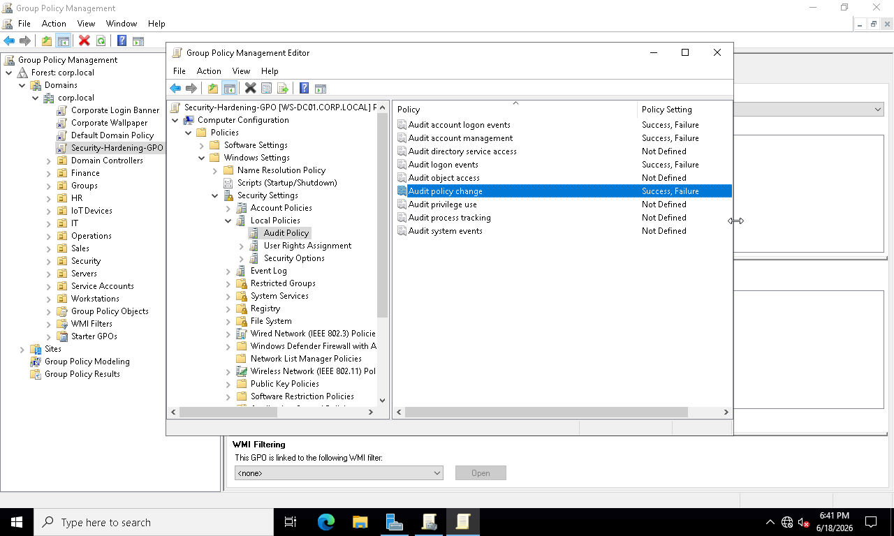

### Screenshot 11 - Audit Policy GPUpdate

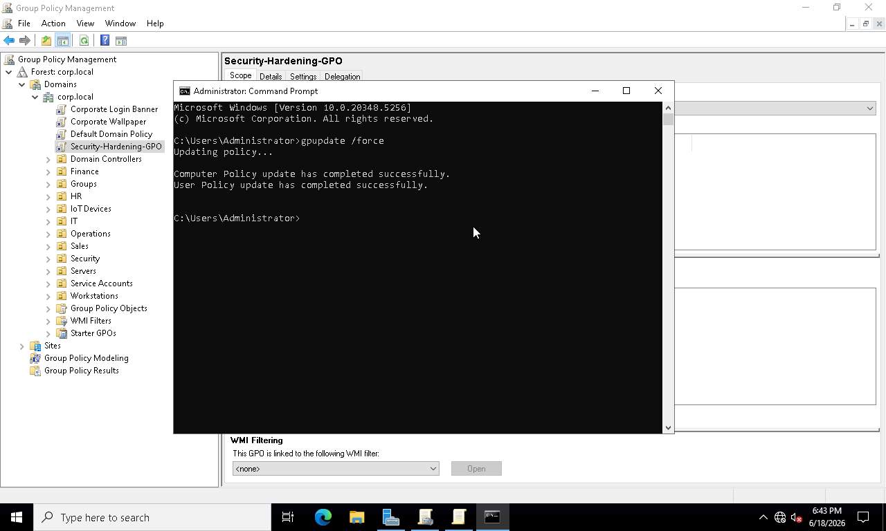

### Screenshot 12 - Security Event Log

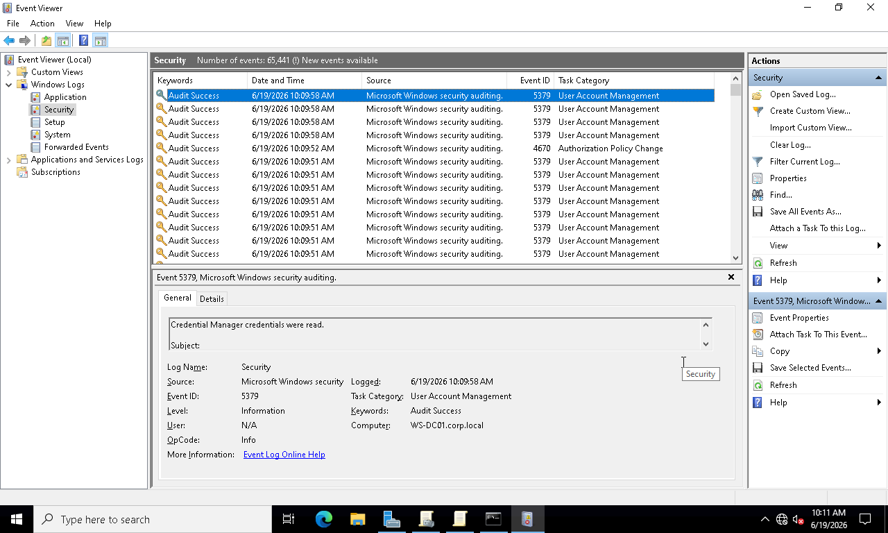

---

## Results

* Security auditing configured successfully
* Event generation verified
* Security logging operational
* Audit policy deployment confirmed

---

## Skills Demonstrated

* Audit Policy Administration
* Event Logging
* Group Policy Administration
* Windows Security Administration

---

# Phase 04 - Windows Defender Hardening

## Overview

This phase focused on reviewing and validating Windows Defender Antivirus protection within the Windows Server environment.

Windows Defender provides built-in endpoint protection against malware, ransomware, spyware, and other malicious software threats. Ensuring that Defender is operational and updated is a critical component of enterprise security.

---

## Objectives

* Verify Windows Defender operational status
* Verify real-time protection
* Review Defender health status
* Verify signature updates
* Validate endpoint protection readiness

---

## Implementation Steps

### 1. Open Windows Security

Windows Security was accessed to review the overall Defender protection status.

### 2. Verify Real-Time Protection

Real-time protection settings were reviewed to ensure active malware protection.

### 3. Verify Defender Status Through PowerShell

PowerShell was used to verify Defender operational status and configuration.

### 4. Verify Security Intelligence Updates

Security signatures and threat definitions were reviewed to ensure current protection.

---

## Screenshots

### Screenshot 13 - Defender Overview

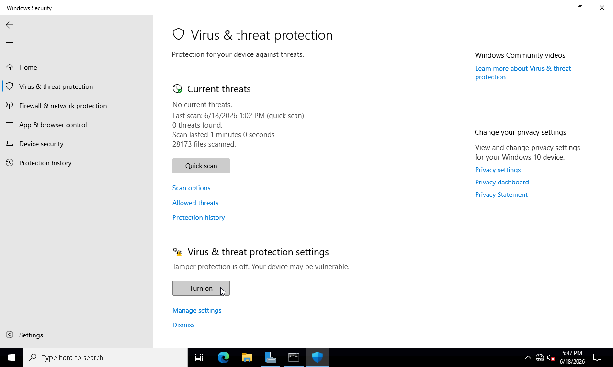

### Screenshot 14 - Defender Real-Time Protection

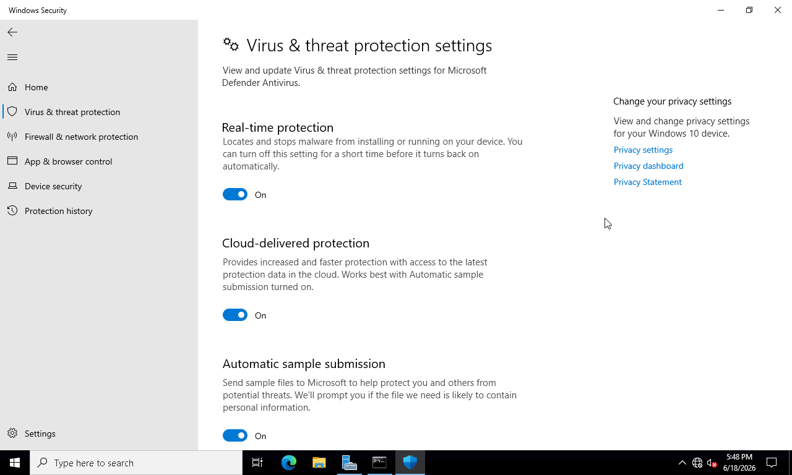

### Screenshot 15 - Defender PowerShell Status

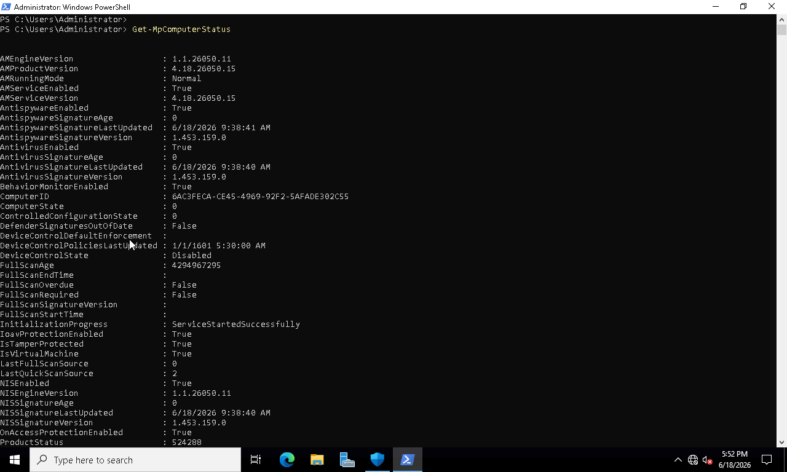

### Screenshot 16 - Defender Updated Signatures

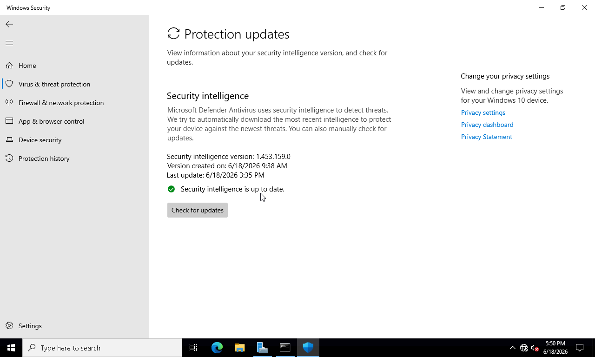

---

## Results

* Windows Defender operational
* Real-time protection verified
* Security signatures updated
* Endpoint protection validated

---

## Skills Demonstrated

* Windows Defender Administration
* Endpoint Protection
* Security Verification
* Windows Security Administration

---

# Phase 05 - Windows Firewall Hardening

## Overview

This phase focused on reviewing Windows Firewall configuration and validating host-based network protection.

Windows Firewall provides an additional layer of defense by controlling inbound and outbound network traffic based on security rules and profiles.

---

## Objectives

* Verify firewall status
* Review firewall profiles
* Review inbound rule configuration
* Review custom firewall rules
* Validate firewall protection

---

## Implementation Steps

### 1. Open Windows Firewall with Advanced Security

The Firewall Management Console was opened.

### 2. Review Inbound Rules

Configured inbound firewall rules were reviewed.

### 3. Review Custom Security Rules

Custom firewall rules were reviewed to validate configuration.

### 4. Export Firewall Policy

Firewall policy settings were exported for administrative review.

### 5. Verify Firewall Profiles

Domain, Private, and Public profiles were reviewed.

---

## Screenshots

### Screenshot 17 - Firewall Console

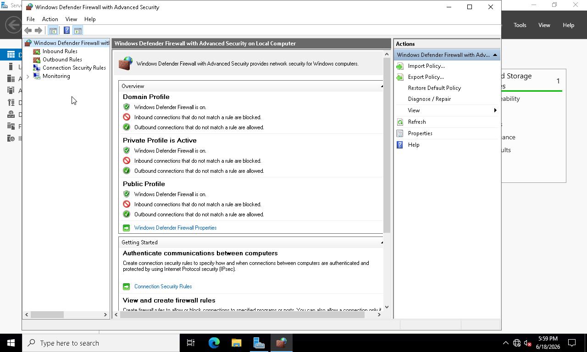

### Screenshot 18 - Firewall Inbound Rules

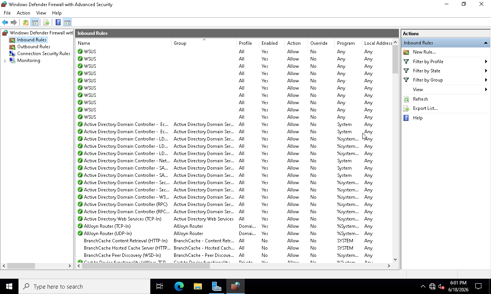

### Screenshot 19 - Firewall Custom Rule

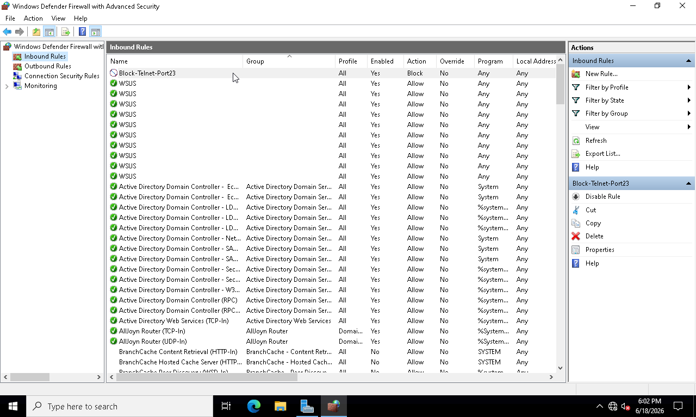

### Screenshot 20 - Firewall Policy Export

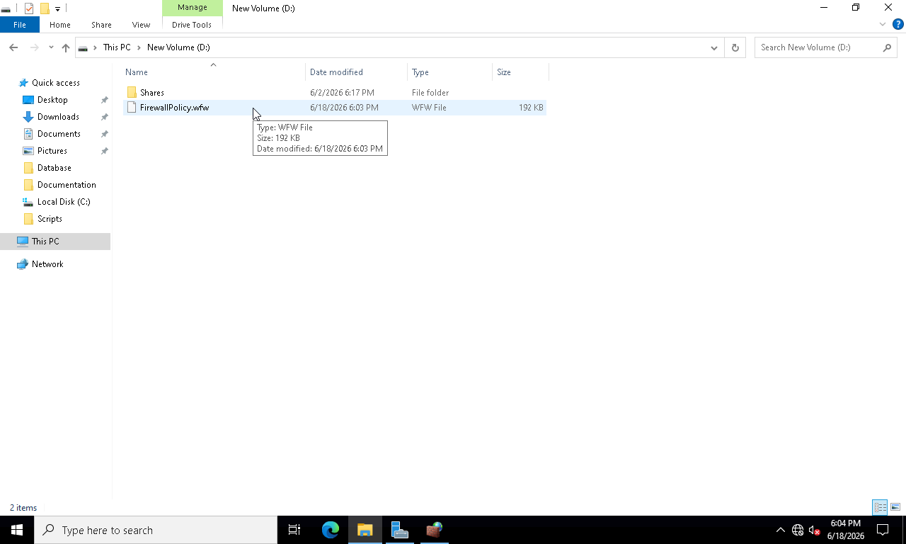

### Screenshot 21 - Firewall Profiles Enabled

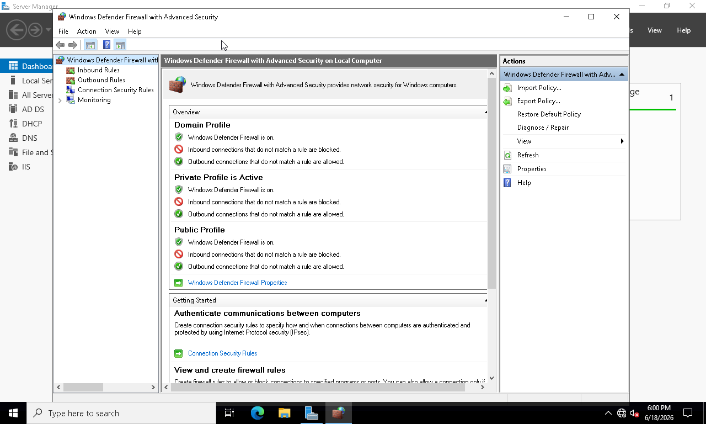

---

## Results

* Firewall operational
* Firewall profiles verified
* Rule configuration reviewed
* Host-based protection validated

---

## Skills Demonstrated

* Windows Firewall Administration
* Host Security
* Network Security
* Windows Security Administration

---

# Phase 06 - User Rights Assignment Review

## Overview

This phase focused on reviewing User Rights Assignment policies configured through Group Policy.

User Rights Assignments determine which users and groups are permitted to perform specific administrative and operational actions within the operating system.

---

## Objectives

* Review administrative privileges
* Review logon rights
* Review shutdown permissions
* Review backup and restore permissions
* Validate privilege assignments

---

## Implementation Steps

### 1. Open User Rights Assignment

User Rights Assignment settings were accessed through Group Policy Management.

### 2. Review Interactive Logon Rights

Allow Log On Locally permissions were reviewed.

### 3. Review Remote Desktop Logon Rights

Remote Desktop Services permissions were reviewed.

### 4. Review Shutdown Permissions

Users authorized to shut down the system were reviewed.

### 5. Review Backup Permissions

Backup-related privileges were reviewed.

### 6. Review Restore Permissions

Restore-related privileges were reviewed.

### 7. Refresh Group Policy

Policies were refreshed to ensure settings were active.

---

## Screenshots

### Screenshot 22 - User Rights Assignment

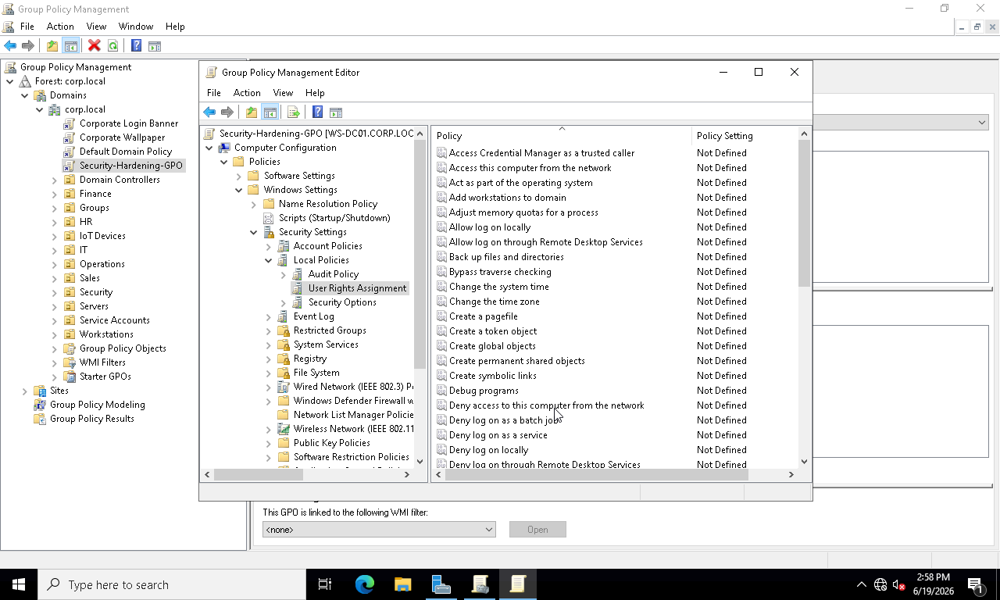

### Screenshot 23 - Allow Logon Locally

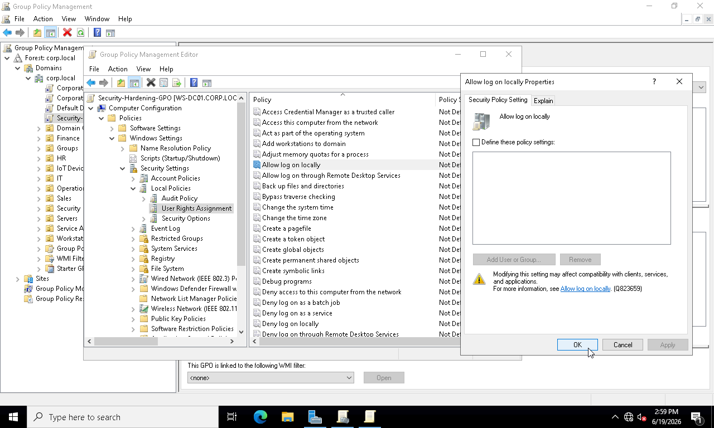

### Screenshot 24 - RDP Logon Rights

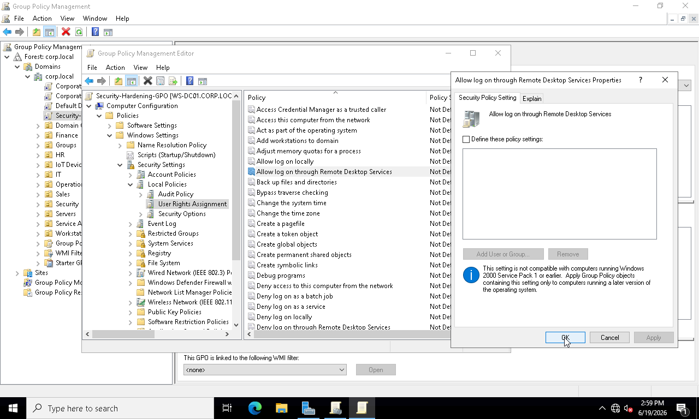

### Screenshot 25 - Shutdown System Rights


### Screenshot 26 - Backup Rights

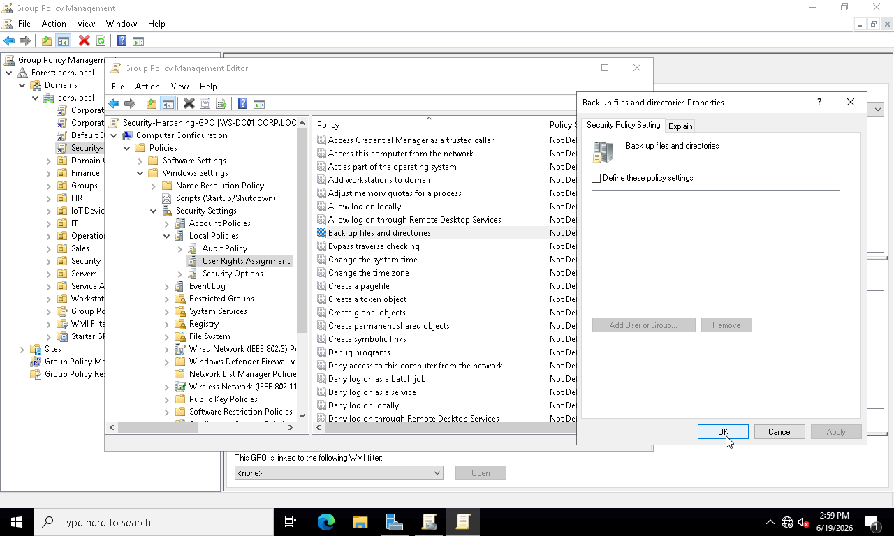

### Screenshot 27 - Restore Rights

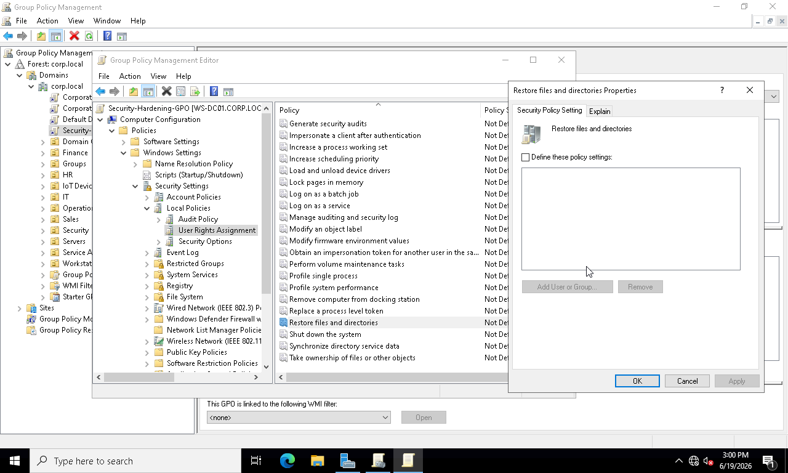

### Screenshot 28 - User Rights GPUpdate

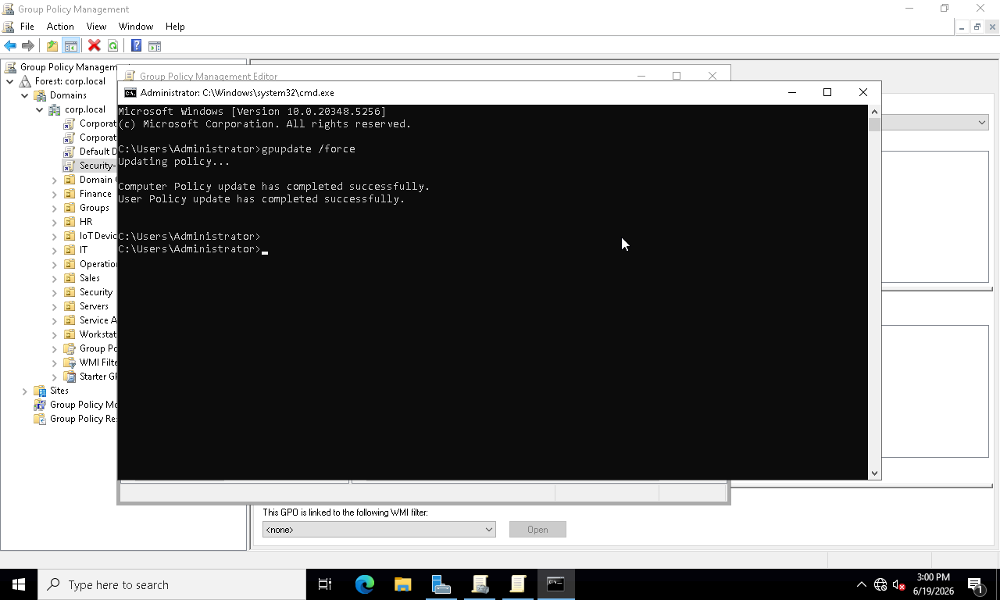

---

## Results

* User Rights Assignments reviewed
* Administrative privileges verified
* Backup and restore privileges reviewed
* Security baseline validated

---

## Skills Demonstrated

* Security Policy Administration
* Privilege Management
* Group Policy Administration
* Windows Security Administration

---

# Phase 07 - Advanced Audit Policy Configuration

## Overview

This phase focused on implementing Advanced Audit Policies to provide more granular security monitoring and event logging than traditional audit policy settings.

Advanced Audit Policies allow administrators to monitor authentication activity, account management events, and other security-related operations with greater precision.

---

## Objectives

* Configure Advanced Audit Policies
* Verify logon auditing
* Verify account management auditing
* Validate audit policy deployment
* Confirm event generation

---

## Implementation Steps

### 1. Open Advanced Audit Policy Configuration

Advanced Audit Policy settings were accessed through Group Policy Management.

### 2. Configure Logon Auditing

Logon auditing settings were reviewed and configured.

### 3. Configure Additional Audit Categories

Advanced auditing categories were reviewed and validated.

### 4. Refresh Group Policy

Group Policy was refreshed to apply the latest security settings.

### 5. Verify Audit Policy Deployment

Audit policies were verified using the auditpol command-line utility.

### 6. Generate Security Events

Authentication activity was reviewed to validate event generation.

---

## Screenshots

### Screenshot 29 - Advanced Audit Policy

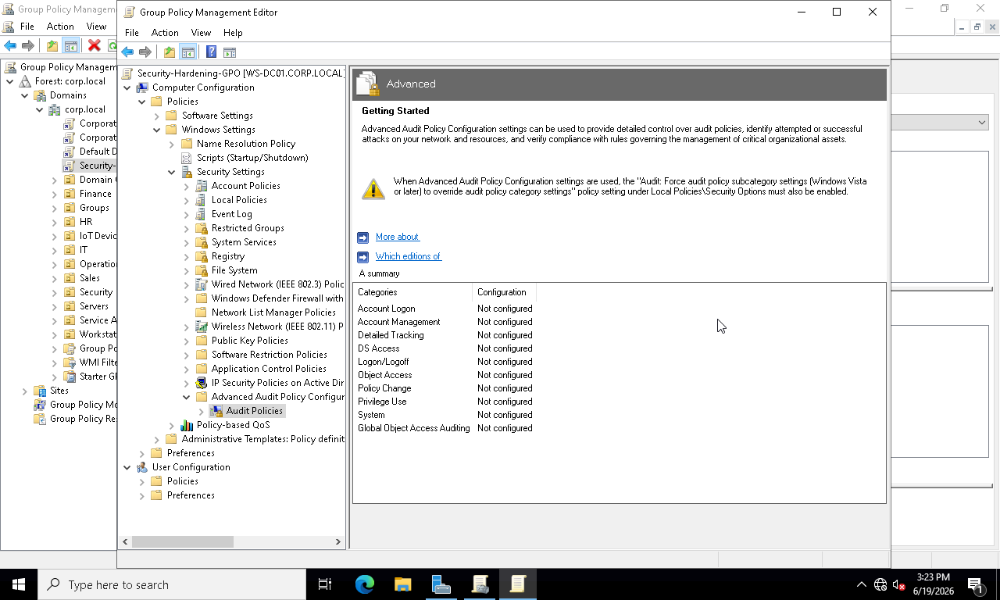

### Screenshot 30 - Logon Audit Configured

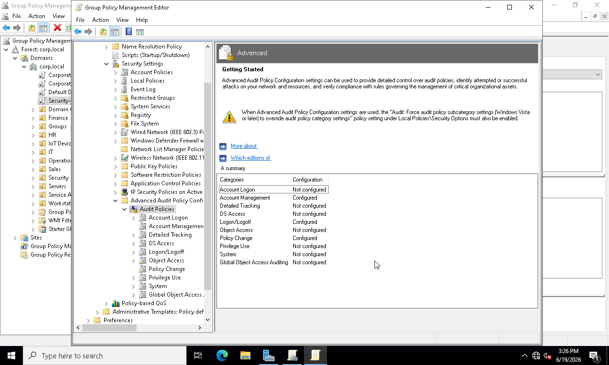

### Screenshot 31 - Advanced Audit GPUpdate

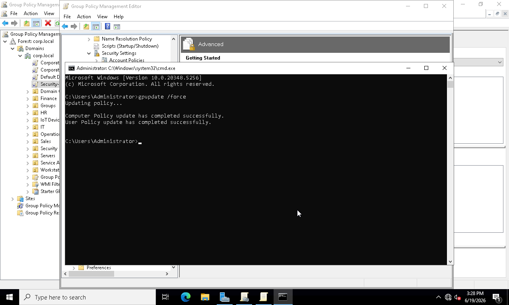

### Screenshot 32a - AuditPol Verification

.png)

### Screenshot 32b - AuditPol Verification

.png)

### Screenshot 33 - Advanced Audit Events

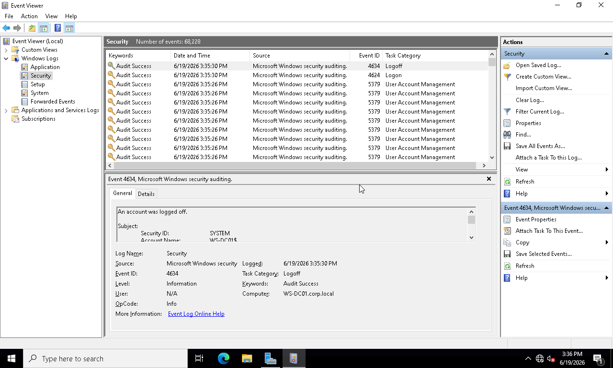

---

## Results

* Advanced Audit Policies configured successfully
* Logon auditing verified
* Audit policy deployment validated
* Security event generation confirmed

---

## Skills Demonstrated

* Advanced Audit Policy Administration
* Security Monitoring
* Audit Verification
* Windows Security Administration

---

# Phase 08 - Security Event Monitoring

## Overview

This phase focused on monitoring and analyzing security-related events using Event Viewer.

Security event monitoring provides administrators with visibility into authentication activity, account usage, and operational security events occurring within the environment.

---

## Objectives

* Monitor security events
* Analyze authentication activity
* Review security logs
* Create custom monitoring views
* Validate event collection

---

## Implementation Steps

### 1. Open Event Viewer

Event Viewer was opened and Security Logs were accessed.

### 2. Review Security Events

Security Logs were reviewed to identify authentication activity.

### 3. Filter Successful Logons

Event ID 4624 (Successful Logon) events were filtered and reviewed.

### 4. Filter Logoff Events

Event ID 4634 (Logoff) events were filtered and reviewed.

### 5. Create Custom Monitoring View

A custom Event Viewer view was created to simplify monitoring of authentication activity.

---

## Screenshots

### Screenshot 34 - Event Viewer Overview

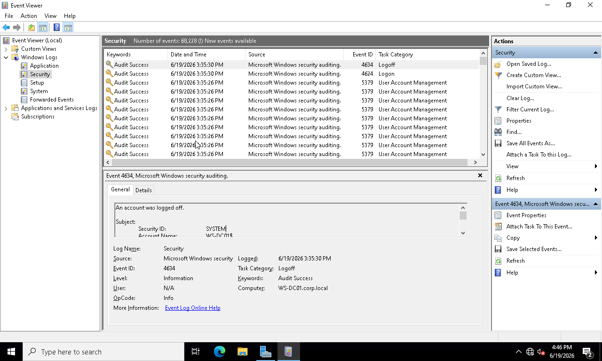

### Screenshot 35 - Security Log Filtered

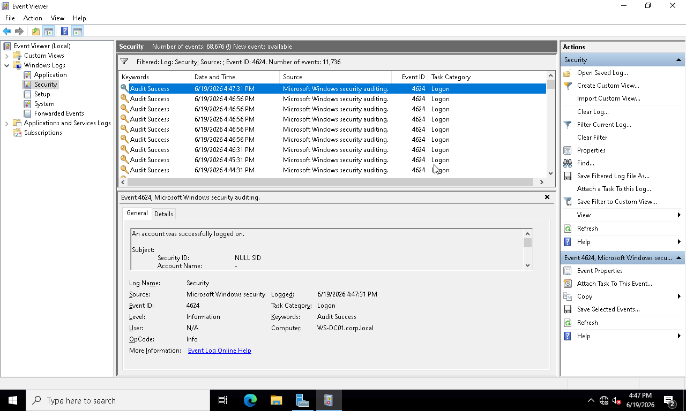

### Screenshot 36 - Event ID 4624

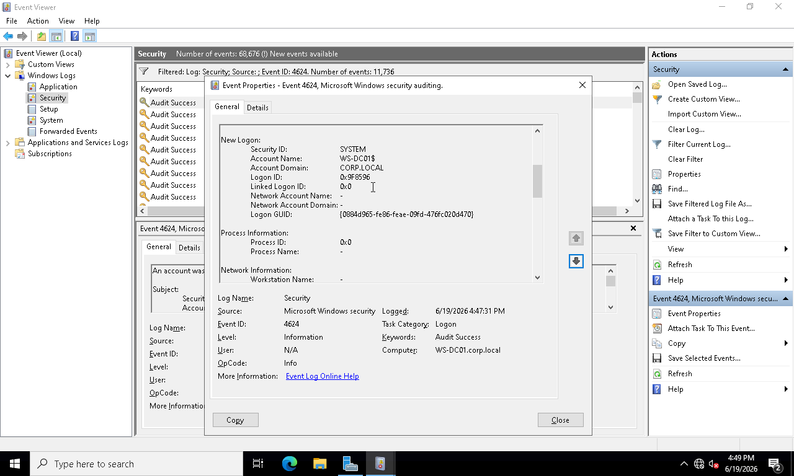

### Screenshot 37 - Event ID 4634


### Screenshot 38 - Custom View Created

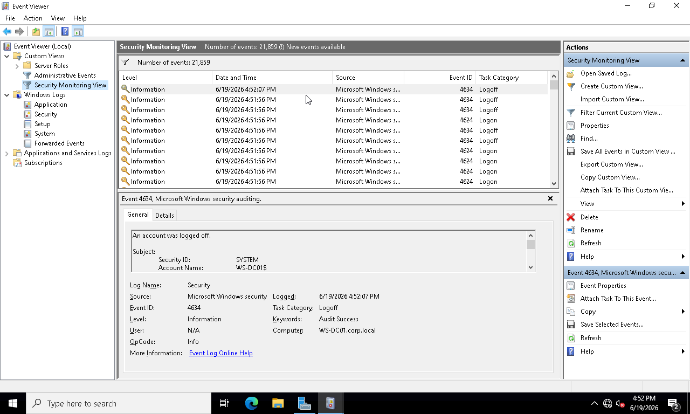

---

## Results

* Security monitoring configured successfully
* Authentication activity monitored
* Event filtering validated
* Custom monitoring view created

---

## Skills Demonstrated

* Event Viewer Administration
* Security Event Monitoring
* Authentication Monitoring
* Windows Security Administration

---

# Phase 09 - Security Verification & Reporting

## Overview

The final phase focused on validating all implemented security controls and generating verification reports.

Security verification ensures that deployed controls are functioning correctly and provides documentation that can be used for operational review and auditing purposes.

---

## Objectives

* Verify Security GPO deployment
* Verify audit policy configuration
* Verify firewall protection
* Verify Defender protection
* Generate security reports
* Validate overall security posture

---

## Implementation Steps

### 1. Verify Applied Security GPO

GPResult was used to verify successful application of security policies.

### 2. Generate Security Report

An HTML-based security report was generated.

### 3. Verify Audit Policies

Audit configuration was reviewed and validated.

### 4. Verify Firewall Status

Firewall protection status was reviewed.

### 5. Verify Defender Status

Windows Defender status was reviewed and validated.

### 6. Review Final Security Configuration

The overall security configuration was reviewed to confirm successful implementation.

---

## Screenshots

### Screenshot 39 - GPResult Security GPO

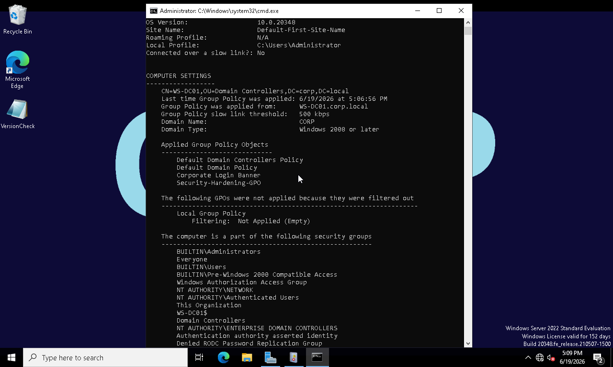

### Screenshot 40 - Security Report HTML

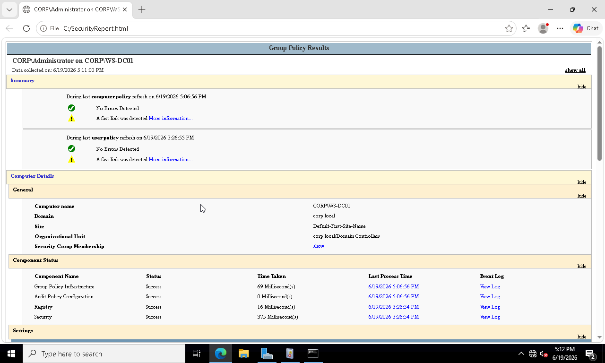

### Screenshot 41a - Audit Policy Verification

.png)

### Screenshot 41b - Audit Policy Verification

.png)

### Screenshot 42 - Firewall Status

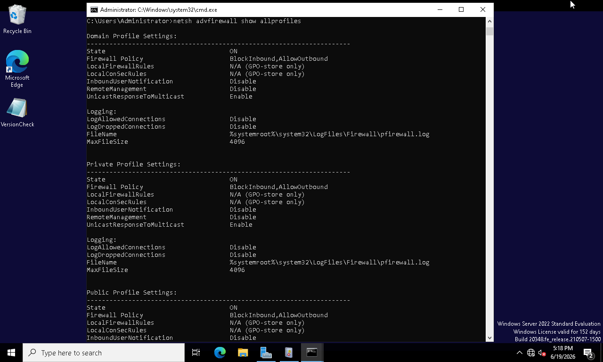

### Screenshot 43a - Defender Verification

.png)

### Screenshot 43b - Defender Verification

.png)

### Screenshot 44 - Final Security Overview

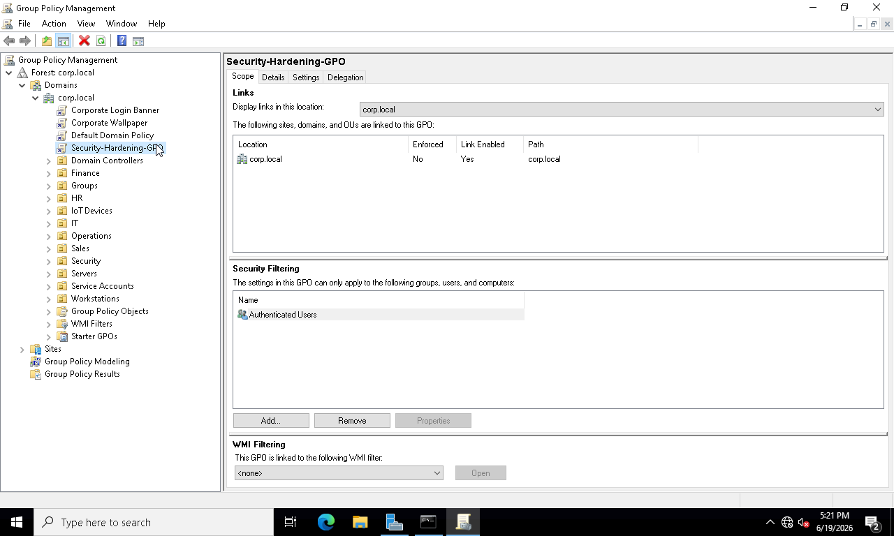

---

## Results

* Security GPO deployment verified
* Audit policies validated
* Firewall protection verified
* Defender protection verified
* Security reporting completed
* Security hardening implementation confirmed

---

## Skills Demonstrated

* Security Verification
* Security Reporting
* Audit Validation
* Enterprise Security Administration

---

# Overall Results

The Windows Server Security Hardening Lab was successfully completed and validated.

The following security controls were reviewed and verified:

* Password Policy Hardening
* Account Lockout Protection
* Security Auditing
* Windows Defender Protection
* Windows Firewall Protection
* User Rights Assignment Review
* Advanced Audit Policy Configuration
* Security Event Monitoring
* Security Verification and Reporting

The environment now follows a stronger enterprise security baseline and demonstrates practical Windows Server security administration skills commonly required in enterprise environments.

---

# Skills Demonstrated

## Windows Security Administration

* Security Hardening
* Security Verification
* Security Monitoring
* Security Reporting

## Group Policy Administration

* Security Policy Management
* Password Policy Administration
* Audit Policy Administration
* User Rights Assignment Management

## Endpoint Protection

* Windows Defender Administration
* Malware Protection Verification
* Security Intelligence Management

## Network Security

* Windows Firewall Administration
* Host-Based Security Controls
* Network Protection Validation

## Monitoring & Auditing

* Event Viewer Administration
* Security Event Monitoring
* Authentication Auditing
* Audit Policy Validation

## Enterprise Administration

* Security Baseline Review
* Security Documentation
* Operational Security Management
* Enterprise Windows Administration

---
